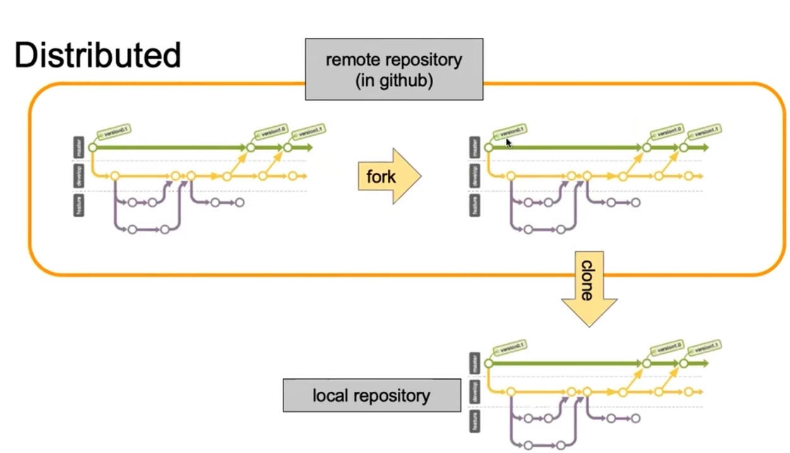
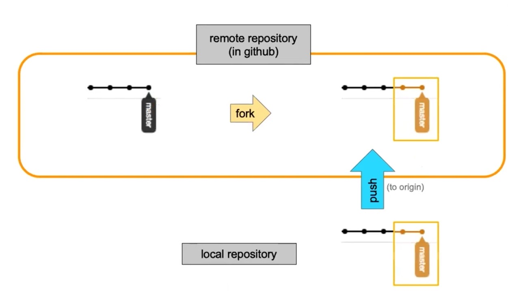
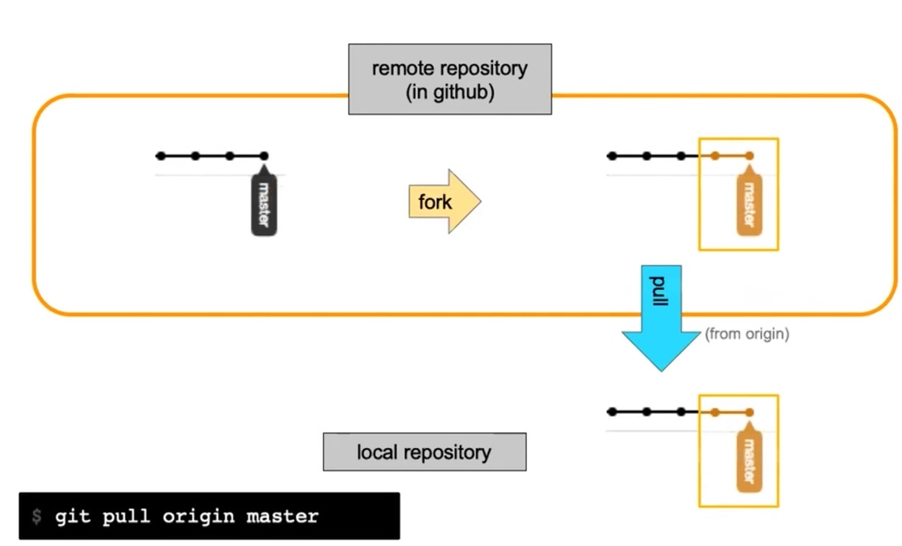
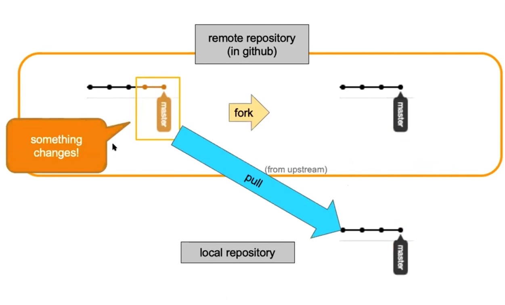
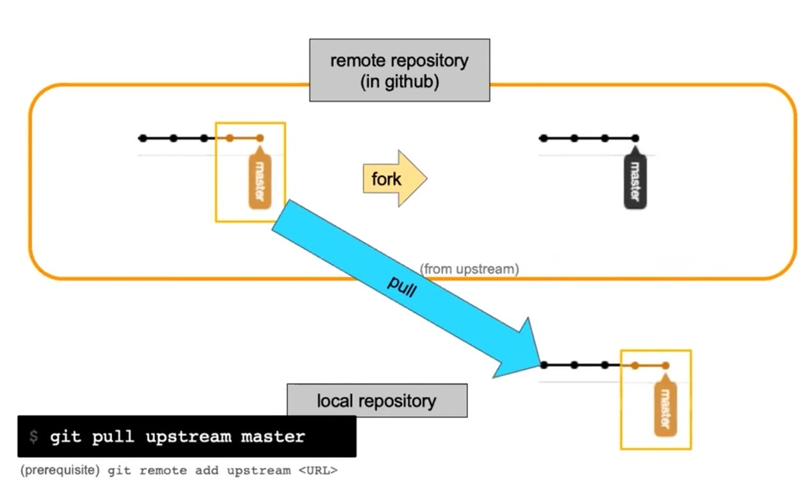
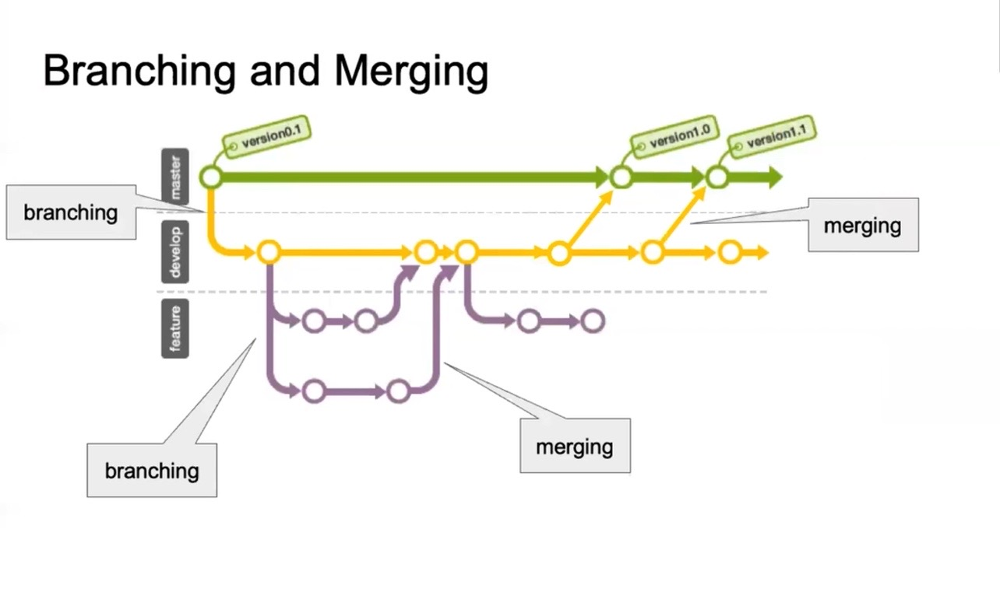

## 1. Git (Version Control System) 에 대해

<p align="center"></p>

여러 사람들이 하나의 파일을 다룰 때 사용하고 파일의 변경사항을 추적할 수 있고, 이전 버전의 파일 확인이 가능하다.

날짜별로 어떤 식으로 무슨 내용으로 변경이 되었는지 추적 가능하다.

### 비교!. Git 과 Github 의 차이

- Github : git 을 사용하는 사람들이 모인 social media, platform 이다.

Repository (코드 저장소) 를 서로 공유 가능한 플랫폼이다. 여기서 오픈소스 (facebook/react) 같은 것을 내 로컬로 가져와서 작업해 볼 수도 있다. 협업을 가능하게 해 준다.

- Git : 버전 관리 시스템 자체

- 참고할 만한 사이트

https://www.zerocho.com/category/Git/post/58045dbc146be6001542a465

## 2. Git 의 분산 시스템에 대해



### 2-1. 깃헙의 (오픈소스 등등) 레포 하나를 내 깃허브 계정으로 복사하는 fork



### 2-2. 내 로컬 컴퓨터로 (local repository) 가져오는 clone

fork 로 내 github 계정으로 repo 를 가져왔어도 깃헙 remote repo 에서는 내가 소스코드를 수정할 수 없다.

이제 이를 내 로컬의 컴퓨터로 가저오는 과정을 거치게 하는 것이 바로 clone 이다.

내가 주인이 되어서 직접 수정이 가능해 진다.

clone 을 통해 가져와 작업을 한 뒤 remote repository 에 올리고 그걸 maintainer 에게 변경된 소스에 대한 검사를 받고 적용이 되는 흐름이라고 한다.

### 2-3. 내 local repo 의 변경사항을 "내 소유의 (Origin)" repository 에 저장 적용이 가능한 git push origin master

### 2-4. git pull origin master



만약 누군가와 함께 어떤 저장소에 대한 내용을 작업하는데, 상대방이 변경사항을 먼저 추가했다면?

이제 내가 그 변경된 사항을 컴퓨터로 받아와야 한다.

왜냐면 그 변경 사항을 포함한 내용을 가지고 함께 작업 해야 하니까 인거 같다.

즉, remote repo 의 변경사항을 내 컴퓨터에 적용시키고자 할 때 사용한다.

만약, 그 repo 의 원조를 컨트롤하는 maintainer 가 repo 의 내용을 변경했다면?

### 2-5. git pull upstream master



- from upstream : local repo 입장에서 바라본 원본 repo 를 의미한다고 한다.

- git remote add upstream <url> 등록을 해줘야 한다고 한다.

- 잘 이해가 되지 않는다. 변경되었다 할 때마다 fork 로 가져오거나 하면 안되는 것일까?



### 2-6. git fetch, git merge

- git fetch 와 git merge 를 합친 것이 git pull 이라고 한다.

- git pull 은 working directory 를 최신화, 업데이트 하는데 사용한다.

## 3. git 을 이용한 작업 흐름

참고 사이트 : https://git-scm.com/book/ko/v2/%EC%8B%9C%EC%9E%91%ED%95%98%EA%B8%B0-Git-%EA%B8%B0%EC%B4%88

Git 디렉토리는 Git이 프로젝트의 메타데이터와 객체 데이터베이스를 저장하는 곳을 말한다. 이 Git 디렉토리가 Git의 핵심이다. 다른 컴퓨터에 있는 저장소를 Clone 할 때 Git 디렉토리가 만들어진다.

워킹 트리는 프로젝트의 특정 버전을 Checkout 한 것이다. Git 디렉토리는 지금 작업하는 디스크에 있고 그 디렉토리 안에 압축된 데이터베이스에서 파일을 가져와서 워킹 트리를 만든다.

Staging Area는 Git 디렉토리에 있다. 단순한 파일이고 곧 커밋할 파일에 대한 정보를 저장한다. Git에서는 기술용어로는 “Index” 라고 하지만, “Staging Area” 라는 용어를 써도 상관 없다.


Git으로 하는 일은 기본적으로 아래와 같다.

- 워킹 트리에서 파일을 수정한다.

- Staging Area에 파일을 Stage 해서 커밋할 스냅샷을 만든다. 모든 파일을 추가할 수도 있고 선택하여 추가할 수도 있다.

- Staging Area에 있는 파일들을 커밋해서 Git 디렉토리에 영구적인 스냅샷으로 저장한다.

### 3-1. git add

staging area 에 파일 추가하기

왜냐면 수정한 내용을 git 에 의한 관리를 받게 하기 위해서 이다.

```js
1. git add .
2. git add index.html

이 둘 사이에는 큰 차이가 있다
1 은 깃에 의해 컨트롤 되는 모든 사항에서 수정사항을 전부 등록한다는 의미 이다.
2 는 index.html 을 콕 찝어서 staging area 에 추가한다는 의미이다.
```

### 3-2. git commit

스냅샷 하나하나를 만드는 것을 의미한다. 반드시 커밋 메시지를 잘 적어 줘야 어떤 내용이 변경 되었는지 한 눈에 확인하기에 좋다고 한다.

```js
git commit -m "commit message"
```

### 3-3. Branching and Merging

- Branching : master 에서 뻗어나와 가지를 새로 치는 것을 의미

- Merging : 여러 가지 (branch) 들을 하나로 합치는 것을 의미

아래 그림 처럼 동그라미 하나 하나가 커밋을 의미한다.



여기에서,

- master

- develop branch
  : 충분한 테스트와 수정사항을 거친 뒤 master 에 올리기 위한 branch 이다.

- feature branch
  : 하나하나의 기능을 담고 있는, 예로 마법사 캐릭터의 기능을 처음 만드는 작업을 진행하는 branch 이다.

에 대한 이해가 중요한 거 같다. feature 에서 master 로 올라갈 수록 안정성이 좋아진다.
