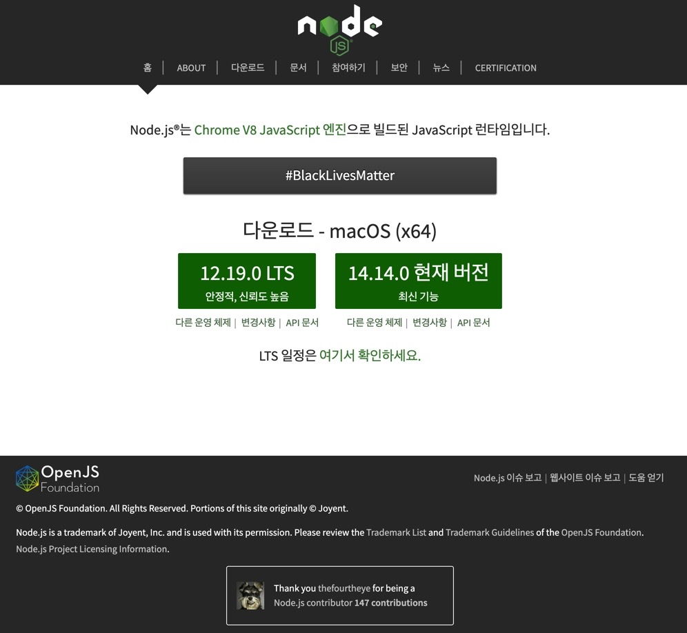
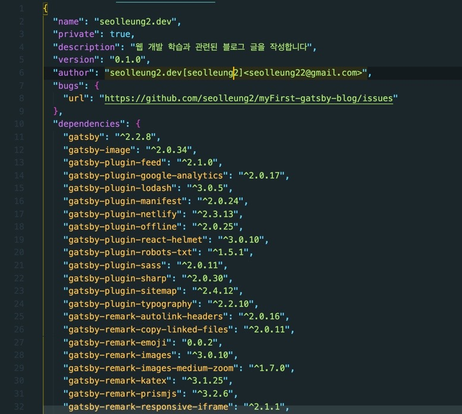
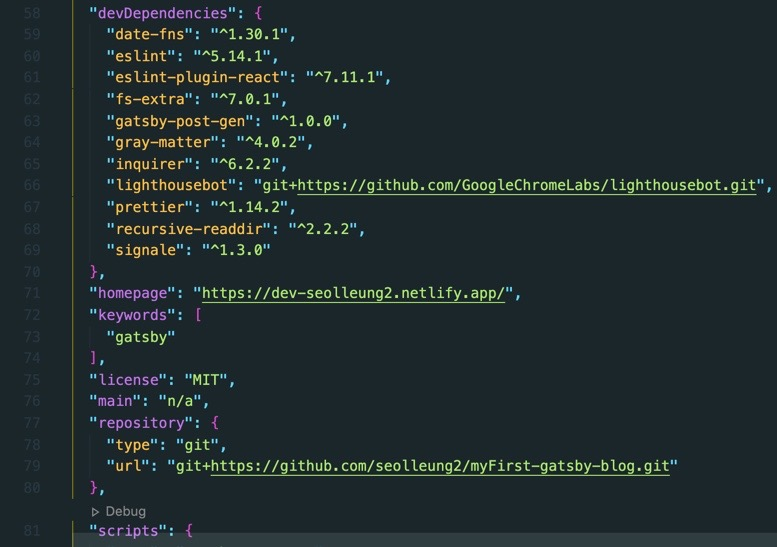
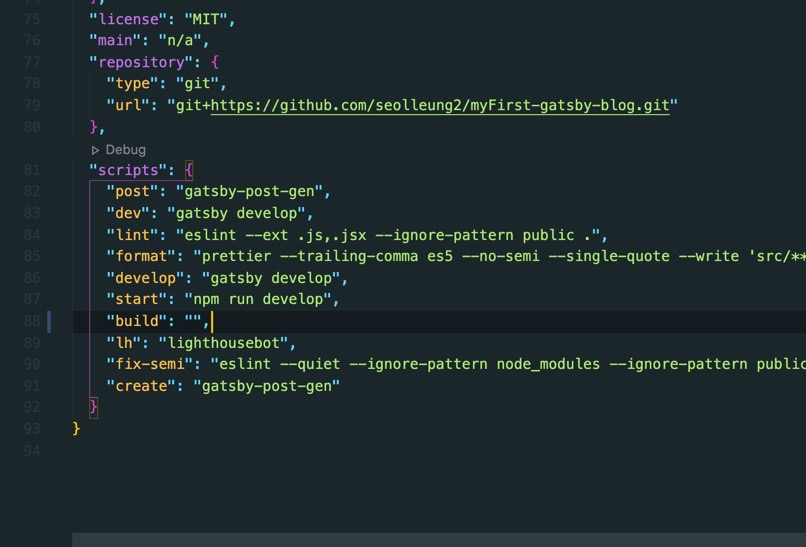

## 🏃🏻‍♀️Runtime 이란?

- 프로그래밍 언어가 구동되는 환경 (프로그래밍 언어가 돌아가는 환경)

- 어떤 프로그래밍 언어가 동작할 수 있는 프로그램 혹은 실행 되는 곳을 의미

예를 들어, 자바스크립트를 이용해서 HTML < script > 태그 내에 작성한 JS 코드 또는 파일을 연결한다면, 작성한 코드가 html 과 맞물려서
"브라우저" 에서 실행이 된다.

바로 이 브라우저가 대표적인 Javascript Runtime 이 되는 것이다.

## 🌳Node.js

브라우저 외에 Javascript 가 실행될 수 있는 런타임.

이제 Javascript 가 브라우저가 아닌 다른 곳에서 실행될 수 있다.
터미널에서,

```js
node <file_name>
```

을 통해 작성한 Javascript 코드가 node.js 환경에서 실행되게 한다.

## 🎫NVM - 다양한 node version 을 설치하고 관리할 수 있는 프로그램

node.js 에는 많은 버전들이 있다.
다양한 버전에 대응해야 될 일이 많이 생긴다. 예를 들어 현재 내 로컬 환경의 기본 버전은 12.13.0 인데 테스트&개발을 해야 하는 버전은
10.13.0 이다. 그럼 그때마다 업데이트 혹은 다운그레이드를 해줘야 할까?
다운그레이드라면 매번 설치한 node.js 를 삭제해 주어야 할까?

그래서 NVM 이 필요하다.

### NVM - Node Version Manager

간단한 명령어로 node 를 설치하고 다양한 node version 을 손쉽게 옮겨 다니게 해준다.
가상 환경에서 파이썬의 버전을 다르게 설치하는 것을 떠올려보면 조금 이해가 가기도 한다.

```js
nvm ls
>>> nvm 을 통해 설치한 node version 이 나온다.

nvm install 10.13.0
>>> nvm 을 통해 원하는 node version 을 설치한다.

nvm use 12.13.0
>>> nvm 을 통해 설치된 node.js 중 원하는 node version 을 사용한다.

nvm --version
>>> 0.35.3

nvm install 12.18.3
node -v
>>> 12.18.3

nvm 과 node.js 를 설치 후 확인 했다.
```


뭔가 최신사항을 받으면 좋을 거 같지만 LTS 버전을 받는 것이 좋다고 한다.
이유는 최신 버전은 실제 개발자들이 테스트 중이므로 LTS 버전에 비해 안정적이지가 않을 수 있기에 그렇다는 것 같다.

## 👀NPM (Node package manager)

프로그램은 모듈들의 집합이라고 한다. 모듈이란 프로그램이 기능하게 해주는 각각의 요소 라 생각하면 될 듯하다. 개발자들은 프로그램 개발을 위해 검증된 모듈을 다운해 사용한다.

NPM 은 바로 그러한, 필요한 모듈들을 다운로드 할 수 있는 모듈들이 모여 있는 모듈 스토어 이다.

## 🎁Package.json

다른 사람들이 내가 만든 프로젝트를 실행 시킬 때 (혹은 반대의 입장) 프로그램을 실행시키기 위해 필요한 모듈은 어떤 것들이 있고, 이 프로그램은 어떻게 실행하고 테스트 하는지 명시되어 있는 파일이다.

package.json 에 명세되어 있는 모듈은 어떤 모듈을 download 받아야 하는지 알려주는 역할을 한다.
실제 설치된 모듈들은 node_modules 라는 프로젝트 내 디렉토리에 들어가 있다.

package.json 은 그러니까 해당 프로그램을 구동하기 위해 필요한 module 은 이러이러 한 것들이다 하면서 보여주는 제품의 카달로그 같은 것이다.
그럼 이를 보고 사용자가 직접 download 받아서 쓰게 된다.

우리는 그래서 바로 이 "package.json" 을 확인해서 npm 을 이용해 필요하다고 하는 모듈을 다운로드 받는다.

```js
npm install

```

위의 명령어를 통해 package.json 에서 필요하다는 module 을 다운받고 완료되면 해당 프로젝트 내에 위에 언급했듯 "node_modules" 라는 디렉토리가 생긴 것을 확인할 수 있다.

## 🎁Package.json 의 구성

내가 작성하는 개츠비 블로그의 package.json 을 캡처해 왔다.

### 1. dependencies

프로젝트가 돌아가기 위해 반드시 필요한 모듈들이 무엇이 있는지 적혀 있다.



### 2. devDependencies

프로젝트를 개발하는 환경에서 필요한 모듈들이 무엇인지 적혀 있다.
실제 프로젝트 동작에 직접적으로 영향을 주지 않는 모듈들을 명시한다.



### 3. scripts

npm 으로 실행시킬 수 있는 명령어를 정의한다.
명령어 입력을 통해 어떤 동작을 해야 하는지가 적혀 있다.

gatsby build 를 실행하듯이 말이다.


