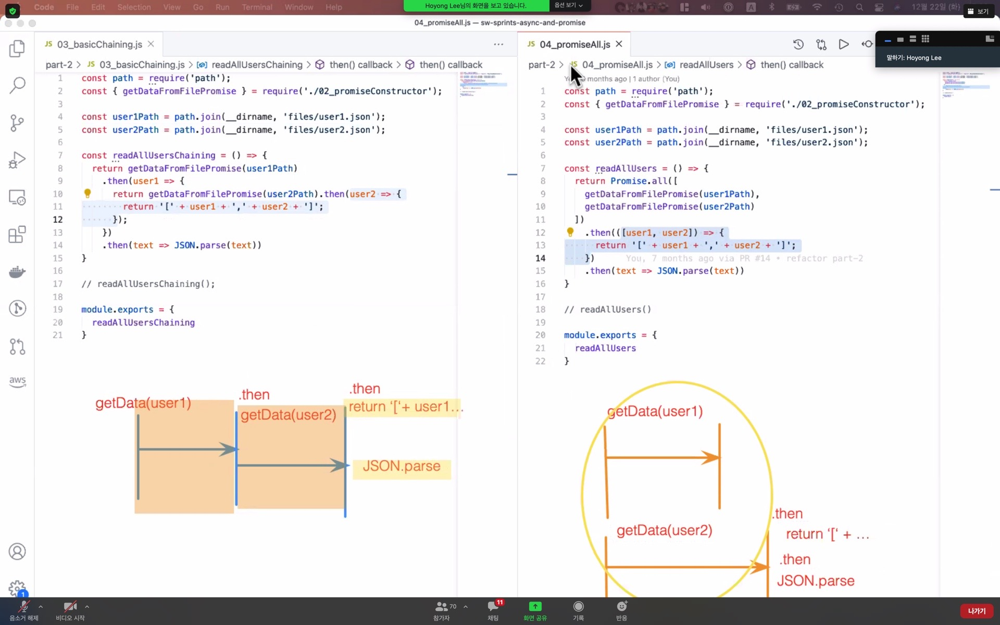

## ⏰리뷰 시간

자바스크립트는 싱글 쓰레드 인데 비동기를 통해서 다른 일을 동시에 처리할 수 있게 되었다 고 한다.

비동기를 왜써요?

비동기 적인 작업에서는 api 작업 순서가 랜덤이라 1- 2- 3 순서대로 코드를 실행하기 위함이다?

순서대로 작동 한다는 보장을 받기 위해서라고 한다.

## 🧱Blocking 과 Non-Blocking

카페에서 줄서있는 그림을 떠올려보자.

블로킹 - 마냥 대기해야 하는 상황. 앞 사람 주문하고 받을 때까지 주문도 못넣어.

<p align="center"></p>

포토샵 pop-up error : adobe xxxx is not responding

블로킹의 예시이다.

논블로킹 - 백그라운드에서 실행하게 두고 다른 작업을 수행할 수 있는 것.

JS 생태계 에서는 동기가 블로킹이고 비동기가 논블로킹과 똑같다 보면 된다고 한다.

## 𝐐중첩된 콜백이 발생하는 사례를 이해하고 있나요?

앱에 파일 업로드 하는 창 (여기에 파일 drop), 그리고 업로드 버튼을 생성했다고 가정하자.

파일 입출력, 타임라인 애니메이션, 네트워크 요청은 한꺼번에 일어나는 것이 아니다.

<p align="center"></p>

1. 파일 입출력

2. 타임라인 애니메이션

3. 네트워크 요청

순서에 따라 순서를 제어 하기 위해서 콜백 을 사용해 본다.

```js
importFile(result => {
  doAnimation(progress => {
    uploadFile(result => {})
  })
})
```

예시로 작성한 코드 이지만 만약 비동기 적인 task 들이 위의 세 종류가 아니라 더 많다면 콜백 지옥을 (중첩된 콜백) 경험하게 될 것이다.

## 𝐐여러개의 비동기 함수가 존재할 때 Promise 를 이용해 함수 실행 순서를 자유자재로 프로그래밍 할 수 있나요?



왼쪽은 병렬 구조가 아니다. Promise를 리턴하는 비동기 함수들이 서로 독립적이지 않을때 사용한다.

오른쪽의 Promise.all 을 사용한 consumer 함수 내의 비동기 함수들은 병렬 구조이다. 이것은 비동기 함수들이 서로 독립적일 때 사용한다.

언제 Promise.all 을 써야 할지, then 을 써서 이어가야 할지 알아야 한다.

await 여러개 가 붙은 함수를 동시에 처리하고 싶다면 여기서 다시 promise.all 로 묶어주면 된다.

async await 의 요청에 대한 에러를 잡을 때는 try - catch 구문을 사용하고,

프로미스 에서는 .catch 로 에러를 처리한다.

## 👨🏻‍🚒주의!

setTimeout 의 리턴은 프로미스가 아니다.

```js
await setTimeout(() => console.log('프로미스'), 1000)
```

는 잘못된 코드라는 뜻이다.

반드시 promise 로 감싸줘야 한다.

비동기 함수라고 막 await 같다 쓴다고 동기적으로 쓸 수 있는게 아니라는 거다.

## 𝐐Promise의 세 가지 상태

<b>Fullfilled / Pending / Rejected</b>


Fullfilled 상태 일 떄 이제 resolve 로 성공한 비동기 요청을 .then 으로 받아와서 반환

Rejected 상태 일 때 이제 rejected 로 실패한 비동기 에러를 .catch 로 받아와서 반환

## 𝐐Promise.all 의 사용법을 이해하셨나요?

작동 원리는 다르다. 순서를 보장하지 않는다.

배열 인자 에 프로미스 객체가 둘다 fullfilled 상태일 때만 then 으로 불리게 된다.

하나라도 rejected 되면 catch 로 넘어가게 된다.

또한 <b>Promise.all 이 리턴하는 것은 배열이 아니라 프로미스 객체 이다.</b>

## 𝐐Promise.allSettled()

얘는 둘 중 하나라도 fullfilled 되면 then 이 불리게 된다.

## 𝐐node.js 와 브라우저의 차이점

<b>node.js</b> - 파일을 읽고 쓰는것을 다룰 수 있다. 서버를 만들고, db 를 연결할 수 있는 환경

<b>브라우저</b> - 파일 다루는 거에는 한계가 있다.

fetch 는 브라우저에서 사용하는 api 이다.

그럼 node 에서는 네트워크 요청을 못하나요?

할 수 있다. node.js 에서 모듈을 찾아보면 http 를 사용 할 수 있다.

혹은 node-fetch 같은 모듈을 인스톨해 사용할 수 있다. node 와 브라우저는 서로 환경이 다르다 라는 것을 인식할 수 있어야 한다.
