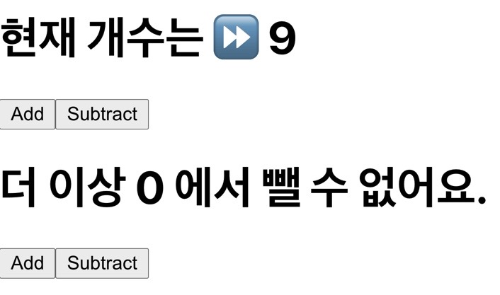

## 🔢Counter

무언가 숫자를 하나 올리고 더하는 기능은 장바구니 라든지 많이 쓸법한 기능이다.


그래서 실습해 보았다.

## 🚀Code (1) - Class Component

```jsx
import React, { Component } from 'react'

class Counter extends Component {
  constructor(props) {
    super(props)
    this.state = {
      count: 1,
    }
  }
  render() {
    const { count } = this.state
    return (
      <>
        <h1>
          {count === 0
            ? `더 이상 ${count} 에서 뺄 수 없어요.`
            : `현재 개수는 ⏩ ${count}`}
        </h1>
        <button onClick={() => this.setState({ count: count + 1 })}>Add</button>
        <button
          onClick={() => {
            if (this.state.count !== 0) {
              this.setState(
                prevState => ({ count: prevState.count - 1 }),
                () => console.log('방금 setState 가 호출되어 하나 뺏습니다.')
              )
            }
          }}
        >
          Subtract
        </button>
      </>
    )
  }
}

export default Counter
```

클래스형 컴포넌트에서 state 를 가져오는 방법은 this.state 로 접근해서 가져오게 된다.

그리고 render 내에 상태를 전달하거나 jsx 내에 보여지게 할텐데, 매번 this.state.count, this.state.movies ... 코드가 길어진다.

그래서 이 또한 구조 분해 할당을 통해 state 변수를 미리 가져와 선언해 놓으면 코드가 짧아지고 가져다 쓰기 좋다.

```js
const { count } = this.state
```

또한 setState 를 호출 할 때, 내부 인자로 객체 자체가 올 수도 있고 아님 함수가 올 수도 있다.

객체가 올 때는 만약 state 가 배열로 받는다 가정하면 Spread Operator 를 통해 이전 배열에 값을 추가해 나갈 수도 있을 것이다.

내부 인자로 함수가 올 때는 prevState 를 첫번째 인자로 받는 콜백함수가 작성된다.

```js
if (this.state.count !== 0) {
  this.setState(
    prevState => ({ count: prevState.count - 1 }),
    () => console.log('방금 setState 가 호출되어 하나 뺏습니다.')
  )
}
```

옵션으로다가 두번째 인자에 콜백함수를 넣어 상태를 변경하고 실행할 함수를 작성할 수도 있다.

## 🚀Code (2) - Functional Component

아직 hooks 에 대해 제대로 알지는 못하지만 일단 알고 있는 선에서 한번 써봤다.

```jsx
import React, { useState } from 'react'

const CounterFunc = () => {
  const [count, setCount] = useState(1)
  return (
    <>
      <h1>
        {count === 0
          ? `더 이상 ${count} 에서 뺄 수 없어요.`
          : `현재 개수는 ⏩ ${count}`}
      </h1>
      <button onClick={() => setCount(count + 1)}>Add</button>
      <button
        onClick={() => {
          if (count !== 0) {
            setCount(count - 1)
          }
        }}
      >
        Subtract
      </button>
    </>
  )
}

export default CounterFunc
```

## 🐧만들어본 모습


