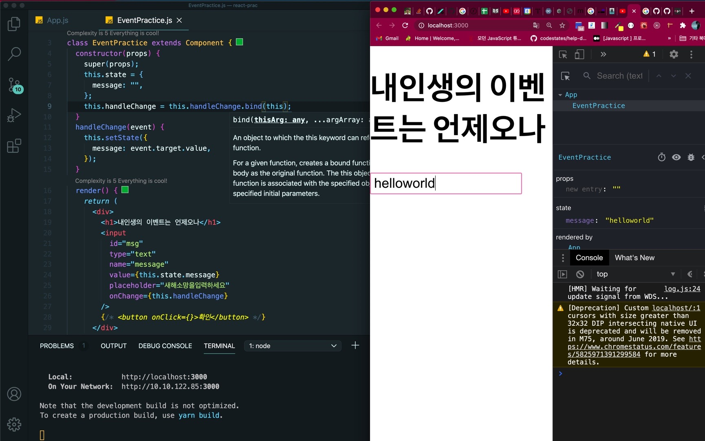

## 🍊Class 컴포넌트에서의 Event - onXXXX 에 함수 직접 전달

input 태그에 onChange 이벤트 함수를 직접 실행 하면서 setState 를 호출하게 하여 상태를 변경시킨다.

그런데 input 의 value 속성에 this.state.message 를 표기해주어야 하는지는 아직 확인 진행 중이다.

button 태그에는 onClick 이벤트 함수를 적용해서 message 의 상태를 비우고 input 에 id 를 줘서, DOM 요소 를 선택하게 해서

입력값을 초기화하게 했다.

```jsx
import React, { Component } from 'react'

class EventPractice extends Component {
  constructor(props) {
    super(props)
    this.state = {
      message: '',
    }
  }
  render() {
    return (
      <div>
        <h1>내인생의 이벤트는 언제오나</h1>
        <input
          id="msg"
          type="text"
          name="message"
          value={this.state.message}
          placeholder="새해소망을입력하세요"
          onChange={e => this.setState({ message: e.target.value })}
        />
        <button
          onClick={() => {
            alert(this.state.message)
            document.querySelector('#msg').value = ''
            this.setState({ message: '' })
          }}
        >
          확인
        </button>
      </div>
    )
  }
}

export default EventPractice
```

## 🍊Class 컴포넌트에서의 Event - 함수를 미리 준비 (임의 메서드 만들기)

함수가 호출될 때 this 는 호출부에 따라 결정되므로, 클래스의 임의 메서드가 특정 HTML 요소의 이벤트로 등록되는 과정에서 메서드와 this 의 관계가 끊어져 버린다고 한다.

이 때문에 임의 메서드가 이벤트로 등록되어도 this 를 컴포넌트 자신으로 제대로 가리키기 위해서는 메서드를 this 와 바인딩 (binding) 하는 작업이 필요하다.

```jsx
import React, { Component } from 'react'

class EventPractice extends Component {
  constructor(props) {
    super(props)
    this.state = {
      message: '',
    }
    this.handleChange = this.handleChange.bind(this)
    this.handleClick = this.handleClick.bind(this)
  }
  handleChange(event) {
    this.setState({
      message: event.target.value,
    })
  }

  handleClick() {
    alert(this.state.message)
    document.querySelector('#msg').value = ''
    this.setState({
      message: '',
    })
  }
  render() {
    return (
      <div>
        <h1>내인생의 이벤트는 언제오나</h1>
        <input
          id="msg"
          type="text"
          name="message"
          value={this.state.message}
          placeholder="새해소망을입력하세요"
          onChange={this.handleChange}
        />
        <button onClick={this.handleClick}>확인</button>
      </div>
    )
  }
}

export default EventPractice
```



만약 바인딩하지 않는 경우라면 this 가 undefined 를 가리키게 된다.

내가 현재 작성한 코드는 constructor 함수에서 함수를 바인딩 하는 작업이 이루어지고 있다.

그런데 bind 를 써주기가 너무 귀찮고 싫다면?

바로 소개한 첫번째 방식으로 이벤트 함수를 직접 익명함수로 전달하는 방법이 있지만 더 원초적인 방법이 있다.

## 🍊Class 컴포넌트에서의 Event - 애초에 화살표 함수 형태로 메서드 정의하기.

Property Initializer Syntax 라는데 이런 어려운 용어 는 접어두고 애초에 함수를 화살표 함수 형태로 만들어 정의해버리면,

메서드를 새로 만들때마다 constructor 에 bind(this) 적어주고 수정할 필요가 없어진다.

```js
handleChange = event => {
  this.setState({
    message: event.target.value,
  })
}

handleClick = () => {
  alert(this.state.message)
  document.querySelector('#msg').value = ''
  this.setState({
    message: '',
  })
}
```
