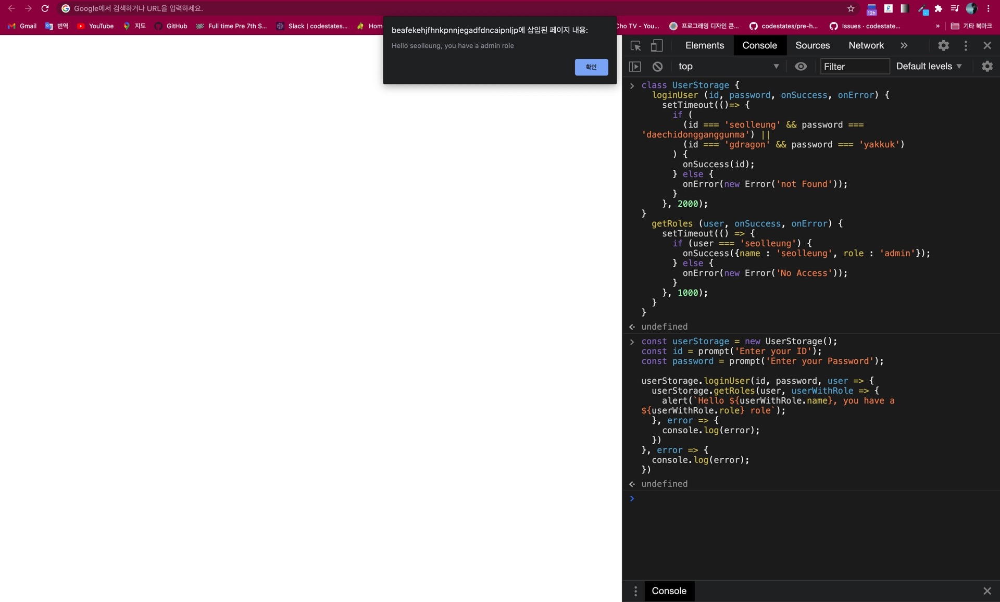

## ✍🏻자바스크립트는 Synchronous 하다

자바스크립트는 동기적이다.

호이스팅이 된 이후부터 작성된 순서대로 실행된다.

Hoisting 이란, var 과 function declaration 이 자동적으로 제일 위로 올라가게 되는 것을 의미한다.

모든 함수의 선언은 호이스팅 된다.

```js
console.log(1)
console.log(2)
console.log(3)
```

1, 2, 3 순서대로 찍히는 것을 확인 할 수 있다.

## ⏲비동기 처리의 대표적 예시, setTimeout()

비동기 처리 (Asynchronous) 의 대표적 API 는 setTimeout() 이 있다.

setTimeout() 는 브라우저 API 로, 일정 시간이 지나면 지정한 콜백함수를 호출하게 된다.

아래 비동기적인 실행 방법을 보도록 하자.

```js
console.log(1)
setTimeout(function() {
  console.log(2)
}, 1000)
console.log(3)
// 1, 3, 2 순서로 찍힌다.
```

두번째 줄 setTimeout 은 함수 호이스팅에 의해 맨 위로 올라간 상태에서

1이 먼저 콘솔창에 출력되고 setTimeout 의 콜백 함수는 브라우저에게

"1초 뒤 콜백함수를 실행해줘!"

라고 브라우저에게 요청을 넣게 된다.

바로 뒤이어 숫자 3이 출력되고 1초 뒤, 콜백함수가 실행되어 (Timehandler 역할) 드디어 숫자 2가 출력된다.

## ☎️다시! setTimeout 콜백 함수의 정의

하나의 Parameter 에 들어가는 함수, 지금 당장 실행하지는 않고 몇 초 뒤에 내 함수를 콜 (call) 해줘!

라고 전달하는 것을 의미한다. Callback, 주로 Arrow function 을 사용해서 나중에 다시 불러달라고 하는 것이다.

그러면 콜백은 항상 비동기 적일 때만 쓸까? No!

## 📱콜백 함수의 2가지 종류

### 1. 동기 콜백 (Synchronous Callback)

첫번째, 동기 콜백은 print 라는 콜백함수를 파라미터로 받아서 실행한다.

```js
function printImmediately(print) {
  print()
}
// 위 함수의 선언을 통해 함수의 선언을 제일 위로 (Hoisting) 올린다.

printImmediately(() => console.log('Hello'))
```

1, 3, Hello, 2 순서로 찍힌다. 왜?

```js
console.log(1)
setTimeout(function() {
  console.log(2)
}, 1000)
console.log(3)
printImmediately(() => console.log('Hello'))
```

Hoisting 에 따라 선언한 순서 고대로 출력된다.

그래서 1, 3, Hello, 2 순서로 출력된다.

### 2. 비동기 콜백 (Asynchronous Callback)

두번째, 비동기 콜백함수를 선언 및 실행해 보았다.

```js
function printWithDelay(print, timeout) {
  setTimeout(print, timeout)
}
printWithDelay(() => console.log('Async Callback'), 2000)
// 이제 1, 3, Hello, 2, Async Callback 으로 찍힌다.
```

아까의 누적된 데이터를 다시 불러와 보면,

```js
console.log(1)
setTimeout(function() {
  console.log(2)
}, 1000)
console.log(3)
printImmediately(() => console.log('Hello'))
printWithDelay(() => console.log('Async Callback'), 2000)
```

1, 3, Hello, 2, Async Callback 순으로 출력되는 이유에 대해 수긍할 수 있다.

## 👍백엔드 사용자 데이터를 받는 저장소 만들기

```js
class UserStorage {
  loginUser(id, password, onSuccess, onError) {
    setTimeout(() => {
      if (
        (id === 'seolleung' && password === 'daechidongganggunma') ||
        (id === 'gdragon' && password === 'yakkuk')
      ) {
        onSuccess(id)
      } else {
        onError(new Error('not Found'))
      }
    }, 2000)
  }
  getRoles(user, onSuccess, onError) {
    setTimeout(() => {
      if (user === 'seolleung') {
        onSuccess({ name: 'seolleung', role: 'admin' })
      } else {
        onError(new Error('No Access'))
      }
    }, 1000)
  }
}
```

### loginUser 함수의 역할

loginUser 함수는 id 와 password 를 받고, 사용자의 데이터 (id 나 password 가 일치하는) 가 적합할 때

사용자 데이터와 함께 onSuccess 라는 콜백함수를 호출하고, 적합하지 않을 때는 onError 라는 콜백함수를 통해

에러 메시지를 보이도록 할 것이다.

loginUser 함수 내 setTimeout 의 첫번째 인자로 콜백함수가 오고, 그 콜백함수의 역할은

- 특정 아이디와 비밀번호가 일치하는 경우 (참일때)

- onSuccess 라는 콜백함수에 id 를 담아 전달하게 한다. onSuccess(id)

- 특정 아이디와 비밀번호가 일치하지 않을 때 (거짓조건)

- Error 라는 Object 를 만들어서 (JS 내장객체)

- Not Found 라고 에러 메시지를 전달할 것이다.

### getRoles 함수의 역할

사용자 데이터를 받아서 Admin 또는 guest 권한인지를 받아오는 역할을 담당한다.

해당 로그인 유저 중에 일치하는 유저가 있다면, onSuccess 함수를 통해 유저의 역할을 담은 객체를 리턴한다.


## 🤤과정 요약

- UserStorage 에서 id, password 를 받아온다.

- 입력을 받아와 로그인에 성공하면 id 를 다시 받아오는데,

- onSucccess(id) 를 통해 Roles, 역할을 요청하게 된다. (getRoles)

- 역할을 받아 올 수 있다면, 사용자의 오브젝트 (이름, 역할이 들어있는)를 보이게 한다.

## ✍🏻사용해보기

```js
const userStorage = new UserStorage()
const id = prompt('Enter your ID')
const password = prompt('Enter your Password')

userStorage.loginUser(
  id,
  password,
  user => {
    userStorage.getRoles(
      user,
      userWithRole => {
        alert(
          `Hello ${userWithRole.name}, you have a ${userWithRole.role} role`
        )
      },
      error => {
        console.log(error)
      }
    )
  },
  error => {
    console.log(error)
  }
)
```



## 👻문제점

1. 코드를 읽기가 너무 거북하다. 거북거북

2. 가독성이 떨어져서 한눈에 알아보기가 어렵다.

3. 디버깅에 어려움을 겪을 수 있다.

4. 콜백체인이 길어져 좋지 않다.
