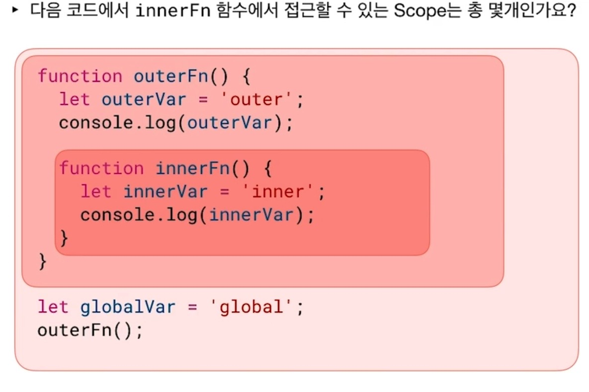
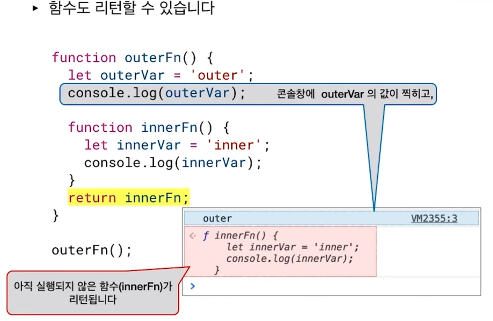
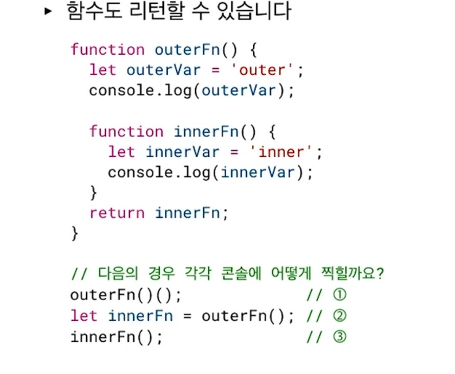
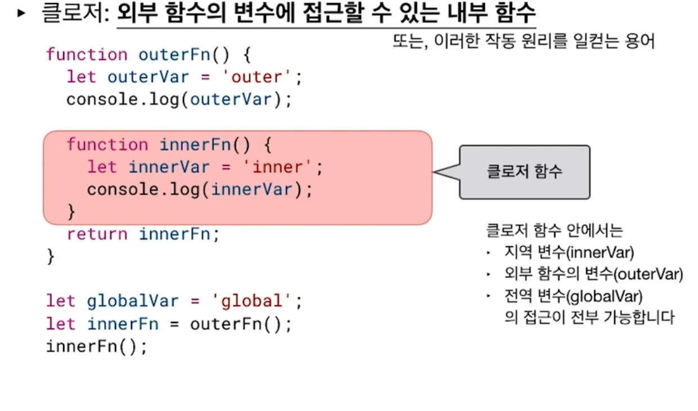
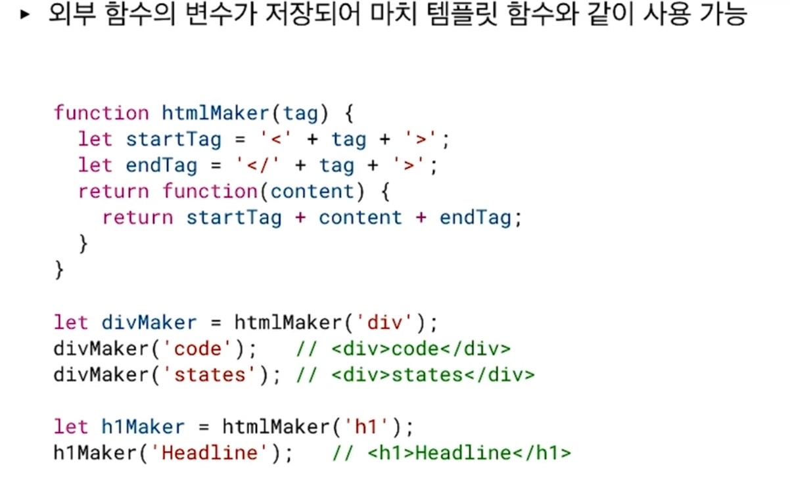
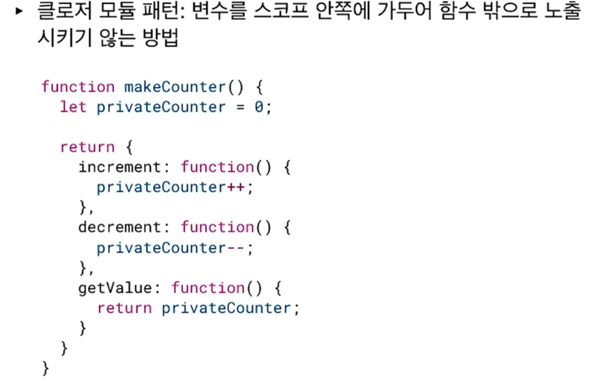
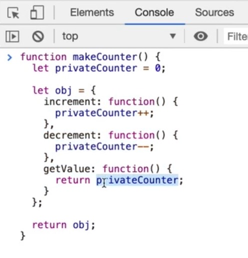
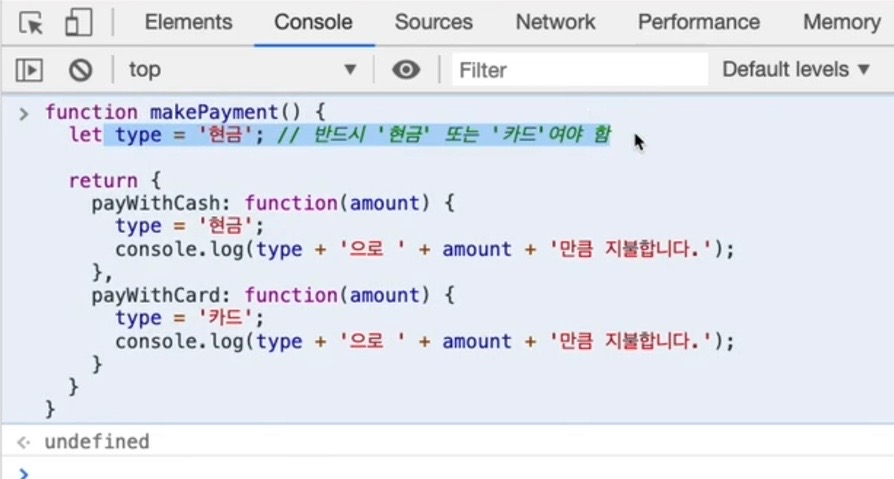
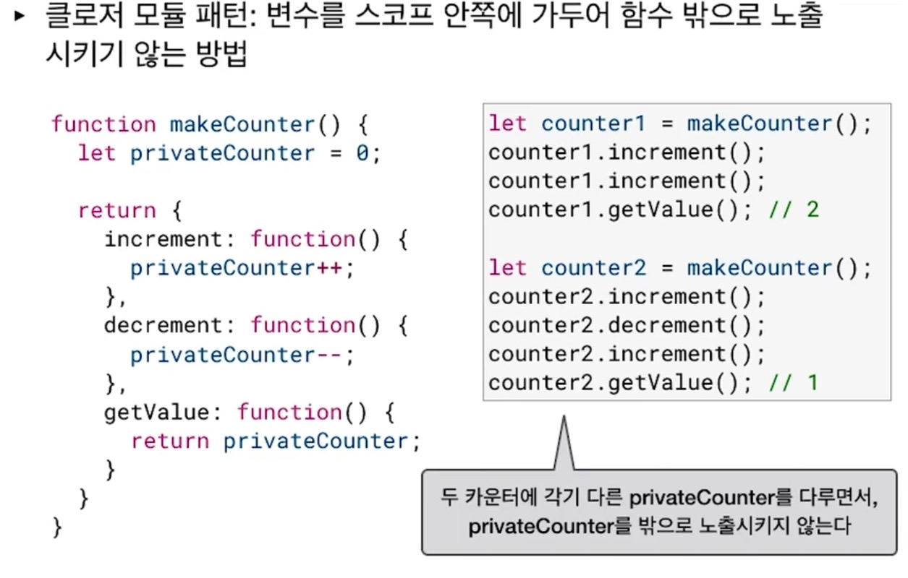

## 1. Closure (클로저) 가 뭐지.



위 그림에서 innerFn() 함수에서 접근할 수 있는 스코프의 갯수는? 3개이다.

외부 함수가 있고 내부 함수가 안에 있는 듯한 구조인데 이제 여기서 return innerFn;
같이 그 함수 자체를 리턴하는 상황이 나오는데 (함수를 파라미터로 받는다는 건 그렇구나 했지만), 이 때 outerFn 을 실행시키면 뭐가 나올까?

```js
outerFn()
```

일단 outerVal 변수에 할당된 'outer' 가 console.log 로 출력될 테고, 함수 맨 아래 return innerFn; 은

```js
innerFn
```

outerFn 함수 내부에 정의된 innerFn() 함수 자체를 리턴한다.



절대! innerFn() 함수를 실행시키는 것이 아니다!!
innerFn 함수의 모양새를 보여줄 것이다. 즉 함수 자체가 리턴된 거지 안의 함수가 실행된 것이 아니라는 점!

다음의 경우에는 각각 콘솔에 어떻게 찍힐까?



1. outerFn()();
   처음에 괄호 하나를 실수로 하나 더 쓴 줄 알았다.
   여기에서는 위의 예 처럼 outer 가 콘솔로그로 찍히고 inner 함수의 모양새를 보여준다. outerFn() 여기까지는 그렇다.

근데 괄호 하나가 더 붙으면 함수의 실행을 의미하듯이, 이제 그 innerFn 의 모양새를 보여준 것을 직접 실행해서 드디어 'inner' 를 찍어준다.

2. let innerFn = outerFn();
   outer 가 콘솔로그로 찍히고 inner 함수의 모양새를 보여준다. 리턴되는게 없지 않은가?

3. innerFn();
   2에 선언된 innerFn 을 실행시키는 과정이다. 그러면 1번 처럼 동일한 결과를 보여준다.

## 2. 클로저의 정의

클로저란,

1. 외부함수의 변수에 접근할 수 있는,

2. 내부함수를 의미한다.

또는 이러한 작동원리를 일컽는 용어라는데 위의 1번, 2번이 중요하다.
그냥 함수 안에 함수가 있으니 클로저네? 이러면 낭패라는 의미와 비슷하다.



저 innerFn() 함수 자체를 클로저 함수라 부르고, 이러한 패턴 자체를 클로저 패턴이라 부른다.

클로저 함수 안에서는 3가지 scope 에 접근이 가능하다.

- 지역 변수 (innerVal) 에 접근이 가능
- 외부 함수의 변수 (outerVal) 에도 접근이 가능
- 전역 변수 (globalVal) 에도 접근이 가능

이러한 클로저를 써먹는 유용한 예제는 무엇일까?

## 3. 커링 (Currying)

쉽게 설명하자면, 여러 개의 인자를 받는 함수가 있을 때 일부의 인자를 고정한 함수를 만드는 기법이라 한다.

함수 하나가 n 개의 인자를 받는 대신, n 개의 함수를 만들어 각각 인자를 받게 하는 방법이라 한다.

```js
function adder(x) {
  return function(y) {
    return x + y
  }
}

adder(2)(3) //  5
```

위의 함수 코드를 보면 (함수형 프로그래밍의 예제라 한다) 리턴값이 이름이 없는 함수이다. 이 내부 함수는 y 를 인자로 받아서 x 와 y 를 더한 값을 또다시 리턴하고 있다.

커링이 좋은 이유는 특정 x 값을 고정해 놓고 재사용, 재사용 할 수가 있어서 이다.

```js
let add100 = adder(100) // x 를 100으로 깔아 놓고 add100 이라는 변수에 할당!
add100(2) // 102
add100(10) // 110

let add5 = adder(5) // x 를 이번에는 5로 깔아 놓고 add5 라는 변수에 할당!
add5(2) // 7
```

adder() 함수 자체가 함수를 생성하는 함수라 할까?

## 4. 템플릿 함수 처럼 사용

외부 함수의 변수가 저장되므로 마치 템플릿 함수와 같이 사용이 가능하다.



```js
function htmlMaker(tag) {
  let startTag = '<' + tag + '>'
  let endTag = '<' + tag + '>'
  return function(content) {
    return startTag + content + endTag
  }
}
undefined

let divMaker = htmlMaker('div')
undefined

divMaker('Hello!')
;('<div>Hello!<div>')

divMaker('World🥰')
;('<div>World🥰<div>')

let h1Maker = htmlMaker('h1')
undefined

h1Maker('Welcome, my blog!')
;('<h1>Welcome, my blog!<h1>')
```

외부함수의 변수인 tag 가 저장된 채로 쓰이고 있으며, 내부 함수에서 외부함수의 변수 tag 를 받는 지역 변수인 startTag, endTag 를 참조할 수가 있게 되었다.

이처럼 외부함수의 변수를 내부함수가 계속 쓰면서, 뭔가 재사용 할 수 있는 마치 템플릿 처럼, 템플릿함수 처럼 쓸 수 있는 게 클로저 함수의 특징이다.

## 5. 클로저의 또다른 패턴, 클로저 모듈 패턴



변수를 스코프 안에 가두어 함수 밖으로 노출 시키지 않는 방법이라고 한다.

위 그림을 보면 return 하고 curly bracket 이런 식으로 연달아 있는데 사실 let obj = 와 같다고 한다.

즉 객체에 대한 키값을 함수로 표현한 형태, 즉 함수 모음집을 리턴한 것이다.



마찬가지로 외부함수의 변수 privateCounter 를 내부 함수에서 사용하고 있다.

```js
function makeCounter() {
  let privateCounter = 0

  let obj = {
    increment: function() {
      privateCounter++
    },
    decrement: function() {
      privateCounter--
    },
    getValue: function() {
      return privateCounter
    },
  }

  return obj
}

let counter1 = makeCounter()
```

코드 맨 아래 선언된 counter1 은 찍어보면 객체이다.

```js
counter1
{increment: ƒ, decrement: ƒ, getValue: ƒ}
decrement: ƒ ()
getValue: ƒ ()
increment: ƒ ()
__proto__: Object
```

그렇다는 뜻은 변수 counter1 을 메소드 처럼 써먹을 수 있다는 의미이다.

```js
counter1.increment()

counter1.increment()

counter1.getValue()
2
```

getValue() 를 통해 총 2번 증가 시켰음을 알 수 있다.

또한 privateCounter 변수 값을 scope 법칙에 의해 함수 바깥에서 접근이 불가능하다.
레퍼런스 참조 에러가 뜬다.

```js
privateCounter;
Uncaught ReferenceError: privateCounter is not defined
    at <anonymous>:1:1
```

이렇듯 직접 privateCounter 변수 값을 건드릴 수는 없지만 위의 예시 처럼 increment 나 decrement 함수를 통해 privateCounter 의 변수 값을 간접적으로 바꿀 수 있다.

왜 privateCounter 변수를 바깥에서 수정하지 못하게 하는 것인가?

영상에서 좋은 예시가 있었다.



프로그램 외부에서 type 이라는 변수를 외상 이라든지 수표 등으로 변수를 직접 내 맘대로 바꿀 수 있다면 정상적으로 작동하는 함수에 문제가 생길 것이다.

대신 간접적으로 변수를 바꿀 수 있게 (가능한 한도 내에서) 세팅해 주는 느낌이라 한다.
안쪽 함수에서, 그러니까 내부 함수 자체는 바깥에서 볼 수 없으니 안전하다고 판단을 하는 것일까.

아까 위에서 counter1 을 선언해서 2번 실행하게 했는데 이번에는 counter2 라는 변수를 줘보자.



```js
let counter2 = makeCounter()

counter2.increment()
counter2.increment()
counter2.increment()
counter2.increment()
counter2.increment()

counter2.getValue()
5
```

총 5번 증가시켰음을 확인할 수 있다.
그럼 이제 counter1 에 있는 value 인 2 와 counter2 에 있는 value 5 가 서로 영향을 미칠까?

서로 영향을 전혀 주지 않는다.

이유는 함수 내에서 privateCounter 라는 변수를 counter1, counter2 가 각각 privateCounter 변수를 독립적으로 가지고 있기 때문이다.

이렇다는 것은,
counter3 등의 변수를 또 줘서 재사용이 가능하다는 뜻이 된다.

이러한 패턴을 클로저 모듈 패턴이라 부른다고 한다.
