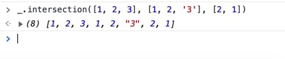
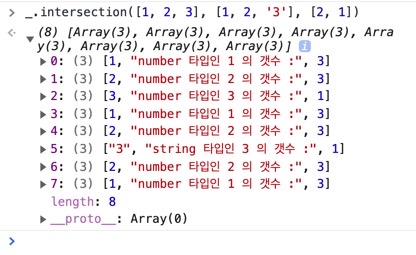
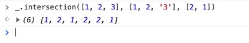
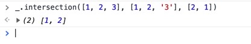
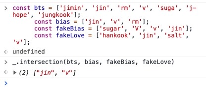

# 😭코드는 길지만 어쨋든 해냈다.


안풀려서 혼자 실성해가지고 실실 쪼개는 순간을 찍었다...

10월 17일 새벽 2시, 공유 오피스 아무도 없는 이곳에서..

예쓰!!!!! 환호성을 질렀다.

```js
_.intersection = function(...arrays) {
  let lumpOfArrays = []
  let arrNum = arrays.length
  // console.log(arrNum);
  _.each(arrays, function(arr) {
    lumpOfArrays.push(...arr)
  })
  // return lumpOfArrays;
  let customArr = []

  for (let i = 0; i < lumpOfArrays.length; i++) {
    let form = [
      lumpOfArrays[i],
      `${typeof lumpOfArrays[i]} 타입인 ${lumpOfArrays[i]} 의 갯수 :`,
      0,
    ]

    customArr.push(form)
    for (let j = 0; j < lumpOfArrays.length; j++) {
      if (lumpOfArrays[j] === form[0]) {
        form[2] = form[2] + 1
      }
    }
  }
  // return customArr;
  let answer = []
  _.each(customArr, function(item) {
    if (item[2] === arrNum) {
      answer.push(item[0])
    }
  })
  // return answer;
  let result = []
  _.each(answer, function(el) {
    if (_.indexOf(result, el) === -1) {
      result.push(el)
    }
  })
  return result
}
```

보다시피 레퍼런스에 비해 길디 긴 코드이다.
미련한 느낌이 없지않아 있기는 한데 난 끝내 안보고 풀어냈다. 이제 레퍼런스를 보면서 이해하고 내가 작성한 코드를 줄여나가기만 하면 된다.

먼저 과정을 블로깅 해보고자 한다.

# ⁉️여러 배열들을 받아 교집합 배열을 리턴하는 \_.intersection

## 🩰과정 1. 여러 배열들의 포장을 풀어 한 배열에 합치기

```js
_.intersection = function(...arrays) {
  let lumpOfArrays = []
  let arrNum = arrays.length
  // console.log(arrNum);
  _.each(arrays, function(arr) {
    lumpOfArrays.push(...arr)
  })
  return lumpOfArrays
}
```

Part.1 에서 구현한 \_.each 반복문으로 임의로 만든 빈 배열 lumpOfArrays 에 배열의 요소를 선물 상자 풀듯이 넣기 위해
lumpOfArrays.push(...arr); 를 사용했다.

그리고 파라미터로 들어온 총 배열의 갯수를 let arrNum = arrays.length; 로 담아주었다.
이건 나중에 중요하게 쓰인다.

```js
_.intersection([1, 2, 3], [1, 2, '3'], [2, 1])
```



파이썬의 그 뭐더라 unpacking 이 떠오르는 순간이다.

## 🩰과정 2. 알아보기 좋게 커스텀 배열 만들어 놓기.

과정 1. 에서 모든 요소를 풀어 놓은 배열 lumpOfArrays 을 반복을 돌면서 각 요소의 타입, 요소 그리고 갯수를 배열로 만들어서,

빈 배열인 customArr 에 담은 이중 배열의 형태를 만들었다.

```js
_.intersection = function(...arrays) {
  let lumpOfArrays = []
  let arrNum = arrays.length
  // console.log(arrNum);
  _.each(arrays, function(arr) {
    lumpOfArrays.push(...arr)
  })
  // return lumpOfArrays;
  let customArr = []

  for (let i = 0; i < lumpOfArrays.length; i++) {
    let form = [
      lumpOfArrays[i],
      `${typeof lumpOfArrays[i]} 타입인 ${lumpOfArrays[i]} 의 갯수 :`,
      0,
    ]

    customArr.push(form)
    for (let j = 0; j < lumpOfArrays.length; j++) {
      if (lumpOfArrays[j] === form[0]) {
        form[2] = form[2] + 1
      }
    }
  }
  return customArr
}
```

반복 내에서 또 이중 for 문을 통해 최초 만든 lumpOfArrays 를 돌면서 form[0] 인 lumpOfArrays[i] 와 같은 요소가 있다면,
갯수로 지정해 놓은 form[2] 에 1 씩 더해주게끔 했다.



그렇게 나온 결과가 위의 그림인데 배열 안에서 배열들이 중복이 되는게 있다. 여기서 빈 배열을 만들어 놓고 빈 배열에 해당 커스텀 배열의 하나하나가 빈 배열에 없다면 추가 하는 식으로 하고 싶었는데 결과는 위 그림과 동일하게 나와서 다른 방법을 써야만 했다.

## 🩰과정 3. 최초 파라미터로 받은 총 배열의 개수와 같은 커스텀 배열만 뽑아오기

우리는 맨앞 배열을 기준으로 각 배열마다 공통된 요소를 가져와 리턴해 줘야 한다.
각 배열마다.. 각 배열마다.. 그래서 이제 배열의 개수를 알아야 한다.
위의 예에서는 총 배열 3개를 파라미터에 실려 있다.
각 배열마다 공통된 요소를 가져와야 한다.

```js
_.intersection([1, 2, 3], [1, 2, '3'], [2, 1])
```

과정 2에서 만든 커스텀 배열 마다 이미 개수를 정리해 놓았다.
이제 그 커스텀 배열의 개수와 파라미터로 받은 총 배열의 개수가 같다면 그 커스텀 배열의 0번째,
해당 요소만 임의의 배열에 담게 한다.

```js
_.intersection = function(...arrays) {
  let lumpOfArrays = []
  let arrNum = arrays.length
  // console.log(arrNum);
  _.each(arrays, function(arr) {
    lumpOfArrays.push(...arr)
  })
  // return lumpOfArrays;
  let customArr = []

  for (let i = 0; i < lumpOfArrays.length; i++) {
    let form = [
      lumpOfArrays[i],
      `${typeof lumpOfArrays[i]} 타입인 ${lumpOfArrays[i]} 의 갯수 :`,
      0,
    ]

    customArr.push(form)
    for (let j = 0; j < lumpOfArrays.length; j++) {
      if (lumpOfArrays[j] === form[0]) {
        form[2] = form[2] + 1
      }
    }
  }
  // return customArr;
  let answer = []
  _.each(customArr, function(item) {
    if (item[2] === arrNum) {
      answer.push(item[0])
    }
  })
  return answer
}
```



## 🩰과정 4. 여기서 중복되는 요소 다 뺀 요소 리턴하기

```js
_.intersection = function(...arrays) {
  let lumpOfArrays = []
  let arrNum = arrays.length
  // console.log(arrNum);
  _.each(arrays, function(arr) {
    lumpOfArrays.push(...arr)
  })
  // return lumpOfArrays;
  let customArr = []

  for (let i = 0; i < lumpOfArrays.length; i++) {
    let form = [
      lumpOfArrays[i],
      `${typeof lumpOfArrays[i]} 타입인 ${lumpOfArrays[i]} 의 갯수 :`,
      0,
    ]

    customArr.push(form)
    for (let j = 0; j < lumpOfArrays.length; j++) {
      if (lumpOfArrays[j] === form[0]) {
        form[2] = form[2] + 1
      }
    }
  }
  // return customArr;
  let answer = []
  _.each(customArr, function(item) {
    if (item[2] === arrNum) {
      answer.push(item[0])
    }
  })
  // return answer;
  let result = []
  _.each(answer, function(el) {
    if (_.indexOf(result, el) === -1) {
      result.push(el)
    }
  })
  return result
}
```

마지막 코드 7줄을 보면 중복되지 않는 요소 el 만 배열 result 에 넣어서 리턴하게 했다.



## 🩰과정 5. 다른 모든 요소 테스트 그리고 통과!

다른 요소들도 넣어서 모두 테스트 하니 드디어 모든 테스트 케이스에 초록불이 들어왔고 비로소 그동안 씨름한 걸 보상받은 기분이다.



물론 레퍼런스 코드에 비해 길고 효율이 떨어지는 코드 이지만 어떻게든 되게 만들려고 노력하는 과정에 있어서 나에게 힘찬 박수를 쳐주고 싶다.

이제 레퍼런스 코드를 이해하고 나면 나는 한움큼 더 발전해 있을 거라 믿는다.
하지만 이제 자러 가야지 ㅎㅎ!

# 👋👋👋👋👋👋👋👋
