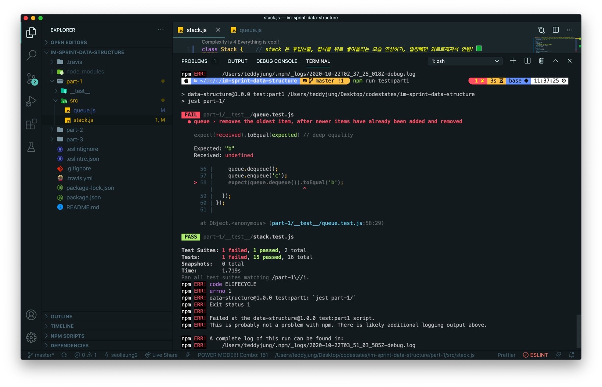
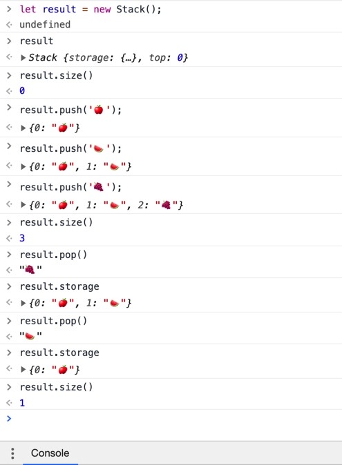

## 🏃🏻‍♂️사전 준비

im-sprint-data-structure 를 fork 및 clone 해 왔다.

이후 해당 프로젝트에서 npm install 명령어를 통해 스프린트에 필요한 라이브러리를 설치하게 한다.

그러면 이제 npm run test:part1 명령어로 아래와 같이 에러 사항을 확인하면서 진행하게 된다.



뭐를 진행하는지?

```js

Stack
다음과 같은 method를 구현하세요 :
push(element) - 요소를 스택의 최상단에 추가합니다.
pop() - 스택의 최상단에서 요소를 제거하고 반환합니다.
size() - 스택의 현재 요소 개수를 반환합니다.

```

Stack 의 기능을 구현하기 위한 내부 메소드를 구현하는 과정이다.

이제 시작!

## 🔥stackoverflow 의 바로 그 Stack!

part-1/src/stack.js 파일을 확인하면 아래 코드와 같다.

```js
class Stack {
  constructor() {
    this.storage = {}
    this.top = 0
  }

  size() {}

  push(element) {}

  pop() {}
}

module.exports = Stack
```

클래스를 선언하고 new 키워드로 인스턴스를 만들어낸 뒤, 만든 인스턴스.push() 혹은 인스턴스.pop() 등을 통해 넣고 빼는 기능을 만드는 것이다.

그럼 이제 진짜 시작!

## 🤔과정 1. stack 에 대한 이미지 다시 떠올리기.

stack 은 후입선출, 마지막에 넣은 것을 먼저 뺀다. 접시를 위로 쌓아올리는 모습을 떠올린다. 밑장빼면 와르르맨션되서 안된다!
(하지만 서점에서 책살때 맨위에 꺼 손탄거 같애서 밑장빼서 구매한다는 거..🥰 나만 그런가?ㅠ)


## 🤔과정 2. constructor 가 하는 역할을 추측 해보기.

MDN 공식 문서에는 class 의 constructor 를 아래와 같이 정의하고 있다.

```js
constructor 메서드는 class 내에서 객체를 생성하고 초기화하기 위한 특별한 메서드입니다.
클래스는 constructor라는 이름을 가진 특별한 메서드를 하나씩만 가질 수 있습니다.
```

쉽게 생각하면 우리가 어떤 함수를 만들 때,

```js
function adder(array) {
  let result = []
  let count = 0
  for (let i = 0; i < array.length; i++) {
    // 이하 생략...
  }
}
```

함수 내에 result 나 count 같은 초기화 하는 변수를 선언해 주지 않는가?

class 의 constructor 가 바로 그러한 역할을 담당한다고 이해하면 된다.
또한 counstructor 는 class 를 통해 나오는 인스턴스의 속성 (차로 치면 차의 브랜드, 색, 제원 등등..) 을 정의하는 곳이다 라고 생각했다.

그리고 클래스에서 찍어 나오는 인스턴스가 this 가 되어, stack 이 담길 객체인 storage 가 정의 되어 있으며

storage 가 비어 있는 현 상태의 top 은 0 이다. 즉 top 은 storage 객체 내에 들어갈 속성의 갯수 를 의미한다고 이해했다.

이제 아래부터 나오는 메소드 들은 인스턴스가 어떻게 동작 하는지에 대한 역할을 규정한다! 라고 이해하면서 아래로 내려가 보자.

## 🤔과정 3. class 내 메소드 size() 는 무엇일까?

```js
인스턴스.size()
```

위의 코드를 통해 내가 storage 에 push 나 pop 을 통해 넣은 속성들의 갯수를 리턴한다.

즉 뭔가 집어넣고 빼고 하다가 어랏? 현재 사이즈가 뭐얏! 하면서 알아볼 때 쓰는 메소드이다.

return this.top; 을 통해 어떠한 자료를 넣고 뺄 때, 변수 top 이 하나 커지거나 작아지는 것을 컨트롤 할 수 있게 했다.

```js
constructor() { // constructor 는 어떻게 이해해야 좋을까? class 를 통해 나오는 인스턴스의 속성을 정의한다 생각하면 될까?
    this.storage = {}; // {0: 'a', 1: 'b'}
    this.top = 0; // storage 가 빈 상태일 때 top (객체 내 속성 갯수?) 은 0 인 상태를 정의했다.
  }               // 이제 아래의 함수들은 인스턴스가 동작하는 역할을 규정한다!
  size() {
    return this.top; // push 또는 pop 에 의해 top 의 값이 바뀌게 된다.
  }
```

## 🤔과정 4. class 내 메소드 push(element) 는 무엇일까?

추측컨대 어떤 속성 (자료) 을 storage 라는 객체에 집어 넣는 (push) 기능을 하는 메소드 일 것이다.

우리는 객체 안에 값을 넣는 방법을 알고 있기 때문에

```js
this.storage[this.top] = element
```

storage 객체에 top 을 key 로 해서 (디폴트가 0으로 되어 있다) push 메소드의 파라미터로 받아오는 element 를 value 로 넣어주게 만든다.

즉 처음에 사과를 넣는다고 하면, 위의 코드를 통해 아래와 같이 storage 에 키가 0인 사과가 들어가 있게 된다.

```js
{ 0: '🍎' }
```

이제 객체 storage 안에 어떤 속성이 하나! 들어갔다. 하나! 하나!
그러면 아까 위에서 규정한 top 은 객체 내 속성의 개수를 의미한다고 했고, size() 메소드와 연동된다고 하지 않았던가? 연동하려면 어떻게?

storage 에 하나 들어갔으니 top 도 0 에서 1로 바뀌어야지 않을까?

```js
this.top++ // 하나 들어가면 객체 내의 속성이 하나 증가 했다고 알려준다!
```

마지막으로 사과를 넣었으니 넣은 storage 를 보여줘야겠다.

```js
return this.storage
```

push 메소드 구현은 아래 코드로 마무리 했다.

```js

push(element) {
    // 객체 안에 key: this.top, value: element
    this.storage[this.top] = element; // 최초 빈 객체에 { 0: '🍎' } 를 넣고,
    this.top++;       // 객체 내의 속성이 하나 증가 했다고 알려준다!
    return this.storage; // 그리고 { 0: '🍎' } 를 리턴해서 보여준다.
  }

```

## 🤔과정 5. class 내 메소드 pop() 은 무엇일까?

프리 코스에서 배열을 공부하면서 push(), pop(), uhshift() 등을 학습해 봤었다.

그때 pop() 은 배열의 맨 뒤의 요소를 제거하고,

제거된 그 요소를 리턴한다고 공부했다. (매우 중요) 이제 시작하자.

### 🤧과정 5-1. pop() 을 통해 뭔가 빼고 싶기는 한데 애초에 뺄게 없다면?

빼고 싶지만 뺄게 없다 라는 문장은 무엇을 뜻할까? 그 말은 바로 객체 내에 들어 있는 요소(데이터) 가 하나도 없다라는 뜻이다.

즉, 객체 내의 속성의 갯수를 정의한 top 이 0 이라는 뜻이 된다.

if 문을 통해 빈 storage 를 리턴하도록 했다.

```js
pop() {
  if(this.top === 0) {
    return this.storage; // 만약 객체 내에 아무것도 넣은게 없다면, 해당된 빈 객체를 그대로 리턴한다.
  }
}
```

### 🤧과정 5-2. 마지막 요소를 빼내기 전에 상상하기.

이제 push(element) 를 통해 storage 에 다음과 같은 속성들이 들어가 있다고 생각하자.

```js
// storage 에 들어가 있는 데이터 상태.
{0: "🍎", 1: "🍉", 2: "🍇"}
```

사과가 젤 처음 들어갔고, 수박, 포도 순으로 storage 에 들어가 있고 객체내 갯수 top 이 3인 상태 이다.

저기서 key 가 2 인 "🍇" 를 pop() 을 통해 빼고 싶은 거다.

일단 storage 객체에서 "🍇" 를 가져오려면 어떻게 해야 할까? 객체에서 값을 가져오는 것!

```js
this.storage[this.top - 1] // 갯수 top 이 3이고 거기서 -1 을 하면 2!
```

즉, storage[2] 가 되어서 storage 의 key 가 2 인 값을 가져와라 라는 의미이다.

그럼 "🍇" 를 가져올 것이다!

이제 이것을 써먹기 위해 따로 변수를 선언해 놓는다. 과정 5-2. 의 최종 형태 이다. (아직 끝이 아니다)

```js
// 현 상태에서는 storage 의 마지막 요소인 2: 🍇 를 지칭한다.
let lastValue = this.storage[this.top - 1]
```

### 🤧과정 5-3. 본격 마지막 요소인 "🍇" 를 지워버리기.

객체의 요소를 지우는 것. delete!

```js
delete this.storage[this.top-1]; // 이제 🍇 를 지워버렸다.

// 지워버리고 남은 storage 의 데이터의 모습
{0: "🍎", 1: "🍉"}
```

### 🤧과정 5-4. storage 내의 갯수는 그럼 이제 몇개?

남겨진 데이터의 갯수는 위를 보면 "🍎" 랑 "🍉" 밖에 없다. 즉 2개가 되었다.

하지만 현재 갯수를 정의하는 top 은 여전히 3으로 정의되어 있다. 포도를 뽑아냈기 때문에 top 을 하나 빼야 되지 않겠는가?

```js
// 이제 storage 내에는 {0: "🍎", 1: "🍉"} 밖에 없고,
this.top-- //  따라서 top 도 2로 바뀐다.
```

### 🤧과정 5-5. 마지막 요소를 뽑는 역할을 수행했다면 이제 pop() 은 뭘 리턴하지?

위에서도 언급했듯이 pop() 은 뒤의 요소를 빼고, 해당 제거된 요소를 리턴한다!

```js
return lastValue
```

## 🤗과정 6. 최종 코드



개발자 도구에서 테스트 해본 그림이다. 인스턴스를 어떻게 만드는지 new 키워드를 사용하는 등의 모습을 유심히 봐야 좋다.

```js
class Stack {
  // stack 은 후입선출, 접시를 위로 쌓아올리는 모습 연상하기, 밑장빼면 와르르깨져서 안됨!
  constructor() {
    // constructor 는 어떻게 이해해야 좋을까? class 를 통해 나오는 인스턴스의 속성을 정의한다 생각하면 될까?
    this.storage = {} // {0: 'a', 1: 'b'}
    this.top = 0 // storage 가 빈 상태일 때 top (객체 내 속성 갯수?) 은 0 인 상태를 정의했다.
  } // 이제 아래의 함수들은 인스턴스가 동작하는 역할을 규정한다!
  size() {
    return this.top // push 또는 pop 에 의해 top 의 값이 바뀌게 된다.
  }
  push(element) {
    // 객체 안에 key: this.top, value: element
    this.storage[this.top] = element // 최초 빈 객체에 { 0: '🍎' } 를 넣고,
    this.top++ // 객체 내의 속성이 하나 증가 했다고 알려준다!
    return this.storage // 그리고 { 0: '🍎' } 를 리턴해서 보여준다.
  }
  pop() {
    if (this.top === 0) {
      return this.storage // 만약 객체 내에 아무것도 넣은게 없다면, 해당된 빈 객체를 그대로 리턴한다.
    } // 이제 이런 상태라고 가정해 보자. {0: "🍎", 1: "🍉", 2: "🍇"} , top 이 3인 상태.
    let lastValue = this.storage[this.top - 1] // 현 상태에서는 2: 🍇 를 지칭한다.
    delete this.storage[this.top - 1] // 이제 🍇 를 지워버렸다.
    this.top-- // 이제 storage 내에는 {0: "🍎", 1: "🍉"} 밖에 없고 따라서 top 도 2로 바뀐다.
    return lastValue // pop() 은 뒤의 요소를 빼고 해당 제거된 요소를 리턴한다.
  }
}
module.exports = Stack
```

## 🤗과정 7. 테스트 케이스 실행한 모습


내가 블로그를 쓰면서 잘 이해 되었던 것 같다.
