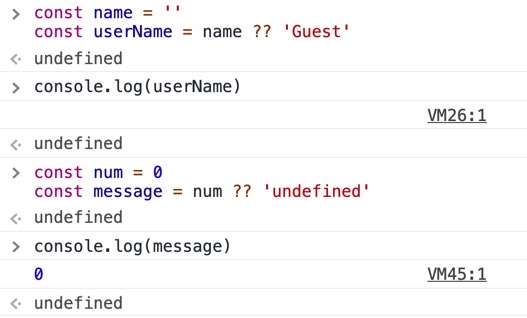

## 🔆Javascript ES11

이전에 전혀 겪어보지 못한 새로운 문법이다. 크게 2가지 이다.

옵셔널 체이닝은 정말 신박하다 라는 것을 느꼈고 널리시 콜리싱의 경우는 기존 OR 연산자 사용시 falsy 한 값 (빈 문자열, 0) 에 대한 처리를 어떻게 더 명확하게 해 주어야 할지 배울 수 있었다.

그럼 다시 시작!

## 🔆Optional Chaining

일단 예시 객체를 두개 띄워 놓는다.

```js
const person1 = {
  name: 'Mook',
  job: {
    title: 'S/W Engineer',
    manager: {
      name: 'Bob',
    },
  },
}

const person2 = {
  name: 'Bob',
}
```

person1 은 해당 사람의 이름 그리고 job 에 대한 내용과 또 그 안에 상사 (manager) 에 대한 정보가 담겨 있다. 하지만 person2 는 person2 의 이름에 대한 정보 외에는 어떠한 정보도 없다.

여기에서 만약 아래와 같은 함수를 구현하고 함수의 인자에 person1 과 person2 를 각각 넣어 실행하면 어떻게 될까?

```js
function printManager(person) {
  console.log(person.job.manager.name)
}

printManager(person1)
printManager(person2)
```

person1 을 파라미터로 넣어 실행한 함수 printManager 는 'Bob' 을 출력할 것이다.

하지만 person2 를 넣어 실행한 함수 printManager 는 manager 에 대한 정보가 존재하지 않기 때문에 Uncaught TypeError 를 일으킨다.

```js
Uncaught TypeError: Cannot read property 'manager' of undefined
at printManager (<anonymous>:2:26)
at <anonymous>:1:1
```

이러한 경우를 방지하기 위해 다음과 같은 방법들을 사용해 보았다.

### 1. if 문 (Ternary Operator) 의 사용

아래와 같은 코드로 중첩된 Operator 를 쓸 수도 있다.

```js
function printManager(person) {
  console.log(
    person.job
      ? person.job.manager
        ? person.job.manager.name
        : undefined
      : undefined
  )
}
```

하지만 코드의 가독성 측면에서 그렇게 좋은 방식은 아닌 것 같다.

### 2, AND (&&) 연산자의 사용

```js
function printManager(person) {
  console.log(person.job && person.job.manager && person.job.manager.name)
}
```

person 의 job 이 있다면 && 연산자의 다음으로 넘어가서 person 의 job 의 manager 가 있다면, 다시 다음 && 연산자로 넘어가서 person 의 job 의 manager 의 이름이 있는지 보고 최종적으로 매니저 이름을 출력하게 될 터이다.

하지만 코딩에서 중복을 좋아하지 않는 만큼 계속 person.job 으로 코드가 중복되어 가는 것을 볼 수 있다.

### 3. Optional Chaining

2와 같은 중복을 피하고자 이제 Optional Chaining 을 이용한다.

```js
function printManager(person) {
  console.log(person.job?.manager?.name)
}

printManager(person1)
printManager(person2)
```

신기하다.

## 🔆Nullish Coalescing Operator

기존 OR 연산자의 사용에 대해서 잠깐 다뤄보자면 Node.js 에서 환경변수 (process.env) 를 다룰 때, 혹은 시퀄라이즈를 사용해서 모델을 mysql 과 연결 했을 때 아래와 같은 코드를 본 기억이 있을 것이다.

(똑같은 코드는 아니고 비슷한 코드를 첨부..)

```js
let server = {
  env: process.env.NODE_ENV,
  port: process.env.PORT || 4000,
  ip: process.env.IP || '0.0.0.0',
  ...
  };
```

이 때 OR 연산자를 사용했다.

물론 보다 더 쉬운 예시를 작성해 보자.

```js
const name = 'mook'
const userName = name || 'Guest'
console.log(userName)
```

이러한 OR 이나 AND 연산자를 사용할 때는 '거짓:false' 의 특성을 조금 이해할 필요가 있다.

false 는 그 자체로 거짓이지만, ''(빈 문자열), 0(숫자), null, undefined 도 falsy 한 값으로 간주되어 지기 때문이다.

```js
const userName = name || 'Guest'
```

다시, OR 연산자 앞에 있는 name 이 false 일 때만 뒤에 있는 'Guest' 가 실행되는 성질이 있다.

그래서 아래와 같이 name 에 null 이 할당되거나 undefined 가 할당된다면 userName 은 'Guest' 가 찍힌다.

맞다.

```js
const name = null
const userName = name || 'Guest'
console.log(userName)
```

그런데 name 에 빈 문자열이나 0 이 할당된다면 어떨까? 그래도 Guest 가 찍힐 텐데 이것이 코드를 작성하는 의도대로 맞는 방법일까?

### 1. name 이 빈 문자열, 또는 0 일 때?

어떤 특정한 값이 null 이라면, 정해지지 않았다면 (undefined) 기본적인 값을 할당하도록 OR 연산자를 많이 썼는데

이처럼 name 이 null, undefined 인 경우 즉 아무런 것도 지정되지 않은 경우에만 "Guest" 를 출력하게 하고 싶은데

```js
const name = ''
const userName = name || 'Guest'
console.log(userName)
```

이렇게 문자열이 비어 있는 경우에도 false 로 간주되기 때문에 이 역시 "Guest" 가 할당되어 버린다.

즉, 사용자의 의도는 아무 이름도 쓰고 싶지 않은 것인데 이 경우에도 역시 "Guest" 가 할당이 되는 것이므로

바로 버그! 라 할 수 있다!


변수에 0 이 할당되는 아래의 경우도 마찬가지 이다.

```js
const num = 0
const message = num || 'undefined'
console.log(message)
```

이처럼 변수 num 이 숫자 0 으로 지정되어 있음에도 불구하고 message 의 출력은 undefined 가 나오게 되어 버린다는 것이다.

숫자 0 이 할당되었지만 0 은 false 로 간주되어 진다 해서 억울? 하게 뒤의 것인 undefined 가 할당된 것을 확인할 수 있다.

OR 연산자는 이러한 특성 때문에 잘 이해하고 사용해야 한다. 아니면 이러한 예외 들로 인해 고생할 수도 있을 거 같다.

### 2. OR 연산자를 개선해 좀 더 명확한 코드 작성하기

이제 Nullish Coalescing 를 사용한다. OR 연산자 대신 ?? 연산자를 사용하는 것이다.

```js
const name = ''
const userName = name ?? 'Guest'
console.log(userName)

const num = 0
const message = num ?? 'undefined'
console.log(message)
```


