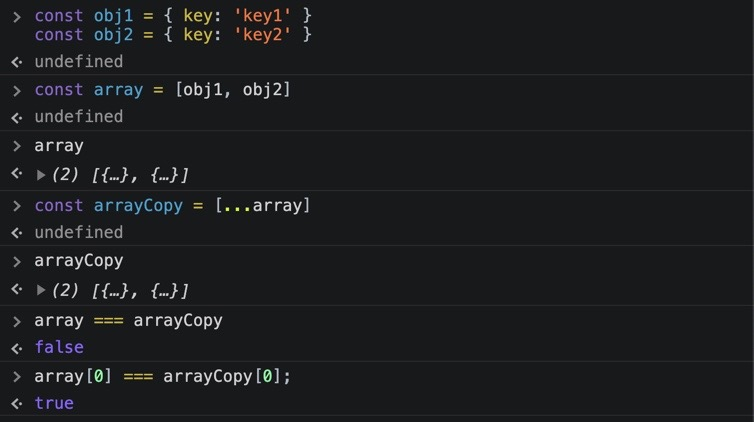
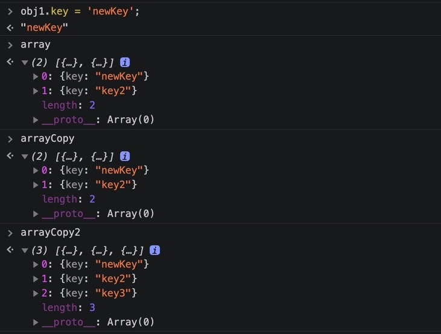
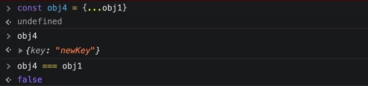
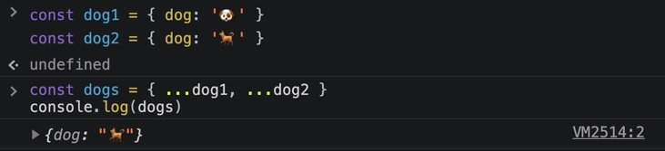

## 🔆Javascript ES6 문법 정리하기


리액트 프로젝트나 기타 알고리즘을 풀 때 사용했는데 뭔가 정리가 제대로 되지 않은 느낌이기에 공부 및 정리를 진행해 본다.

## 🔆Shorthand property names

```js
const name = 'mook'
const age = '25'

const mook2 = {
  name: name,
  age: age,
}
```

이처럼 key 와 value 의 이름이 동일한 경우에는 깔끔하게 하나로만 축약하여 작성이 가능하다.

```js
const name = 'mook'
const age = '25'

const mook3 = {
  name,
  age,
}
```

## 🔆Destruction Assignment

### 1. in Object

```js
const student = {
  name: 'Mook',
  level: 1,
}
```

객체의 키 값에 접근하기 위해서 거의 항상

```js
const name = student.name
const level = student.level
console.log(name, level)
```

이러한 식으로 직접 객체.key 로 접근해야 했었다. 그러나,

```js
const { name, level } = student
```

이렇게 object 의 키의 이름을 중괄호 안에 정의해 주면 student 객체에 있는 name 과 level 의 value 가 중괄호 안에다 정의한 것에 맞게 할당이 된다.

그런데 여기서 만약 name 과 level 이 아닌 다른 변수 명으로 정의해 주고 싶다면 어떻게 할까?

```js
const { name: studentName, level: studentLevel } = student
console.log(studentName, studentLevel)
```

이제 새로운 이름 (변수명) 으로 선언했기 때문에 해당 이름으로 접근할 수 있다.

### 2. in Array

Destructing 은 객체 뿐만 아니라 배열에서도 쓸 수 있다.

```js
const animals = ['🐶', '😸']
const first = animals[0]
const second = animals[1]
console.log(first, second)
```

이처럼 배열 내 값에 접근하기 위해 숫자 인덱스를 사용했지만,

```js
const [first, second] = animals
console.log(first, second)
```

배열에 들어 있는 순서에 맞게 첫번째 선언된 first 에는 강아지가, 두번째 선언된 second 에는 고양이가 순서대로 할당이 된다.

Destructiong 을 위해 object 에는 중괄호를, array 에는 대괄호를 사용해 주어야 한다.

## 🔆Spread Syntax

### 1. Array Copy

```js
const obj1 = { key: 'key1' }
const obj2 = { key: 'key2' }
const array = [obj1, obj2]
```

위의 코드 세번째 줄을 보면 array 는 오브젝트들을 담고 있다. 이 array 를 복사하려면 어떻게 해야 할까?

배열의 고차함수 map, forEach 를 사용할 수도 있지만은 spread syntax 로 간단하게 array 를 복사할 수 있다.

```js
const arrayCopy = [...array]
```

그리고 기존 배열을 복사하면서 새로운 값도 추가하고 싶다면 아래와 같이 추가해 줄 수도 있다.

```js
const arrayCopy2 = [...array, { key: 'key3' }]
```

이처럼 간단하게 array 를 복사할 수 있는데 짚고 넘어갈 점이 있다.



두 배열 array 와 arrayCopy 는 모양은 같지만 서로 다른 주소값을 참조하기 때문에,

```js
array === arrayCopy
```

false 가 된다.

그런데 이것 보이는가?

```js
array[0] === arrayCopy[0]
true
```

오브젝트를 가리키는 변수는 실제로 object 를 담고 있는 것이 아니라 object 가 들어 있는 메모리의 주소값을 가지고 있다.

```js
const obj1 = { key: 'key1' }
const obj2 = { key: 'key2' }
```

spread syntax 로 복사해온 object 들은 그래서 실제로 동일한 주소값을 가리키고 있다.

그 말인즉슨 여기서

```js
obj1.key = 'newKey'
```

로 obj1 의 key 밸류를 변경하게 되면 지금까지 복사해 놓은 배열 내의 해당 키가 모두 바뀌게 된다.



spread 는 object 가 가리키는 주소의 참조값만을 복사해서 가져오므로 원래의 object 를 변경하게 되면 이렇듯 전부 영향이 가게 된다.

### 2. Object copy

위의 배열 뿐만 아니라 object 도 Copy 할 수가 있다.

```js
const obj4 = { ...obj }
console.log(obj4)
```



복사되어 지지만 둘 사이의 주소값이 다르므로 obj1 === obj4 가 false 라는 점에 유의해야 한다.

### 3. 서로 다른 배열을 합치는 Array concatenation

```js
const fruits1 = ['🍑', '🍓']
const fruits2 = ['🍌', '🥝']
```

이 두 배열을 하나로 병합할 수 있다.

첫 번째 방법으로는 concat 메소드를 사용하는 것이지만,

```js
fruits1.concat(fruits2)
// 결과 : [('🍑', '🍓', '🍌', '🥝')]
```

spread operator 를 통해 다음과 같이 간단하게 두 배열을 병합할 수 있다.

```js
const fruits = [...fruits1, ...fruits2]
// 결과 : fruits [('🍑', '🍓', '🍌', '🥝')]
```

### 4. 서로 다른 Object를 합치기 (Object merge)

```js
const dog1 = { dog1: '🐶' }
const dog2 = { dog2: '🐕' }

const dogs = { ...dog1, ...dog2 }
console.log(dogs)
// {dog1: "🐶", dog2: "🐕"}
```

만약 dog1 과 dog2 의 객체 내 키가 동일 (dog) 하다면,

```js
const dog1 = { dog: '🐶' }
const dog2 = { dog: '🐕' }
```

오브젝트를 합쳤을 때, 제일 나중에 오는 dog 가 제일 앞에 있는 dog 를 최종적으로 덮어씌우게 될 것이다.



## 🔆Default Parameters

만약 인자가 필요한 함수를 호출할 때 괄호 안에 아무런 인자를 전달하지 않는다면 어떻게 될까?

아마 undefined 가 출력될 것이다.

그래서 아래와 같이 코드를 작성하게 되는데,

```js
function printMessage(message) {
  if (message === null) {
    message = 'default message'
  }
  console.log(message)
}
```

이렇게 쓰기 보다는 해당 함수의 인자 다음에 초기값을 지정해 준다면 아주 간단히 작성해 줄 수 있다.

```js
function printMessage(message = 'default message') {
  console.log(message)
}

printMessage('hello') // 'hello' 가 출력
printMessage() // 'default message' 가 출력
```

## 🔆Ternary Operator

이것은 리액트에서 굉장히 많이 사용한다. if 문의 축약 삼항 연산자.

이게 없다면 아래와 같이 사용할 것이다.

```js
const isCat = true
let component
if (isCat) {
  component = '고양이'
} else {
  component = '강아지'
}
console.log(component)
```

하지만 한 줄로 끝낼 수 있는데 굳이 위의 코드를 고집할 필요가 없다. 리액트에서 아주 많이 사용해왔다.

```js
const isCat = true
const component = isCat ? '고양이' : '강아지'
```

## 🔆Template Literals

이 또한 익숙하다. 원래 문자열을 조합할 때 '+' 연산자를 사용하는데 공백이라든지 신경 쓰고 할게 많아 기존의 '' 으로는 지저분함을 느낀적이 있다.

템플릿 리터럴을 통해 문자열을 조합하면 작성할 때에도 편하고 가독성이 좋다.

```js
const weather = 'sunny'
const temperature = '14deg'

console.log(`Today weather is ${weather} and temperature is ${temperature}`)
```

내일은 ES11 문법의 특이사항을 학습하고 정리해 보아야 겠다.
