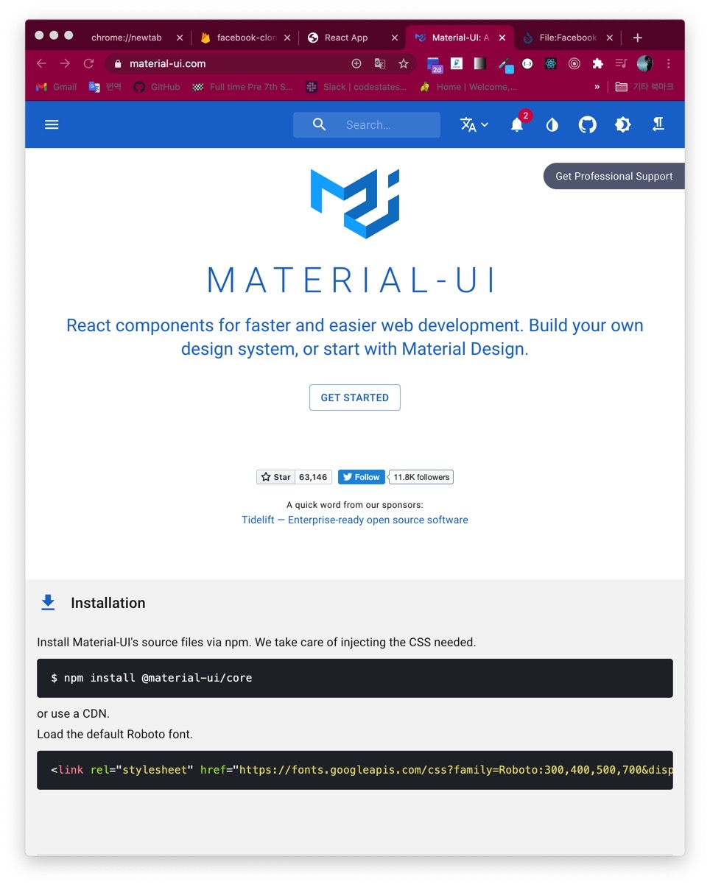
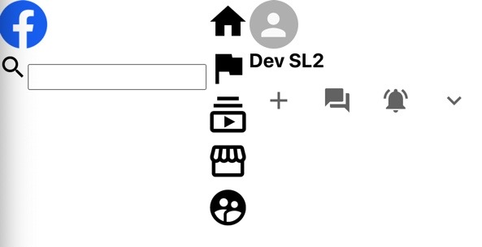
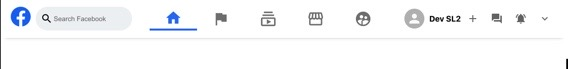
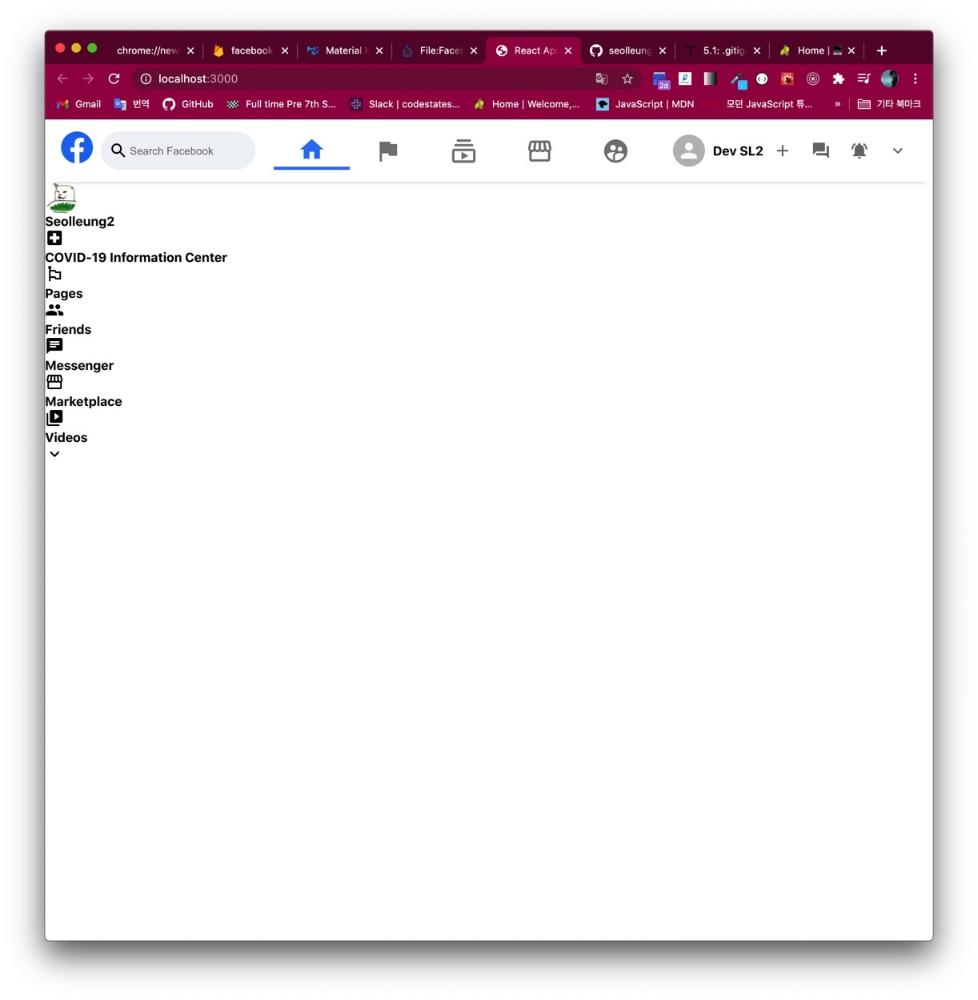
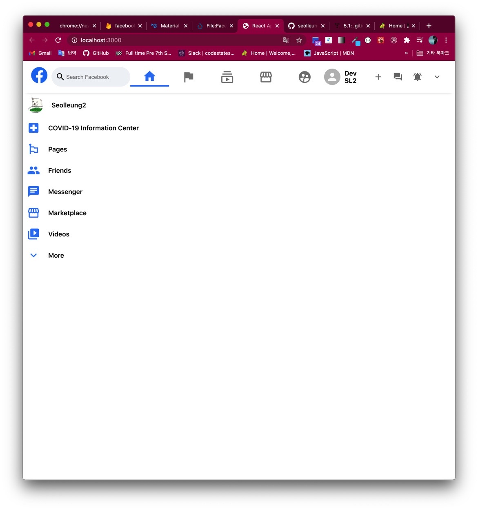
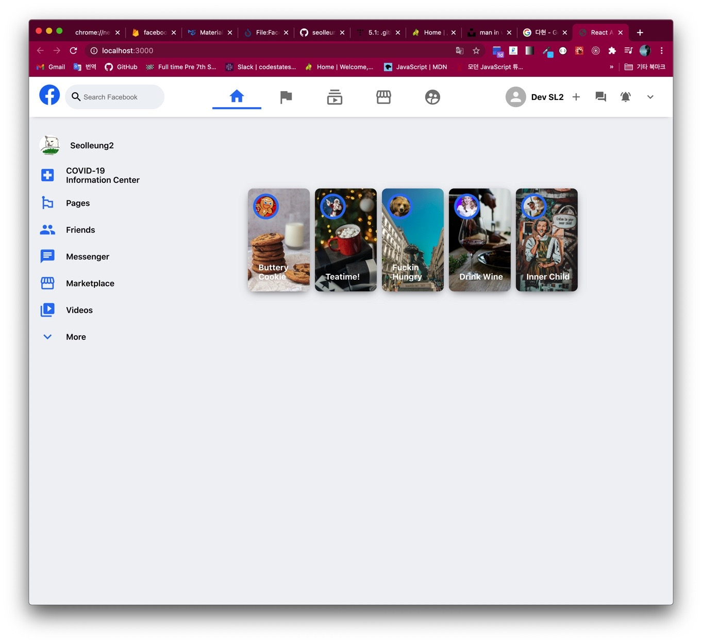
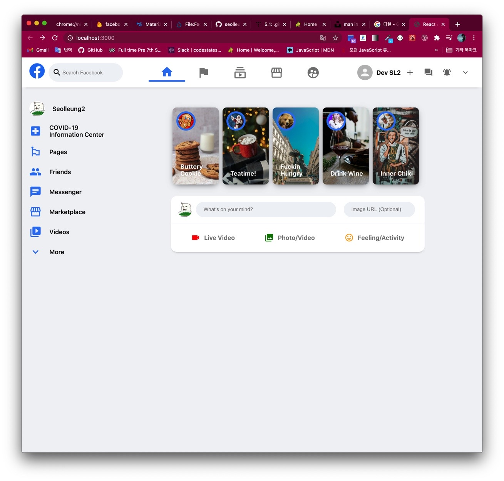
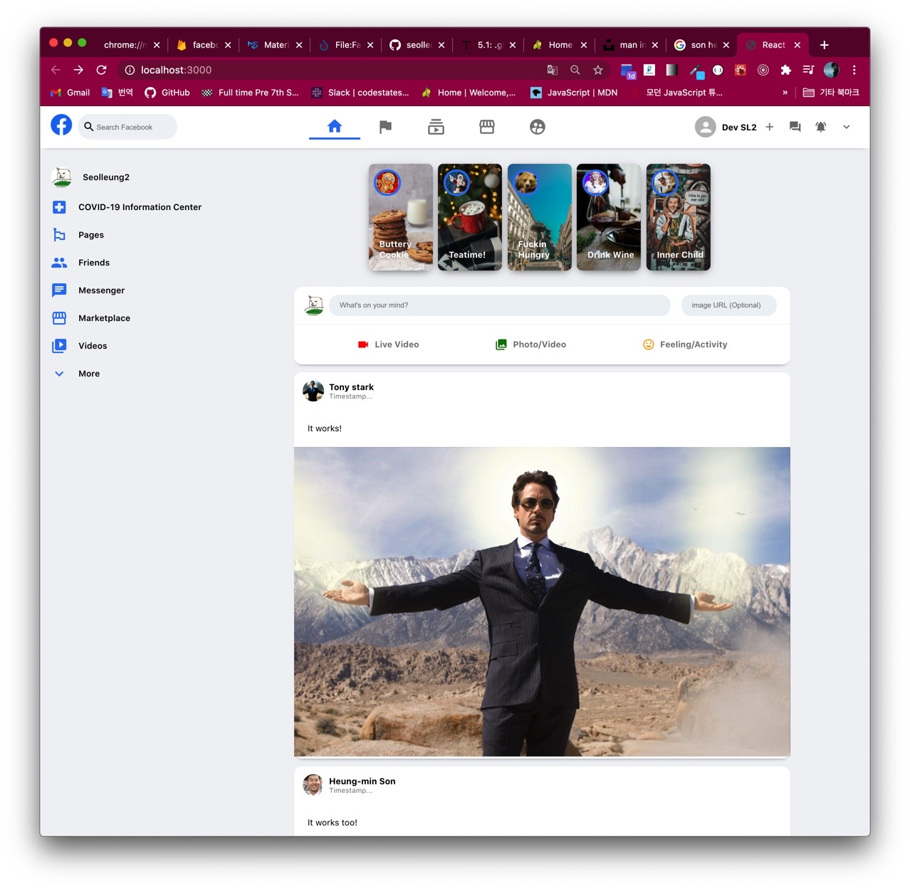

# 👩🏻‍🦳토요일 ~ 일요일 현재까지 과정 요약

## 1. 컴포넌트 구성하기

```jsx
function App() {
  return (
    <div className="app">
      {/* Header */}
      {/* App body */}
      <div className="app__body">
        {/* Sidebar (left side)*/}
        {/* Feed (in the Center) */}
        {/* Widgets (right side)*/}
      </div>
    </div>
  )
}
```

className 짓기 : BEM naming convention

## 2. 아이콘을 쉽게 쉽게 가져다 쓸 수 있는 Material UI



material-ui/core

material-ui/icons

모두 npm 으로 설치한다.

```jsx
import React from 'react'
import './Header.css'
import SearchIcon from '@material-ui/icons/Search'
import HomeIcon from '@material-ui/icons/Home'
import FlagIcon from '@material-ui/icons/Flag'
import SubscriptionsOutlinedIcon from '@material-ui/icons/SubscriptionsOutlined'
import StorefrontOutlinedIcon from '@material-ui/icons/StorefrontOutlined'
import SupervisedUserCircleIcon from '@material-ui/icons/SupervisedUserCircle'

import { Avatar, IconButton } from '@material-ui/core'
import AddIcon from '@material-ui/icons/Add'
import ForumIcon from '@material-ui/icons/Forum'
import NotificationsActiveIcon from '@material-ui/icons/NotificationsActive'
import ExpandMoreIcon from '@material-ui/icons/ExpandMore'
```

그럼 이렇게 컴포넌트 파일 상단에 불러와 놓고 내맘대로 갖다 쓸 수가 있다.

## 3-1. Header 컴포넌트

Header.js, Header.css 파일 동시 생성

import, App.js 연결

```jsx
function App() {
  return (
    <div className="app">
      {/* Header */}
      <Header />

      {/* App body */}
      <div className="app__body">
        {/* Sidebar (left side)*/}
        {/* Feed (in the Center) */}
        {/* Widgets (right side)*/}
      </div>
    </div>
  )
}
```

Header.js 에서 jsx 구성은 헤더도 마찬가지로 왼쪽 가운데 오른쪽 으로 나눈다.



css 가 시간을 오래 잡아먹는데 시간 가는줄 모른다는게 장점일까 단점 일까?

## 3-2. Header.css 스타일링



## 4-1. Sidebar 컴포넌트

Sidebar 통째 하나 그리고 각각의 SidebarRow 가 필요하다.

css 파일까지 그럼 총 네 개의 파일을 만든다. 연동은 지겹게 했으니 설명 ㄴ ㄴ

아이콘 import 후 사용.

### Sidebar.js

```jsx
function Sidebar() {
  return (
    <div className="sidebar">
      <SidebarRow
        src="https://dev-seolleung2.netlify.app/static/c874936a9ad595b612ce4943624bb704/a12fc/profile.png"
        title="Seolleung2"
      />
      <SidebarRow
        Icon={LocalHospitalIcon}
        title="COVID-19 Information Center"
      />
      <SidebarRow Icon={EmojiFlagsIcon} title="Pages" />
      <SidebarRow Icon={PeopleIcon} title="Friends" />
      <SidebarRow Icon={ChatIcon} title="Messenger" />
      <SidebarRow Icon={StorefrontIcon} title="Marketplace" />

      <SidebarRow Icon={VideoLibraryIcon} title="Videos" />
      <SidebarRow Icon={ExpandMoreOutlinedIcon} title="More" />
    </div>
  )
}
```

### SidebarRow.js

```jsx
function SidebarRow({ src, Icon, title }) {
  return (
    <div className="sidebarRow">
      {src && <Avatar src={src} />}
      {Icon && <Icon />}
      <h4>{title}</h4>
    </div>
  )
}
```

## 4-2. SidebarRow.css, Sidebar.css



오 제법...

오..

오오.. 과정 시작 전에 겉핥기로 해본 css 수준은 진짜 못봐주는 수준인데..

flex 사용과 세트메뉴인 justify-content, align-items 그리고

position relative, absolute (부모 내에서 상대적으로 움직이게)

몇 가지만 적당히 알고 있으면 흉내는 내 볼 만하다.

media 쿼리 이런 건 뭔지 몰라서 ㅠ 응 안써 버려~



## 5-1. Feed Component

```jsx
function App() {
  return (
    <div className="app">
      <Header />
      <div className="app__body">
        <Sidebar />
        <Feed />
        {/* Widgets (right side)*/}
      </div>
    </div>
  )
}
```

근데 피드도 여러 갈래로 쪼개진다.

```jsx
function Feed() {
  return (
    <div className="feed">
      <StoryReel />
      {/* 사용자들의 스토리가 미니 사진으로 뜨게됨 */}
      <MessageSender />
      {/* 페이스북 글 작성 컴포넌트 */}
      <Post />
      <Post />
    </div>
  )
}
```

## 5-2. StoryReel 컴포넌트

이런식으로 일단 하드코딩해서 집어 넣어 놓는다.

```jsx
function StoryReel() {
  return (
    <div className="storyReel">
      <Story
        image="https://images.unsplash.com/photo-1598977801327-b21fe652e851?ixlib=rb-1.2.1&ixid=MXwxMjA3fDB8MHxwaG90by1wYWdlfHx8fGVufDB8fHw%3D&auto=format&fit=crop&w=1875&q=80"
        profileSrc="https://w.namu.la/s/0000c5b4bb2599e5eee77d47dcf0fedad216f845a398e85574d3a0d403599624295e628d0d1ad033fb3356fddf0bc872d838ef9a020752a96832a06f486ddc8541393b86920bc6aa7c2508ada736196a2ceda7279e6e19cb9ea28c2a63b8d19d"
        title="Buttery Cookie"
      />
      {/* Story */}
      {/* Story */}
      {/* Story */}
      {/* Story */}
    </div>
  )
}
```

## 5-3. Story 컴포넌트

Avatar 진리의 아바타...

```jsx
function Story({ image, profileSrc, title }) {
  return (
    <div style={{ backgroundImage: `url(${image})` }} className="story">
      <Avatar className="story__avatar" src={profileSrc} />
      <h4>{title}</h4>
    </div>
  )
}
```

## 5-4. Story.css, StoryReel.css



## 6-1. MessageSender 컴포넌트

여기에서 react hooks 의 setState 를 사용해 보고 onClick, onChange 함수를 적용해 보았다.

인라인 스타일을 작성하려면 curly bracket 을 이중으로 사용해 준다.

```jsx
function MessageSender() {
  const [input, setInput] = useState('')
  const [imageUrl, setImageUrl] = useState('')
  const handleSubmit = event => {
    event.preventDefault()
    // input value 가 써지고 버튼을 누르면 글씨가 홀랑 날라가지 않게 한다.
    setInput('') // 그것은 여기서 컨트롤 하게 해준다.
    setImageUrl('')
  }
  return (
    <div className="messageSender">
      <div className="messageSender__top">
        <Avatar
          src={`https://dev-seolleung2.netlify.app/static/c874936a9ad595b612ce4943624bb704/a12fc/profile.png`}
        />
        <form>
          <input
            value={input}
            onChange={e => setInput(e.target.value)}
            className="messageSender__input"
            placeholder={`What's on your mind?`}
          />
          <button onClick={handleSubmit} type="submit">
            Hidden submit
          </button>
        </form>
      </div>
      <div className="messageSender__bottom">
        <div className="messageSender__option">
          <VideocamIcon style={{ color: 'red' }} />
          <h3>Live Video</h3>
        </div>
      </div>
    </div>
  )
}
```

## 6-2. MessageSender.css 스타일링



플렉쓰와 마진 보더의 적절한 배합... 마우스 가지다 댈때 효과인 hover..

```css
.messageSender__bottom {
  display: flex;
  justify-content: space-evenly;
}

.messageSender__option {
  display: flex;
  padding: 20px;
  align-items: center;
  color: gray;
  margin: 5px;
}

.messageSender__option > h3 {
  font-size: medium;
  margin-left: 10px;
  cursor: pointer;
}

.messageSender__option:hover {
  background-color: #eff2f5;
  border-radius: 20px;
}
```

## 7-1. Post 컴포넌트 작성, Feed 와 props 연동하기

Feed.js 에서 일단 Post 컴포넌트 몇개가 들어가 있다 치고서..

Post 컴포넌트의 props 를 하드코딩 해 넣는다.

흥민쏜..

```jsx
<Post
  profilePic="https://upload.wikimedia.org/wikipedia/commons/c/c1/Team_Korea_Russia_WorldCup_02_%28cropped%29.png"
  message="It works too!"
  timestamp="This is a timestamp"
  username="Heung-min Son"
  image="https://i.guim.co.uk/img/media/75726284c42da8e641482ed5197621c33e602dd5/0_177_3274_1965/master/3274.jpg?width=1200&height=900&quality=85&auto=format&fit=crop&s=429d132aeedee7f6215c0cd376ba51fb"
/>
```

profilePic, message, timestamp, username, image 라는 props 를 설정해 놓았다.

이제 Post.js 를 생성하고 위의 속성들을 불러와 넣자.

## 7-2. Post.css 스타일링

플렉스로만 조져줘도 제법 그럴싸하다.

```css
.post__options {
  padding-top: 10px;
  border-top: 1px solid lightgray;
  display: flex;
  justify-content: space-evenly;
  font-size: medium;
  color: gray;
  cursor: pointer;
  padding: 15px;
}

.post__option {
  display: flex;
  align-items: center;
  justify-content: center;
  padding: 5px;
  flex: 1;
}
```

justify-content 는 space-between 등등 아무튼 속성은 많은데 뭐가 뭔지 모르면 다 해보고 적절한거 고르면 된다.



## 8. Widgets 컴포넌트 and css

화면 제일 오른쪽의 페이스북 위젯 컴포넌트이다.

이건 사실 잇어보이지만..

facebook developer 들어가서 페이지 url 에 따른 타임라인 iFrame 코드를 긁어와서 높이와 너비 를 수정하고,

인라인 스타일에 맞게 코드를 컬리 브라켓으로 수정만 해주면 땡이다.


# 👋👋👋👋👋👋👋👋👋👋👋👋👋👋👋👋👋👋👋👋👋👋👋👋👋👋👋👋👋👋👋👋👋👋👋👋👋👋👋👋👋
