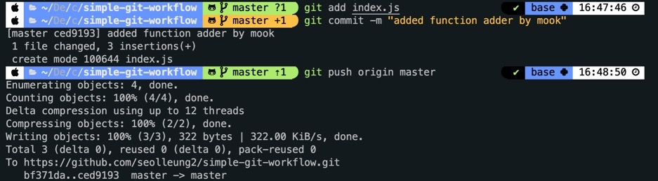
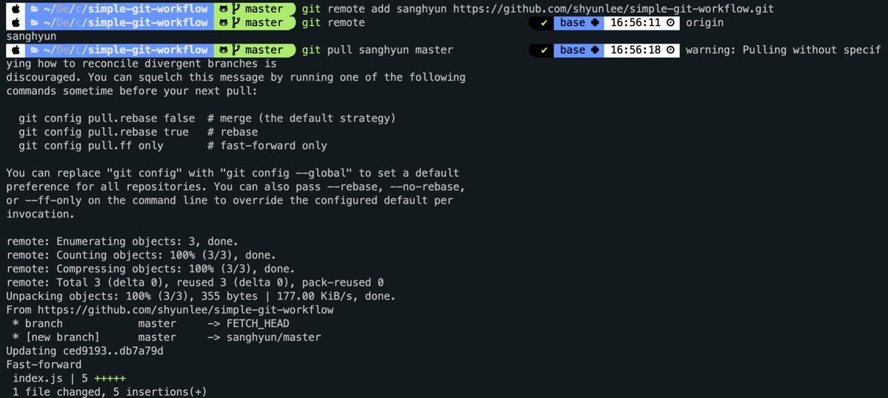
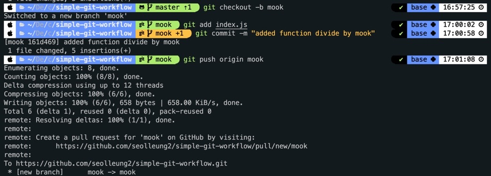
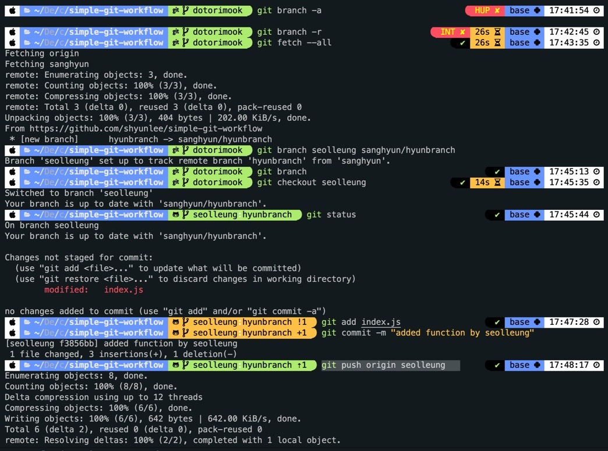
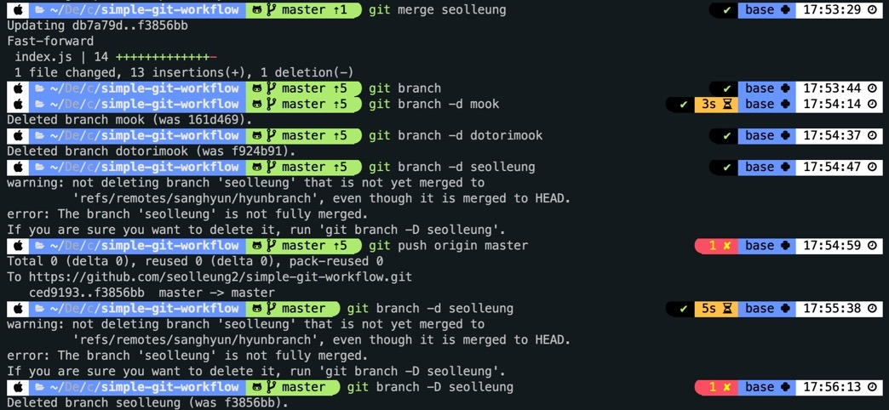

## 🎬시작하기 전에

페어님과 여섯시를 넘기면서도 브랜치를 만들어 페어님의 브랜치에 접근하는 방법을 알게 되었다.
페어님 덕에 몰랐던 부분을 알게 되어 신기함을 느꼈는데 금방 까먹을까봐 황급히 블로그를 작성한다.

아마 내가 알게 된 내용이 좀 틀린 부분이 있더라도 학습하면서 수정하면 되니 크게 개의치는 않는다.

그리고 레슨을 통해 깃 플로우 연습하는 심플 페어 프로그래밍 하는 방법을 간단히 적어보겠다.

## 🥜Basic Git Workflow - 1.

1. codestates/simple-git-workflow 로 가서 fork, 그리고 개별 Local 에 clone 해오기.

2. pair 의 repo 와 나의 local 을 연결하기.

```js
git remote add pair <Repo URL for pairs fork>

git remote -v
```

3. 드라이버를 먼저 맡은 사람이 코드를 작성하고 커밋을 한다.
   이후 드라이버 본인의 깃허브 repo 에 push 한다.

```js
git push origin master (or other branch name)
```

4. 드라이버 / 네비게이터 역할을 바꾼다.
   바뀐 드라이버는 직전에 작성된 페어의 코드를 자신의 로컬로 가져온다.

```js
git pull pair master (or other branch name)
```

5. 이제 새로운 커밋을 만들고 자신 (드라이버) 깃허브 repo 에 push 를 한다.

```js
git push origin master (or other branch name)
```

6. 또다시 드라이버와 네비게이터의 룰을 바꾸고 바뀐 드라이버는 직전에 작성된 코드를 자신의 로컬로 가져온다.

7. 과정을 반복 진행한다.
   push 는 항상 자신의 repo 에, pull 을 땡겨올 때는 pair 의 repo 에서 해야 한다는 것을 기억!

## 👯‍♂️페어 프로그래밍 1.

### 1-1. 일반적인 깃 커밋과 푸쉬.

처음에 각자 fork 및 clone 해온 뒤 내용물을 확인해 보니, README.md 파일이 하나 있었다.
우리는 이것을 건들지 않고 index.js 라는 파일을 만들고 그 안에 사칙 연산 함수를 번갈아 만들어 넣으면서 진행했다.

맨 먼저 더하기 함수를 넣어 보았다.

```js
function adder(a, b) {
  return a + b
}
```

그리고 내 repo 에 push. 여기까지는 일반적이다.



그리고 페어님이 내 레포와 연결하고 다시 push 를 했다.

### 1-2. pair 의 repo 와 나의 local 을 연결하기.

여지껏 해본 적이 없어서 살짝 당황했지만 페어님께서 당황하지 않고 컨트롤 해주셨다.

일단 가이드 된대로의 방법은

```js
git remote add pair <Repo URL for pairs fork>

git remote -v
```

인데 아래와 같은 화면으로 진행했고 뭔 뜻인지는 모르지만 아무튼 페어님의 local 에 저장된 사항을 가져왔다.



이제 이 상태에서 위의 과정을 다시 반복하지 않고 git branch 를 생성한 뒤 branch 로 작업 공간을 옮겨 작업한 뒤 올려 보기로 했다.

## 🥜Basic Git Workflow (branch) - 2.

git branch 는 말 그대로 원본에서 가지치기 된 분리된 작업 영역이라고 할 수 있다.


branch 는 현재 작업 공간을 베이스로 만들어 진다. 그러므로 현재 내가 작업하는 경로가 어디에 있는지 확인해야 한다.

git checkout <브랜치 이름> 을 통해 해당 이름의 branch 로 이동, 즉 작업 공간을 옮길 수 있다.

그리고

1. 해당 branch 를 생성하며,
2. 해당 branch 로 작업 공간을 이동하게 해주는 커맨드는 아래와 같다.

```js
git checkout -b <만들고 싶은 브랜치명>
```

원본을 베이스로 하는 다른 브랜치를 만들고 싶다면,

1. 베이스로 하고 싶은 브랜치로 작업 공간을 옮긴다.

```js
git checkout 원본
```

2. 브랜치를 생성한다.

```js
git checkout -b 기능2
```

## 👯‍♂️페어 프로그래밍 2.

### 2-1. branch 생성하기



git checkout -b mook 으로 "mook" 이라는 branch 를 생성했고, 동시에 master 에서 "mook" 이라는 branch 로 작업 공간을 옮겼다.

그리고 나눗셈 함수를 추가했다. 페어님의 뺄셈 함수와 더불어 내가 하면 세번째 작업 이다.

```js
// add divide by mook, dotorimook
function divide(a, b) {
  return a / b
}
```

커밋 메시지를 남겨 주고,
git push origin mook 을 통해 변경 사항을 "mook" 이라는 branch 에 변경사항을 push 했다.

이제 궁금함이 생긴다.

공동 작업자가 위처럼 branch 를 만들어 push 를 했을 때 그 변경 사항을 내가 가져올 방법은 무엇일까?

브랜치를 하나 더 만들어서 본래 포크받은 저장소에 merge 도 해보고 이런 저런 시도를 페어님과 해보았으나 되지 않았다.

### 2-2. 원격 레포지토리 브랜치를 로컬브랜치에 checkout하고 commit, push 하기.

출처 : https://lucidmaj7.tistory.com/161

위 블로그의 3번째 내용을 보고 따라 한 끝에 페어님이 push 한 원격 repo branch 를 내 로컬 브랜치로 가져올 수 있었다.

과정은 다음과 같다.

```js
// 1. 로컬과 원격 저장소 모두의 branch list를 볼 수 있게 하기.
git branch -a

// 2.  원격 저장소의 branch list를 볼 수 있게 하기.
git branch -r

// 3. 서버에는 존재하지만, 로컬에는 아직 없는 데이터를 받아와서 저장한다.
git fetch --all

// 4. 페어님의 원격 repo branch 를 내 로컬 브랜치로 가져오기.
git branch seolleung sanghyun/hyunbranch

// 5. 해당 로컬 브랜치로 이동.
git checkout seolleung

// 6. 코드를 작업해서 저장하고 커밋 및 푸시하기.
git add index.js
git commit -m "added function by seolleung"
git push origin seolleung

```



내 로컬 브랜치에 페어님의 원격 repo branch 를 가져와서 추가로 덧붙여 코드를 작성했고 그 다음은?

마스터 브랜치에 모든 변경 사항을 병합 (merging) 해 보자!

### 2-3. 완료된 branch 코드 작업을 merge 하기

마스터 브랜치에 그간 브랜치 에서의 작업 사항을 모두 반영하기 위해 다음과 같이 진행한다.

```js
// 1. 마스터 브랜치로 전환하기.
git checkout master

// 2. 병합 (merge) 하기 (최종 모든 코드의 변경사항을 담은 branch 는 seolleung)
git merge seolleung

// 3. push 하기.
git push origin master

// 4. branch 지워버리기.
git branch -d mook
git branch -d dotorimook
git branch -D seolleung
// 아래는 대문자 D 를 써서 지웠다.

```

과정을 캡처해 보았다.



## 느낀 점

아직 충돌 상황을 만들어 보지는 못했다. 어떤 때에 충돌 상황을 야기 하는지 영상을 보면서 다시 보고 내일 페어님과 진행할 것이다.

내가 이제 할 수 있는 방법은

1. 작성한 내 블로그를 다시 읽고 오늘 무엇을 했는지 인지하고,

2. 관련 사이트나 페어님이 보내주신 유튜브 영상을 보고 재학습하기

https://git-scm.com/book/ko/v2

https://rogerdudler.github.io/git-guide/index.ko.html

인데, 일단 머리가 너무 터질것 같으므로 1하고 유튜브 영상을 보는 것으로 오늘 일과를 마무리해야 겠다.
