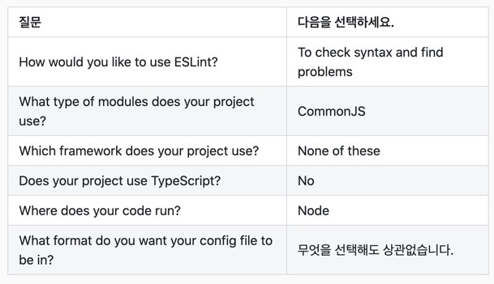
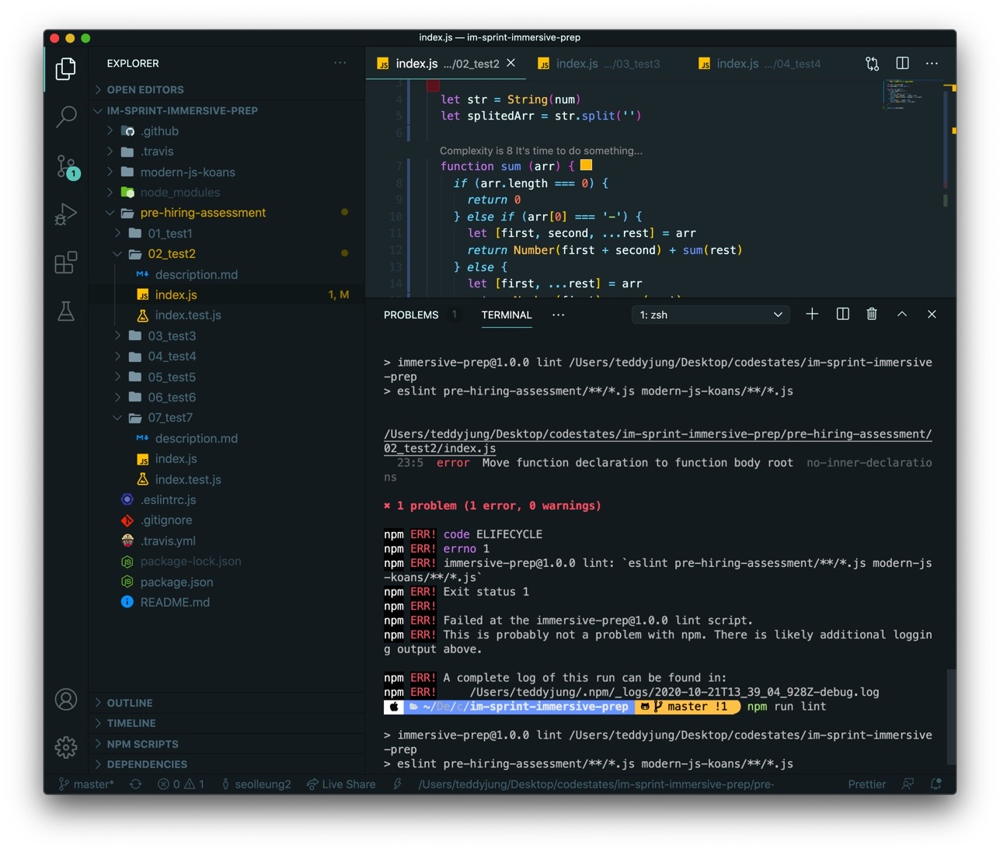
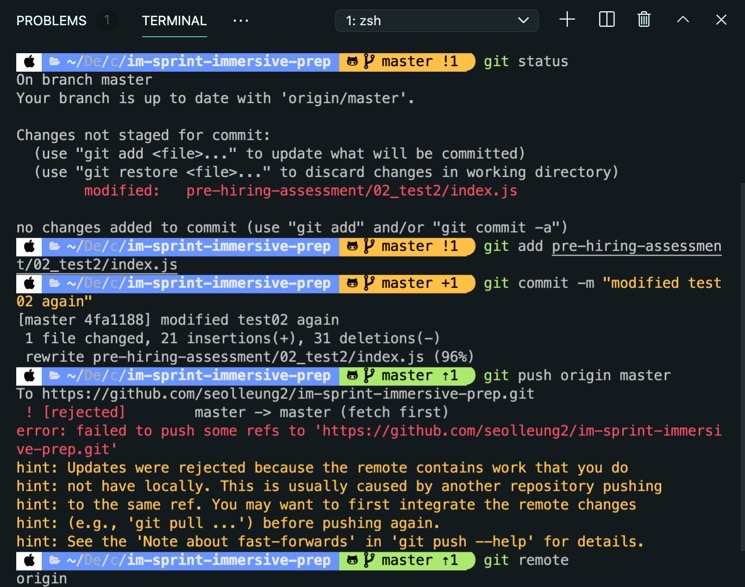
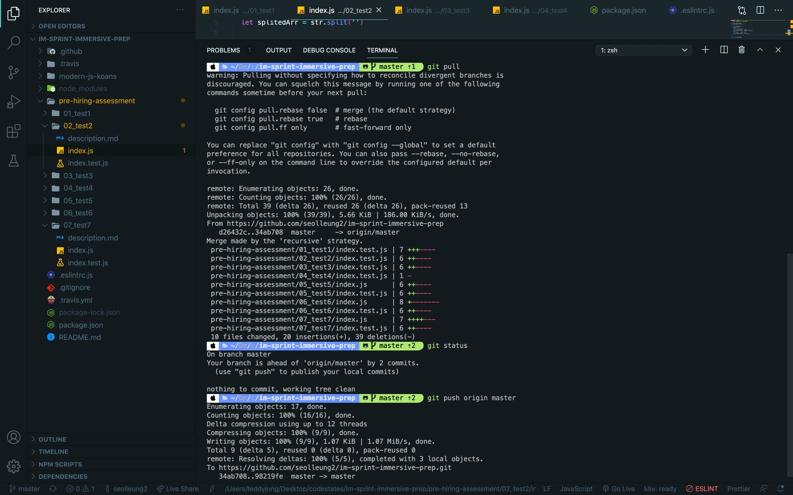

## 🎉들어가기에 앞서

어제 this 키워드나 call, apply, bind 를 학습하고 머리가 얼얼한 느낌에서 오늘 HA 과제를 ESlint 를 사용해 리팩토링 하고 깃허브로 올리는 스프린트를
진행했다.

페어님과 추가 시간 까지 함께 해서 문제를 해결해서 끝내 과제를 제출해서 뿌듯한 느낌이다.
오늘의 과정을 잊지 않고 오래 기억하기 위해 블로그를 남겨본다.

## 🧚‍♀️과제의 목적

어제 포크 및 클론해온 프로젝트에서 pre-hiring-assessment 디렉토리를 통해 프리 코스 시험에 제출한 HA 코플잇 7문제를 ESlint 를 가지고 리팩토링 하고
여기에 추가로 페어와 git simple workflow 를 배웠던 것을 적용해서 서로 역할을 바꾸어 가며 깃허브에 올린 기록을 남기고 최종 PR 하는 과제 이다.

## 😉과정 1. 프로젝트 내 package.json 확인하기

단축어와 단축어가 기능하는 scripts 부분을 보면 urclass 에 적혀있던 lint 가 적혀 있고 더 보면 eslint.. 하면서 실행되는 부분에 작성되어 있다.
하지만 devDependency 를 보면 eslint 가 없는 것으로 보아 설치가 되어 있지 않다.

이제 이것을 설치해야 한다.

```js
// 기억하고 넘어가기!
dependency 는 프로젝트가 돌아가기 위해 반드시 필요한 모듈들의 명세.

devDependency 는 실제 프로젝트 동작에 직접적인 영향을 주지는 않지만,
개발하는 환경에서 필요하거나 도움을 주는 모듈들의 명세 이다.
```

## 🖥과정 2. ESlint 설치

https://eslint.org/docs/user-guide/getting-started

공식 문서 링크를 통해 설치를 진행했다.
Linter 는 코드의 띄어쓰기나 줄바꿈 등의 규칙들을 맞추는 데에 도움이 된다는 모듈이다.

```js
// 1. ESLint 는 npm 앱스토어에서 설치한다.
npm install eslint --save-dev
// save dev 는 package.json 의 devDependency 에 저장하겠다는 뜻.

// 2. 구성 파일 설정을 위해 다음과 같은 명령어를 터미널에 입력한다.
npx eslint --init
```

그러면 터미널에 질문이 나오고 그것을 아래와 같이 선택해서 진행했다.


그렇게 완료 되면 프로젝트 내에 .eslintrc.js 또는 .eslintrc.json 와 같은 설정 파일이 만들어 진다.

설정 파일은 아래와 같이 생겼다.

```js
module.exports = {
  env: {
    commonjs: true,
    es2021: true,
    node: true,
    mocha: true, // 원래는 없었는데 lint 에게 mocha 를 사용하고 있는 환경이라는 것을 알려주었다!
    browser: true,
  },
  extends: 'eslint:recommended',
  parserOptions: {
    ecmaVersion: 12,
  },
  rules: {},
}
```

extends: 'eslint:recommended', 로 미루어 보아 느낌상 eslint 에서 추천하는 기본 설정이 세팅되었음을 짐작할 수 있다.
위의 코드처럼 처음에 rules 부분이 비어 있다.

여기는 기본설정 알파 플러스 내가 정의한 설정이 ESlint 검사할 때 없거나 틀리다면 error 또는 경고 혹은 무시를 정의할 수 있는 곳이다.

```js
"rules": {
        "semi": ["error", "always"],
        "quotes": ["error", "double"]
    }
```

위를 예시로 보면 semi 콜론 빼먹으면 항상 에러를 일으키고, quotes 는 더블 코트를 쓰지 않으면 에러를 일으키는 것을 의미한다.

실제 저렇게 하면 오류가 엄청 나기 때문에 넣지 않았다.

## 👀과정 3. ESlint 로 오류 해결하기

이제 npm run lint 를 터미널에 치면 무수한 에러 메시지를 확인할 수 있는데, 나의 경우는 코딩 컨벤션을 지키지 않은 경우의 에러 보다는,

```js
error  'test4' is defined but never used          no-unused-vars
```

이런 에러가 대부분이였다. 그래서 검색해보니 이런 경우는 함수 또는 변수가 선언만 되고 사용이 되지 않은 경우에 띄우는 에러이므로
단순 경고로 바꾸거나 에러를 띄우지 않게 할 수 있다고 했다. 그래서 찾아봤다.

.eslintrc.js 설정 파일에서 rules 를 아래와 같이 수정했다.

```js
module.exports = {
  env: {
    commonjs: true,
    es2021: true,
    node: true,
    mocha: true,
    browser: true,
  },
  extends: 'eslint:recommended',
  parserOptions: {
    ecmaVersion: 12,
  },
  rules: {
    'no-unused-vars': 0,
  },
}
```

그리고 npm run lint 를 통해 오류를 해결해 보았다.



## 👋과정 4. 본격 HA 코드 리팩토링

아래와 같이 엊그제 배운 사항을 적용하면서 페어님과 리팩토링 하는 과정을 거쳤다.
내가 작성한 코드에 비해 페어님의 코드가 짧고 가독성이 좋아서 페어님의 코드를 위주로 진행했다.

내가 페어님에게 도움을 드릴 수 있었던 코드는 아이러니 하게도 7번 이였다.

- 구조 분해 할당 (Destructing assignment)
- 전개 연산자 (Spread operator)와 나머지 파라미터 (Rest parameters)
- 템플릿 리터럴 (Template literals)
- 화살표 함수 (Arrow functions)
- for ... of 반복문

## 🌳과정 5. Git Workflow 티키타카

https://dev-seolleung2.netlify.app/development/Git%20WorkFlow/

위의 링크의 "Basic Git Workflow - 1." 부분을 따라 하면서 진행했어야 되는 게 정석 이지만

본의 아니게 페어님과 나는 각자 클론받은 프로젝트에서 페어님 따로 나 따로 자신만의 리팩토링 코드를 넣고 커밋 푸시를 완료 한 상태 였다.

원래대로라면 각자 클론받은 상태에서 드라이버 한 명이 문제 하나를 리팩토링 작업해서 푸시하면, 다음 바톤을 이어받는 사람이 이전 드라이버의 해당 저장소를 리모트 해서 pull 로 가져온 다음 역할을 바꾸어 진행했어야 했는데 말이다.

하지만 재밌는 걸 시도해 볼 수 있었다.

그것은 바로 페어님에게 내 레포에 설정 쓰기 권한을 주는 것이다.

반대로 페어님도 나에게 설정 쓰기 권한을 주어야 한다.

1. 나의 작업 레포 메인 주소로 들어가서 settings 를 누른다.

2. Manage access 를 누르고 깃허브 패스워드를 입력한다.

3. Invite teams or people (초록색 버튼)을 누른다.

4. 누르면 유저네임 검색을 할 수 있는데 페어의 유저네임을 입력하면

5. 세 개의 옵션이 나오는데 여기서 Write 권한을 누르고 맨아래 Add 를 누른다.

6. 그러면 master 에 그대로 푸시해서 하겠는가 아님 branch 를 따서 하나 묻는데 master 로 하고 누른다.

페어님과 나 각자 위와 같이 서로에게 내 저장소에 대한 "쓰기" 작업 권한을 주고,
내가 페어님의 저장소를 클론해와서 HA 코드를 몇가지 수정하고 push 했다.

git push origin master 로 진행 하고 페어님의 저장소의 내역이 내가 수정 한 내용을 반영하는 것을 확인할 수 있었다.

## 🤗과정 5. PR 하기

pull request 버튼을 누르면,

Able to merge. These branches can be automatically merged. 라는 메시지가 뜨지 않고 자동 머지가 되지 않는다 라는 빨간 문장을
확인하게 되었다.

그대로 pr 을 하고 보면 어떤 단추가 있었는데 그걸 누르면 이전 사항, 변경 사항이 있는데 그 부분을 깃허브 상에서 지우고 다시 PR 하니 통과가 되었다.

## 😱추가. 충돌 과정 및 해결하기

블로그를 작성하는 와중에 test02 번에서 함수내에 함수를 작성해서 eslint 가 함수 바깥에 작성하라고 알려 줬다.

그래서 아예 페어님의 코드를 참고해서 간결하게 만들어 버렸다.

그런데 아래와 같은 충돌 메시지가 떳다.
이미 merged 를 해서 그런가.



에러 메시지를 보니 추천 힌트에 다음과 같은 메시지가 있었다.

```js
hint: (e.g., 'git pull ...') before pushing again.
```

그래서 해보니 아래와 같은 화면으로 잘 실행되었음을 확인하고 다시 PR 을 날려 다시 제출했다.



끝!!

# 👋👋👋👋👋👋👋👋👋👋👋👋
