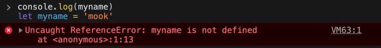
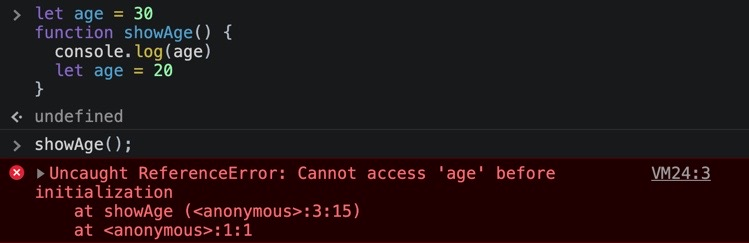
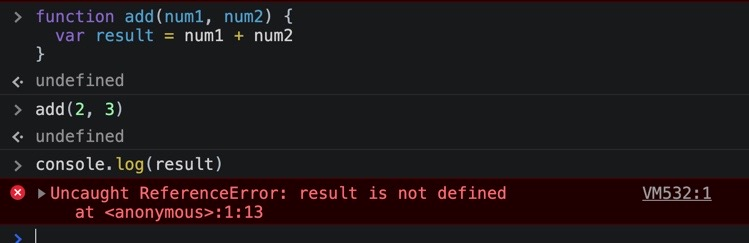

## 🏗let 키워드와 var 키워드의 차이

과거의 내가 작성한 블로그를 통해 재복습을 진행할 수 있었다.

https://dev-seolleung2.netlify.app/development/Scope/

내 블로그 내용을 조금 더 요약해 보았다.

스코프는 변수 접근 규칙에 따른 유효 범위를 의미하며 좀 더 구체적으로는 변수와 그 값이 어디서부터 어디까지 유효한가에 대한 범위 이다.

스코프의 특성은

- 안쪽 Scope 에서 바깥 변수/함수를 접근하는 것은 가능하다.

- 바깥쪽 Scope 에서 안쪽 변수/함수를 접근하는 것은 불가능 하다.

- Global Scope 는 최상단의 Scope 로 전역 변수는 어디서든 접근이 가능하다.

- 지역 변수는 함수 내에서 전역 변수보다 더 높은 우선 순위를 가져서 먼저 해당 지역의 변수를 먼저 찾고 없다면 그 위의 지역 혹은 글로벌 변수를 참조하는 순서로 이어진다.

let 과 var 의 차이를 이야기 하기 전에 바로 이 Scope 에서 Function Scope 와 Block Scope 에 대한 차이를 알아야 한다.

자바스크립트는 기본적으로 함수 단위로 자신만의 스코프를 가지는데 이를 Function Scope 라 하며 var 변수는 Function Scope 를 따르게 된다.

하지만 Curly-Bracket 으로 이루어진 Block 단위로 Scope 를 구분했을 때 Function Scope 보다 더 예측하기 쉬운 코드를 작성할 수 있다.

let 과 const 키워드가 Block Scope 에 사용되는 변수이다. Block Scope 에서의 변수 사용은 해당 블록 (Curly Bracket) 안에 변수가 같히게 된다.

Block Scope 를 통해 변수의 유효 범위가 눈에 확 들어오도록 할 수 있기 때문이다.
var 을 사용하면 예상치 못하게 재사용을 하게 되는 위험성이 존재할 수 있다.

let 과 const 의 유효 범위는 그래서 Block Scope 를 따르며 두 변수 모두 재선언이 불가능 하다.

하지만 let 키워드는 값을 재정의 (재할당) 할 수 있지만 const 는 값을 재정의 하는 것이 불가능 하다.

var 키워드는 Function Scope 를 따르며 (old way) 값 재정의와 재선언이 가능하다.


## 🏗Hoisting

var 키워드는 재선언이 가능하지만 let 은 재선언이 불가능 하다는 점을 염두에 둔 상태에서 들어가보자.

### 1. var 는 선언하기 전에 사용할 수 있다.

아래의 코드를 한번에 개발자 도구 console 에 입력후 엔터를 쳐 보았다.

```js
console.log(myname)
var myname = 'mook'
```

undefined 라 뜨는 것 이외에는 아무 에러 메시지가 뜨지 않는다.

왜냐하면 var 로 선언된 모든 변수는 코드가 실제로 이동하지는 않지만 코드가 최상위로 끌어올려진 것처럼 동작하게 된다.

이를 "Hoisting" 이라 한다.

```js
var myname
console.log(myname) // undefined
myname = 'mook'
```

위의 코드처럼 동작하는 것이다! 그런데 console.log 에서는 undefined 가 뜨는 이유는?

그것은 바로 선언 (declaration) 은 호이스팅이 되지만 할당 (assignment) 은 호이스팅이 되지 않기 때문이다. myname 이라는 변수만 올려진 것이고 'mook' 이라는 할당된 값은 그 자리에 있는 것이다.

위의 코드처럼 할당은 세 번째 줄에서 처리가 된다.

### 2. let 도 호이스팅이 되나요? 된다. 그런데..

위의 코드와 같은 상황에서 아래의 코드를 동시에 복사해 개발자 도구에 넣고 엔터를 치면,

```js
console.log(myname)
let myname = 'mook'
```



Reference Error 를 일으킨다.

그럼 let 을 썼을 때는 Hoisting 이 안 되는 걸까?

하지만 let 과 const 도 호이스팅이 된다.

### 3. 호이스팅의 정의

스코프 내부 어디서든 변수 선언은 최상위에 선언된 것처럼 행동한다는 뜻이다.

### 4. let 이 Reference Error 를 내는 이유

let 도 호이스팅이 된다면 왜 var 키워드 처럼 동작하지 않고 레퍼런스 에러를 낼까?

그것은 바로 Temporal Dead Zone (TDZ) 라는 것 때문에 그렇다고 한다.


let 과 const 키워드는 바로 이 TDZ 의 영향을 받는다.

즉, 값 할당을 하기 전에는 사용할 수 없다. 할당 이전의 코드는 사용할 수 없는 TDZ 영역 이라는 것이다.

이러한 것들은 코드를 예측 가능하게 하고 잠재적인 버그를 줄일 수 있다고 한다. 그래서 var 키워드 대신 let 과 const 키워드를 사용하는가 보다.

### 5. 호이스팅의 예시

첫번째는 아무런 문제가 없는 코드이다.

```js
let age = 30
function showAge() {
  console.log(age)
}

showAge()
```

함수 showAge 내 age 라는 변수는 지역 스코프 내에서 참조 할 수 있는 값이 없으므로 전역 스코프에 선언 및 할당된 age 를 참조할 수 있다. 그러므로 함수를 실행하면 숫자 30 이 찍히게 될 것이다.

자 이제 두번째로 문제가 되는 코드를 소개한다.

```js
let age = 30
function showAge() {
  console.log(age)
  let age = 20
}

showAge()
```



let 은 hoisting 이 되지 않는다고 생각하게 된다. 하지만 이는 사실이 아니다.

hoisting 은 스코프 단위로 일어나는데 위의 코드 처럼 curly bracket 의 block 스코프 내에서 let 역시도 hoisting 이 일어나는데,

만약 let 이 hoisting 이 일어나지 않는다면 age = 30 이 찍혔어야 할 것이다.

```js
let age = 30
function showAge() {
  let age
  console.log(age)
  age = 20
}
```

let 에서 block scope 내 호이스팅이 일어나는 코드를 정리해 보았다.

전역에 이미 age 가 let 으로 선언되어 있는데 블록 스코프 내에서 age 가 let 으로 재선언 되어 있는 모습을 확인할 수 있다.

앞서 서두에 설명했듯 let 은 재선언이 불가능 하다고 했다.

### 6. 변수의 3단계 생성 과정

변수는 3단계의 생성 과정을 거친다.

1. 선언 단계

2. 초기화 단계

3. 할당 단계

var 키워드는,

1. 선언 및 초기화 단계가 동시에 일어난다.

2. 할당 단계

여기서 초기화란 undefined 를 할당해 주는 단계를 의미한다. 그래서 아까 오류를 일으키지 않고 undefined 를 콘솔에 출력해 보여줬던 것이다.

let 키워드는 맨 위처럼 선언 단계와 초기화 단계가 분리 되어서 진행된다.

초기화 단계는 실제 코드에 도달했을 때 진행되기 때문에 Reference Error 가 일어난다.

const 키워드는,

선언 + 초기화 + 할당 이 동시에 이루어진다. (그렇지 않으면 에러가 발생) 왜냐하면 let 과 var 은 값을 바꿀 수 있기 (재할당) 때문이지만 const 는 그렇지 않기 때문이다.

```js
let myname;
myname = 'mook'

var age;
age = 25

const gender
gender = 'male' // Error
```

const gender 부분에서 에러가 발생한다. 그 이유는 선언하면서 바로 할당을 하지 않았기 때문이다.

즉 선언 + 초기화 + 할당 이 동시에 이루어지지 않았기 때문이다.

## 🏗Scope (var, let, const)

var 는 함수 스코프이며, let 과 const 키워드는 블록 스코프를 가진다.

(함수, if문, for문, while문, try/catch 문 등을 의미)

블록 스코프란 선언된 curly bracket 의 코드 블록 내에서만 변수가 유효하며 외부에서 블록 스코프 내의 변수에 접근할 수 없다는 의미이다.

즉 코드 블록 내부에서 선언한 변수는 지역 변수이다.

var 는 함수 스코프 이다.

```js
const age = 30

if (age > 19) {
  var txt = '성인'
}

console.log(txt) // '성인' 이 찍힌다.
```

이처럼 var 는 가능하지만 let 과 const 는 중괄호 내부 안에서만 변수를 사용할 수 있다.

해당 코드처럼 외부에서 접근이 불가능 하다는 뜻이다.

var 또한 함수 스코프 이므로,

```js
function add(num1, num2) {
  var result = num1 + num2
}

add(2, 3)
console.log(result)
```



Reference Error 를 일으킨다. var 도 함수 내에서만 변수 참조가 가능하기 때문이다.

var 가 유일하게 벗어날 수 없는 스코프가 함수라고 생각하면 된다.

## 🏗결론

예측 가능한 결과를 내고 버그를 줄이기 위해 let 과 const 사용을 권장한다.

추가로 읽은 블로그 (캡틴판교님 블로그 - 함수선언식, 표현식의 호이스팅)

https://joshua1988.github.io/web-development/javascript/function-expressions-vs-declarations/
