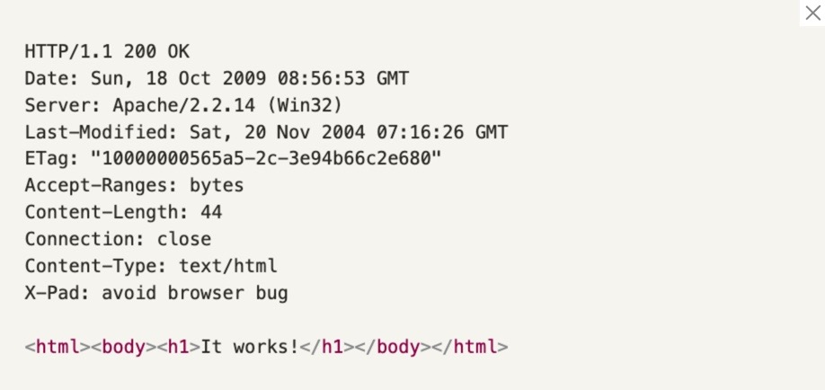
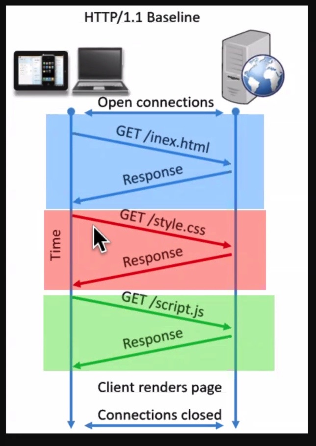

## ✍🏻Socrative 오답노트

HTTP 는 1.1 version 을 근간으로 한다. HTTP 의 새로운 구현체 프로토콜 QUIC 이 나왔다는데 아 그렇구나 하고 넘기자.

## 𝐐1. HTTP에 대한 다음 설명 중 옳지 않은 것은?

a. 모든 HTTP 요청은 header와 body를 갖는다.

- a 에서 GET method 일 때는 body 가 필요 없다.

- OPTIONS 에서도 DELETE 에서도 body 가 필요없다고 한다.

b. 클라이언트와 서버 간 요청-응답이 이루어지는 과정이다.

c. 브라우저와 서버가 통신할 수 있도록 만들어 주는 여러 프로토콜 가운데 한 종류다.

- 프로토콜의 종류는 다양하다. ftp, udp, smb 등등이 있는데, 웹을 사용하기 위한 프로토콜 http 를 사용하는 것이다.

d. 서버가 처리할 수 없는 요청의 경우, 400번대 status code를 반환한다.

- 500 번대 status code 를 반환한다.

e. 서버는 클라이언트의 요청에 대해 무조건 응답을 돌려 주어야 한다.

<b>정답 : A, D</b>

### 🌲해설

서버는 만드는 사람 나름대로 이므로 때로는 GET 요청 시에도 POST 처럼 body 를 담아 보낼 수 있지만 Restful 하지 않다고 한다.

왜냐면 목적에 맞는 구현 방법이 아니기 때문이다.

목적에 맞는 구현 방법을 Restful 이라고 한다. 즉 의도된 디자인이 아니라는 의미이다.

어떤 형태의 정보로 데이터를 교체하기 위해서 BODY 를 보내는 것이다.

mdn http message 를 검색해서 읽어보자.

https://developer.mozilla.org/ko/docs/Web/HTTP/Messages

Payload 는 Body 와 같은 말이라 한다.

페이로드 - 적재물품, 트럭에 뭘 실을때, 도로라는 프로토콜을 이용하는 트럭이 있다.

트럭이 요청을 실어 보내서 목적지에 갔다 돌아온다 (요청과 응답)

트럭에 짐을 실어야 요청을 보낼때 가지 않겟나 이런느낌? 바디랑 같다. 짐 이다.

## 𝐐2. 아래의 HTTP 메시지에 대한 설명으로 잘못된 것은 무엇일까요?

a. http response 이다.

b. post 메소드를 사용했다 - 여기서는 모른다.

c. response 가 성공적으로 이루어졌다는 사실을 알 수 있다.

d. response 의 payload 는 html 문자열이다.

- header 의 Content-Type 을 통해 어떤 타입으로 바디를 보낼지 결정할 수 있다

저기는 Content-Type 이 text/html 이네?

### 🌲해설 : MIME 타입에 대해 검색 해볼 것!

https://developer.mozilla.org/ko/docs/Web/HTTP/Basics_of_HTTP/MIME_types

네트워크 상에는 확장자가 의미가 없고 MIME 타입 으로 보내는데 여기에 보면 text 부분에 text/plain, text/html, 이 있고 application 부분에도 보면 나와있다.

여기에 웹 개발자들을 위한 중요한 MIME 타입 꼭 볼 것.

가장 popular 한 Content-Type 은 application/json 이다.

구글 검색창에 입력하는 댓글은? GET 요청, 즉 payload 가 실려가는게 아니고, url parameter 에 ?(물음표) 파라미터가 이런 식으로 담겨져 간다.

그런데 요청이 POST 라면? 오늘 스프린트 만들어서 네트워크 탭 열어서 Headers 맨 아래 내리면 Request Payload 에 문자열이 실려 있다!

<b>정답 : b. POST 메소드를 사용했다.</b> 가 오답.

## 𝐐3. 서버로 데이터를 전송하여 새로운 리소스를 생성하고자 할 때 사용해야 하는 HTTP 메서드는 무엇인가요?

<b>정답 : POST</b>

### 🌲번외 - PUT, PATCH

PUT, PATCH 의 차이 - payload 전체를 다 바꾼다. 혹은 일부만 바꾼다의 차이라 고 한다.

PUT, PATCH 는 그 목적이 해당 리소스 업데이트 이므로 (댓글 수정) 여러번 실행해도 서버에서의 결과는 똑같다.

멱등하다. (idempotent) 멱등성.

## 𝐐4. HTTP 통신의 두 가지 특성 (무상태, 비연결성) 을 적어주세요.

<b>정답 : stateless, connectionless</b>

🍎stateless : 각각 (색깔별로) 의 요청은 독립적이다. 즉 상태를 저장하지 못한다는 의미.

클라이언트의 상태를 저장하는 쿠키나 세션같은 보조 도구가 있어야 상태를 저장하지만 기본적으로 모든 http 요청은 각각이 독립적이다.

🍎connectionless : 더 이상의 커넥션이 없다. 무연결성. 한번 응답 요청을 주고받으면 연결이 끊겨버린다. 한번의 요청 응답이 하고 난 후 연결 상태는 끊어진다.

### 🌲Same-Origin 의 요건

프로토콜, 도메인, 포트 셋다 같아야 Same-Origin 이다!
