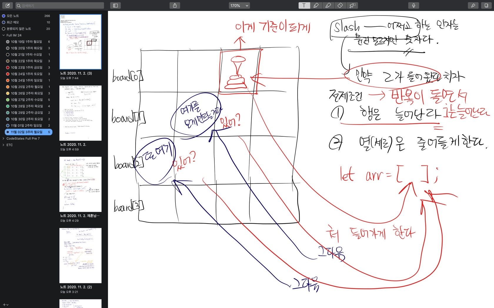

## NQueens

페어님과 가로줄, 세로줄에 대한 충돌을 해결했다.

하지만 오른쪽에서 왼쪽 하향으로 내려오는 대각선 줄에 대한 충돌을 해결하려다 막혔다.

그야말로 멘붕 이다..

그렇게 여섯시가 되었고 얼떨떨 하다가 아래와 같은 낙서를 하게 되었고,

그리고 마침내 저 낙서를 코드로 구현하여 정방향 슬래시 (대각선) 일 때 충돌을 해결해 보게 되었다.

페어님에게 줌으로 그림 설명을 드리고 나니 뿌듯했다.

비록 그 뒤로 역방향 슬래시 등은 미해결이지만...

이제 밥먹으러 가야겠다 ㅠ..

너무 어렵다..
