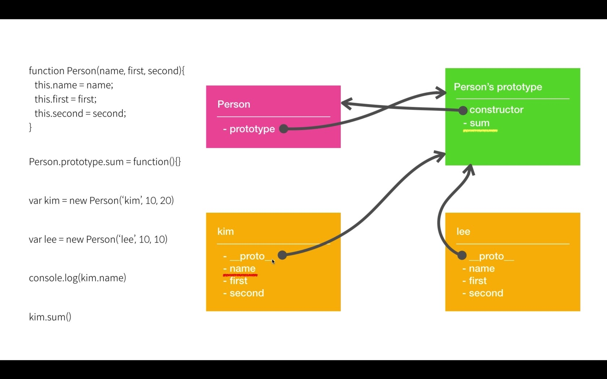

## 💃🏻자바스크립트의 함수는 객체

```js
function Person() {} //statement 처럼 보이지만 객체라고 한다.

const Person = new Function() // 위와 동일하다.
```

자바스크립트에서 함수는 객체이다. 객체이기 때문에 함수들은 property 들을 가질 수 있다.



```js
function Person(name, first, second) {
  this.name = name
  this.first = first
  this.second = second
}
```

함수 Person 의 선언을 통해 분홍 박스인 Person 객체 안에서는 내부적으로 "prototype" 이라는 프로퍼티가 생기고,

그 프로퍼티는 Person 의 prototype 객체를 가리킨다. (녹색 박스 참조)

녹색 박스를 보면 즉, Person.prototype 객체 이다.

그리고 이제 녹색 박스인 Person.prototype 객체도 자신이 Person 의 소속이라는 것을 기록하기 위해 "constructor" 라는 프로퍼티를 만들고

그 프로퍼티는 Person 을 가리킨다 (상호 참조를 하네)

일단 여기 까지 끊고..

쉽게 쉽게 쉽게 한 문장으로 줄여보면

사람을 찍어내는? 공장인 Person 공장은 설립되자마자 name, first, second 등의 속성이 생김과 동시에 내부적으로 또 prototype 이라는 속성도 함께 생기고 그 속성은 Person.prototype 이라는 객체를 가리키게 되며 그 해당 객체 역시 constructor 라는 프로퍼티를 만듬과 동시에 Person 공장을 가리킨다는 말이다.

아 똑같이 어렵네..

## Person.prototype.sum = function () {}

```js
Person.prototype.sum = function() {}
```

합을 구하는 함수를 선언했다.

그러면 그림 그대로 Person.prototype 를 가리키게 되고 이제 javascript 는 sum() 이 없네. 그럼 생성하자. 하면서
constructor 에 sum() 함수를 생성하게 된다.

## const kim = new Person('kim', 10, 20)

```js
const kim = new Person('kim', 10, 20)
```

맨 위에 Person 이라고 하는 constructor function 이 실행되면서 (공장이 가동되면서) this 의 값이 세팅된 결과를 노란 박스에 담았다.

이렇듯 name, first, second 라는 속성이 생성이 됨과 동시에,

\_\_proto\_\_ 라는 주인공이 자동 생성이 된다.

이제 kim 이라는 객체를 생성한 Person 의 prototype 이 \_\_proto\_\_ 가 되는 것이다.

그러면 이제 Person 의 prototype 을 통해서도 Person's prototype 에 접근을 할 수 있었고,

kim 의 \_\_proto\_\_ 를 통해서도 Person's prototype 에 접근을 할 수 있게 되었다.

## console.log(kim.name)

```js
console.log(kim.name)
```

자바스크립트 에서는 kim 이라는 객체에 name 이라는 property 가 있는지 우선적으로 찾는다. 노란 박스에 있다.

없다면 \_\_proto\_\_ 가 가리키는 객체에 name 이 있는지 찾게 된다.

## kim.sum()

```js
sum()
```

sum() 이라는 메소드가 없다. 마찬가지로 자바스크립트 에서는 \_\_proto\_\_ 를 통해 가리키고 있는 Person's prototype 에 sum 이 있는지를 찾는다.

있다. 사용한다.

만약 없다. 그러면 얘도 \_\_proto\_\_ 가 있을 테니 또 찾아갈테지만 일단 논외로 둔다.

## 👨‍👩‍👧결론

생성자로 만들어진 객체에서 해당 객체에 없는 함수를 호출할때 객체 프로퍼티 \_\_proto\_\_ 를 통해서 부모 prototype 객체에서 메소드를 찾아 호출합니다.

그러므로 부모에서 prototype 프로퍼티는 따로 prototype 객체를 두어 바로 자식 객체에서 호출할때 부를수 있도록 만들고 자식 \_\_proto\_\_ 경우는 부모 prototype으로 연결하여 부모 프로퍼티, 메소드를 호출할수 있도록 합니다.

라고 써놓은 댓글을 붙여 왔는데 이건 좀더 생각해 봐야 할 거 같다.
