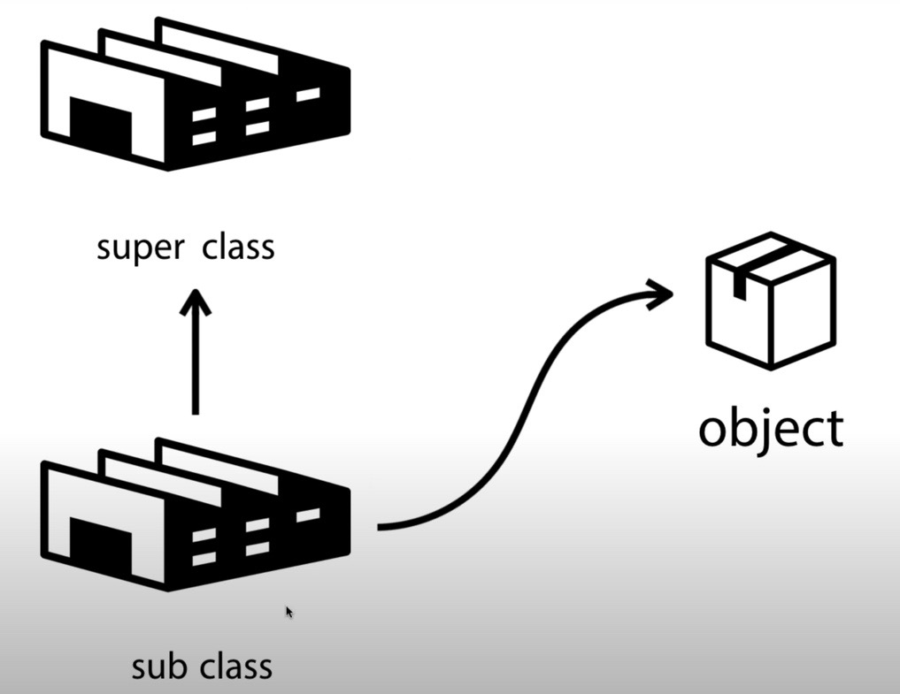
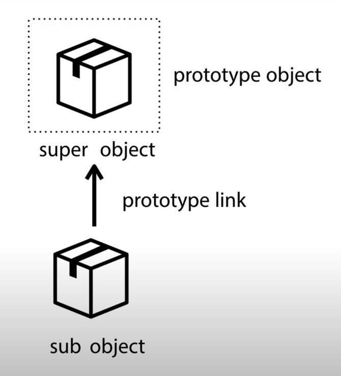
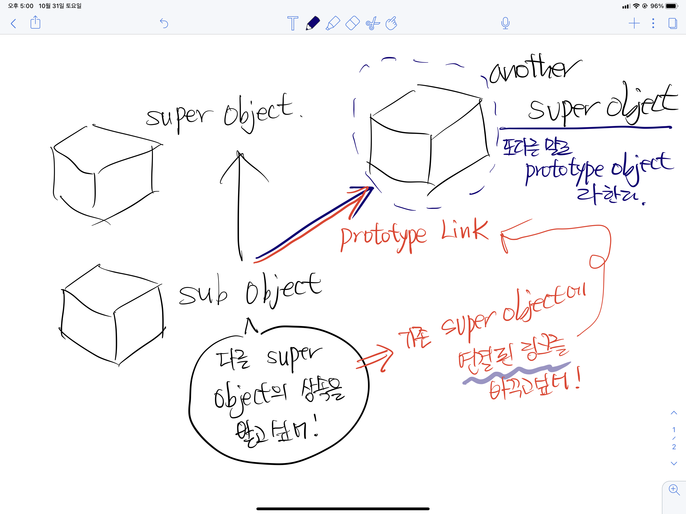

## 👨‍👩‍👧객체 간의 상속 - Class

Class : 객체 지향 언어에서 상속을 다루는 방법

Object (인스턴스) : Class 를 통해 만들어지는 객체

위의 그림 처럼 super class 와 sub class 가 있다.

super class 의 기능을 물려 받기 위해서는 sub class 가 super class 의 자식이 되어야 한다.

자식이 되는 것을 좀 더 효과적으로 표현하기 위해서

class SubClass extend SuperClass 라는 키워드로 표현을 했었다.

그리고 이를 통해 만들어진 SubClass 를 통해 객체 (인스턴스) 를 생성해 낸다.

그렇게 만들어진 Sub Object 객체의 기능과 역할은 Class 단에서 이미 결정되어 버린다.

## 👨‍👩‍👧객체 간의 상속 - Object

위의 그림을 다시 참고해 보자. Sub Object 는 Super Object 로부터 기능을 직접 상속 받을 수 있다는 그림이다.

전통적인 주류 객체 지향 언어에서는 "클래스" 가 상속을 주도하는데,

자바스크립트에서는 객체가 직접 다른 객체를 상속받을 수 있다.

또한, 얼마든지 해당 상속 관계를 바꿀 수 있다.

Sub Object 에서 기존 Super Object 를 가리키던 화살표를 (상속 관계를) Another Super Object 로 화살표를 돌리는 거다.

이 화살표를 연결된 링크, Prototype Link 라고 부른다.

그리고 그렇게 연결된 Another Super Object 를 Prototype Object 라고 부른다.
