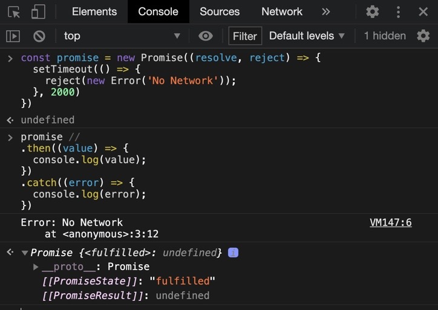

## 🤙🏻Promise


가보자. 프라미쓰!

### 🧐프라미스가 뭐?

비동기를 간편하게 처리할 수 있도록 도와주는 Object 이다.

정해진 장시간의 기능을 수행하고 나서 정상적 기능이 수행되었다면 성공 메시지와 함께 처리된 결과값을 전달해준다.

마찬가지로 기능을 수행하다가 예상치 못한 문제가 발생했다? 그러면 에러를 전달해준다.

### 😅더 쉽게


아이폰 12 사전예약 사이트가 열렸다고 하자.

나는 얼리어답터라 새로 나오는 기계를 참지 못하고 냉큼 사이트에 접속해서 사전예약 등록 버튼을 눌러 버렸다.

지금 당장 아이폰 12를 손에 쥐진 못하지만 추후 정식 판매가 개시될 때 내 메일로 바로 공지를 받게 될 것이고 구매를 할 수 있게 된다.

그리고 누군가는 정식 판매가 시작되고서 해당 사이트에 등록버튼을 눌렀을 수도 있다.

그때도 마찬가지로 메일로 공지를 받게 되고 구매가 가능해 질 것이다.

이러한 처리를 (비동기 처리 방식) callback 을 쓰지 않고! 하는 방식이다.

## ✍🏻Promise is a Javascript object for asynchronous operation.

Promise (프라미스) 는 비동기적인 것을 수행할 때 콜백 함수 대신에 유용하게 쓸 수 있는 오브젝트 이다.

## 🎁이제부터가 중요하다!! Promise 의 두 가지 포인트!

### 1. State (상태)

Process 가 heavy 한 operation 을 수행하는 중인지 (pending),

아니면 기능 수행이 완료되어서 성공했는지 (fulfilled),

기능 수행은 완료되었긴 했는데 실패했는지 (rejected) 에 대한 상태.


상태 요약.

1. 오퍼레이션이 진행 중일 때 : Pending

2. 오퍼레이션이 성공적으로 끝났을 때 (완료) : fulfilled

3. 오퍼레이션 이후 파일을 찾을 수 없거나 네트워크 오류 : rejected

### 2. Producer 와 Consumer 의 차이점

- Producer : 원하는 DATA 를 제공하는 사람

- Consumer : 제공한 DATA 를 쓰는, 필요로 하는 사람

프라미스로 데이터를 제공하는 역할을 만들면 뭐하나 (Producer), 갖다 써먹어야 뽑는게지 (Consumer)..

## 🏊🏻‍♂️Deep Dive into Producer

Promise 인스턴스 객체를 선언해 보자.

```js
const promise = new Promise((resolve, reject) => {
  // doing some heavy work
})
```

new 키워드를 붙여 promise 인스턴스를 만드는데 Promise 의 인자로 executor 라는 콜백 함수를 전달해 줘야 한다.

그런데 위의 모양을 봐서 알다시피, 이 executor 콜백 함수에는 또 다른 2가지의 콜백 함수를 인자로 받는다.

### resolve 와 reject

그것은 바로 resolve 와 reject 키워드 이다.

- resolve : 기능을 정상적으로 수행해서 마지막에 최종 데이터를 전달하는 콜백함수

- reject : 기능을 수행하다 중간에 문제가 생기면 호출하게 될 콜백함수

### 갑자기 뜬금 나오는 왜?

왜 써? 라고 한다면..?

음.. 네트워크 통신 상의 데이터를 받아오거나, 대용량 파일의 내용을 읽어올 때 시간이 오래 걸리리라는 것은 삼척 동자도 짐작할 수 있다.

그리하여 이러한 시간이 오래 걸릴법한 task 들을 동기적 (synchronous) 으로 처리하면 어떻게 될까?

아마 데이터를 받는 동안 그 다음 라인의 코드가 실행되지 않을 것이다.

### promise 를 만드는 순간?!

```js
const promise = new Promise((resolve, reject) => {
  // doing some heavy work
  console.log('come on you spurs');
})
come on you spurs
```

promise 를 만드는 순간, 전달한 executor 라는 콜백함수가 바로 실행되는 것을 확인할 수 있다.

그런데 여기서 중요한 점이 있다.

만약 네트워크 요청을 사용자가 요구했을 때만 해야 하는 경우라면 (가령 버튼을 클릭했을 때만),

위처럼 작성하면 불필요한 네트워크 통신이 일어날 수 있다.

훗날 이점을 간과하다가 불필요한 네크워크 통신을 할 수 있다는 점을 알고 넘어가자.

```js
When new Promise is created,
the executor runs automatically.
```

이제 promise 안에서 마치 네트워크 통신을 하는 것처럼, setTimeout 을 이용해서 시간의 딜레이를 줘보자,.

### promise 에 resolve 뿌리기

```js
const promise = new Promise((resolve, reject) => {
  setTimeout(() => {
    resolve('seolleung2.dev')
  }, 2000)
})
```

resolve 를 썼다는 의미는 성공적으로 네트워크, 혹은 파일에서 읽어온 (받아온) 것들을 가공한 데이터를 resolve 라는 콜백함수를 통해 전달한다 라는 의미이다.

어떤 기능을 성공적으로 수행했을 때, resolve 라는 콜백함수를 호출한다.

그리고 그 때 데이터를 받아온 사용자의 이름은 'seolleung2.dev' 이다.

다시,

어떤 일을 2초 정도 무언가를 하다가 결국에는 일을 잘 마무리 해서 resolve 라는 콜백함수를 호출하면서 'seolleung2.dev' 라는 값을 전달해주는 promise 를 만들었다.

그럼 이제 만든 Producer 를 써먹어 보는 Consumer 를 적용해 보자.

## 🏊🏻‍♂️Deep Dive into Consumer

### Consumer 의 첫번째 키워드 : then

이제 앞서 만든 promise 에다 원하는 기능을 하는 callback 함수를 전달해주자.

```js
promise.then((value) => {
  console.log(value);
})
seolleung2.dev
Promise {<fulfilled>: undefined}
__proto__: Promise
[[PromiseState]]: "fulfilled"
[[PromiseResult]]: undefined
```

앞서 Producer 의 resolve 인자로 태운 'seolleung2.dev' 가 then 의 콜백 함수 내 value 로 값을 받게 되면서,

즉 Promise 가 정상적으로 잘 수행이 되어서 마지막에 최종적으로 resolve 콜백함수를 통해 'seolleung2.dev' 라는 값이 value 로 들어온다.

아.. 정상적으로 수행되었을 때 resolve..

그럼 resolve 말고 reject 를 쓰면 어떻게 되나?

### promise 에 reject 뿌리기

Consumer 의 두번째 키워드를 블로깅하려는 밑밥이다.

```js
const promise = new Promise((resolve, reject) => {
  setTimeout(() => {
    reject(new Error('No Network'))
  }, 2000)
})
```

reject 라는 키워드로 바꾸었고 그 인자로는 new Error 라고 해서 자바스크립트에서 제공하는 에러 object 를 넣었다.

나중 쓸 일이 있을 때 에러 메시지를 명확하게 전달해야 한다고 한다.

그리고 콘솔로 옮겨 실행해 보니까 Uncaught Error 즉 잡히지 않은 에러가 뜬다.


왜?

아까 then 이라는 키워드를 써서 성공적으로 수행되었을 때의 케이스만 다루어 보았기 때문이다.

이제 에러 핸들링을 위한 키워드를 익힐 차례다.

### Consumer 의 두번째 키워드 : catch

.catch 를 통해 그 내부 인자로 error 로 에러 메시지를 받아 에러가 발생했을 때 어떻게 처리해줄 것인지에 대한 콜백함수를 실어 보냈다.

```js
promise //
.then((value) => {
  console.log(value);
})
.catch((error) => {
  console.log(error);
})
Error: No Network
    at <anonymous>:3:12
Promise {<fulfilled>: undefined}
__proto__: Promise
[[PromiseState]]: "fulfilled"
[[PromiseResult]]: undefined
```

이제 더 이상 빨간 에러를 보이지 않고 에러 메시지를 출력하는 것을 볼 수 있다.



### Consumer 의 세번째 키워드 : finally

이 키워드가 있다는 걸 알게 되면서 블로깅할 때 이 짤을 꼭 쓰고 싶었다.


여기까지만 하자...

```js
promise //
  .then(value => {
    console.log(value)
  })
  .catch(error => {
    console.log(error)
  })
  .finally(() => {
    console.log('퐈이나알리~')
  })
```


일의 수행 성공, 실패에 상관 없이 무조건 마지막에 호출되어지는 아이이다.

어떤 기능을 마지막에 수행하고 싶을 때 사용한다.

프로미스 체이닝은 다음 블로깅에 소개해 보겠다.
