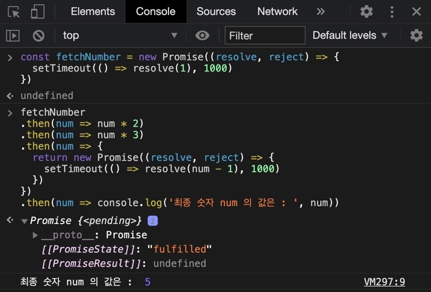

## 🤙🏻Promise Chaining

서버에서 1초 정도 뒤에 숫자를 받아오는 새로운 Promise 를 만들어 보자.

```js
const fetchNumber = new Promise((resolve, reject) => {
  setTimeout(() => resolve(1), 1000)
})
```

다시 복습 타임.

Promise 의 인자에 executor 라는 callback 함수를 전달한다. 그런데 executor 는 resolve 와 reject 라는 콜백함수를 받는다.

위의 예시 처럼 Producer 를 만들었으니 소비 해보자.

## 👻.then 키워드 인자에 태워버리는 내맘대로 콜백함수

.then 의 사용에 따라 최종 숫자가 어떻게 출력되나 해보자.

```js
fetchNumber
  .then(num => num * 2)
  .then(num => num * 3)
  .then(num => {
    return new Promise((resolve, reject) => {
      setTimeout(() => resolve(num - 1), 1000)
    })
  })
  .then(num => console.log('최종 숫자 num 의 값은 : ', num))
```



총 도합 1 + 1 = 2초 뒤 5라는 값을 출력해 주었다.

new Promise 로 만들어진 객체 fetchNumber 가 성공적으로 동작이 되면,

.then 을 통해 resolve 의 1을 num 으로 받아와서 새로운 값을 리턴하기 시작한다.

그러다가 그 숫자를 다른 Server 에 보내서 다른 숫자로 변환된 값을 받아올 거다.

위처럼 다른 서버와 통신을 하는 새로운 프로미스를 리턴했다.

## 🧐여기서 알 수 있는 점

- .then 은 값을 바로 전달할 수도 있고

- .then 은 또다른 비동기인 Promise 를 전달해도 되는구나

- .then 여러가지를 묶어, 다른 비동기적인 요소들을 묶어서 처리할 수 있구나.


