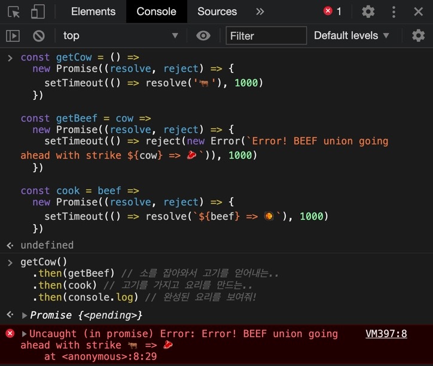

## 🤙🏻비프 부르기뇽 만들기

지금부터 아아주 재밌는 짓을 해볼거다.

뭘 할거냐면

1. 소를 한마리 어디서 데려온 뒤

2. 도축을 해서 고기를 얻어낼 거다. 텐더 로오인~

3. 고기를 갖다가 비프 부르기뇽을 만들거다.


## 🤙🏻세 가지의 Promise 를 리턴하는 함수

각 서버마다 소를 받고 소를 잡아서 텐더로인을 받고 그 고기를 받아다가 비프 부르기뇽을 만드는 거다.

```js
const getCow = () =>
  new Promise((resolve, reject) => {
    setTimeout(() => resolve('🐂'), 1000)
  })

const getBeef = cow =>
  new Promise((resolve, reject) => {
    setTimeout(() => resolve(`${cow} => 🥩`), 1000)
  })

const cook = beef =>
  new Promise((resolve, reject) => {
    setTimeout(() => resolve(`${beef} => 🥘`), 1000)
  })
```

Producer 를 해놨으니 이제 Consume 해보자.

```js
getCow()
.then(cow => getBeef(cow)) // 소를 잡아와서 고기를 얻어내는..
.then(beef => cook(beef))  // 고기를 가지고 요리를 만드는..
.then(meal => console.log(meal)) // 완성된 요리를 보여줘!

Promise {<pending>}
🐂 => 🥩 => 🥘
```


🐂 => 🥩 => 🥘

우와 비프 부르기뇽이다!!

## 🥘Consumer 코드 리팩토링하기

then 내에서 리턴되는 함수가 받는 인자가 하나만 일때 코드를 아래와 같이 줄일 수 있다.

리턴되는 함수에 위에서 받은 밸류를 넣어 리턴해 달라 라는 암묵적인 동의이다.

```js
getCow()
  .then(getBeef) // 소를 잡아와서 고기를 얻어내는..
  .then(cook) // 고기를 가지고 요리를 만드는..
  .then(console.log) // 완성된 요리를 보여줘!

  Promise {<pending>}
  🐂 => 🥩 => 🥘
```

이제 본격적으로 에러 핸들링을 해볼 예시로 바꿔보자.

## 😱전국 도축 공장이 파업할 때 (Error)

만약 도축공장들이 단체 파업을 해서 소고기로 가공하는 부분에서 문제가 생겨 실패되면 어떻게 할까?

```js
const getCow = () =>
  new Promise((resolve, reject) => {
    setTimeout(() => resolve('🐂'), 1000)
  })

const getBeef = cow =>
  new Promise((resolve, reject) => {
    setTimeout(() => reject(new Error(`Error! BEEF union going ahead with strike ${cow} => 🥩`)), 1000)
  })

const cook = beef =>
  new Promise((resolve, reject) => {
    setTimeout(() => resolve(`${beef} => 🥘`), 1000)
  })

getCow()
  .then(getBeef) // 소를 잡아와서 고기를 얻어내는..
  .then(cook) // 고기를 가지고 요리를 만드는..
  .then(console.log) // 완성된 요리를 보여줘!

Promise {<pending>}
Uncaught (in promise) Error: Error! BEEF union going ahead with strike 🐂 => 🥩
  at <anonymous>:8:29
```



아 요리가 안만들어 지는데..

아 이러면 나가린데..

## 😘에러 핸들링 1

혹시 과정 중에 에러가 발생했다면 .catch 로 에러를 맨 밑으로 전달해서

catch 가 잡혀지게 하자.

```js
getCow()
  .then(getBeef) // 소를 잡아와서 고기를 얻어내는..
  .then(cook) // 고기를 가지고 요리를 만드는..
  .then(console.log) // 완성된 요리를 보여줘!
  .catch(console.log)

Promise {<pending>}
Error: Error! BEEF union going ahead with strike 🐂 => 🥩
  at <anonymous>:8:29
```

빨간색 Uncaught Error 가 아닌 단순 에러 메시지를 출력한 결과를 볼 수 있다.

이를 통해 에러를 컨트롤하여 수정할 수 있음을 의미한다.


## 😘에러 핸들링 2

소 도축공장 파업으로 인해 소고기를 못가져와서 발을 동동 구를 때,

야매 꼼수로 돼지고기로 대체해 버리고 싶어졌다!

```js
const getCow = () =>
  new Promise((resolve, reject) => {
    setTimeout(() => resolve('🐂'), 1000)
  })

const getBeef = cow =>
  new Promise((resolve, reject) => {
    setTimeout(() => reject(new Error(`Error! BEEF union going ahead with strike ${cow} => 🥩`)), 1000)
  })

const cook = beef =>
  new Promise((resolve, reject) => {
    setTimeout(() => resolve(`${beef} => 🥘`), 1000)
  })

getCow()
  .then(getBeef) // 여기서 소고기를 더이상 못갖고 오는 오류가 생긴다. 그래?
  .catch(error => {
    return '🍖'; // 돼지 족발을 긴급 공수해왔다.
  })
  .then(cook) // 돼지 앞족을 가지고 요리를 만드는..
  .then(console.log) // 완성된 요리를 보여줘!
  .catch(console.log) // 에러 메시지도 일단은 띄워바!

  Promise {<pending>}
  🍖 => 🥘
```


소고기를 얻어 요리를 하는데 실패했지만 전체적인 Promise 체인에 문제가 생기지 않도록 돼지 앞족으로 땜빵을 해준거다.

그리하여 결국 요리까지 완성했다.

포크 부르기뇽.. (실제로 해본 적 있다)

## 🍖결론

즉! .then(getBeef) 에서 오류, error 가 생겼을 때 바로 다음 줄에 .catch 를 작성해서 바로바로 문제를 해결할 수 있다.
