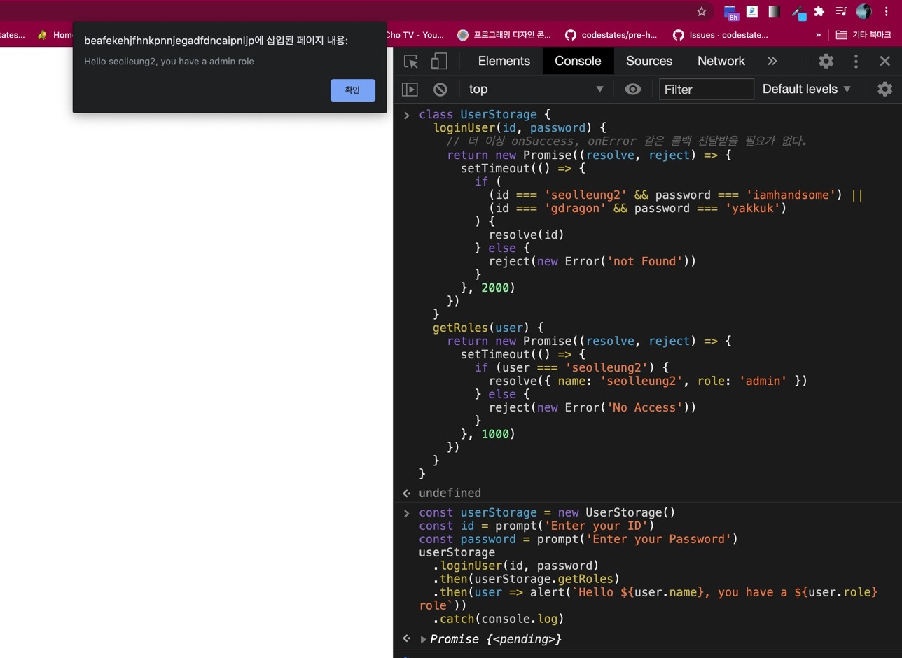

## 🤙🏻콜백 지옥 소환

https://dev-seolleung2.netlify.app/development/CallbackHell/

위 링크 블로그 말미의 예시를 그대로 가져왔다.

```js
// 백엔드에서 id, password 를 가져오는 저장소 UserStorage.
// 하지만 콜백 지옥이다.

class UserStorage {
  loginUser(id, password, onSuccess, onError) {
    setTimeout(() => {
      if (
        (id === 'seolleung2' && password === 'iamhandsome') ||
        (id === 'gdragon' && password === 'yakkuk')
      ) {
        onSuccess(id)
      } else {
        onError(new Error('not Found'))
      }
    }, 2000)
  }
  getRoles(user, onSuccess, onError) {
    setTimeout(() => {
      if (user === 'seolleung2') {
        onSuccess({ name: 'seolleung2', role: 'admin' })
      } else {
        onError(new Error('No Access'))
      }
    }, 1000)
  }
}

const userStorage = new UserStorage()
const id = prompt('Enter your ID')
const password = prompt('Enter your Password')

userStorage.loginUser(
  id,
  password,
  user => {
    userStorage.getRoles(
      user,
      userWithRole => {
        alert(
          `Hello ${userWithRole.name}, you have a ${userWithRole.role} role`
        )
      },
      error => {
        console.log(error)
      }
    )
  },
  error => {
    console.log(error)
  }
)
```

## 🤙🏻아이 프라미쓔~

Callback Hell 코드를 Promise 로 바꾸는 연습을 해봤다!

```js
class UserStorage {
  loginUser(id, password) {
    // 더 이상 onSuccess, onError 같은 콜백 전달받을 필요가 없다.
    return new Promise((resolve, reject) => {
      setTimeout(() => {
        if (
          (id === 'seolleung2' && password === 'iamhandsome') ||
          (id === 'gdragon' && password === 'yakkuk')
        ) {
          resolve(id)
        } else {
          reject(new Error('not Found'))
        }
      }, 2000)
    })
  }
  getRoles(user) {
    return new Promise((resolve, reject) => {
      setTimeout(() => {
        if (user === 'seolleung2') {
          resolve({ name: 'seolleung2', role: 'admin' })
        } else {
          reject(new Error('No Access'))
        }
      }, 1000)
    })
  }
}
```

자 마저 바꿔보자.

```js
const userStorage = new UserStorage()
const id = prompt('Enter your ID')
const password = prompt('Enter your Password')
userStorage
  .loginUser(id, password)
  .then(userStorage.getRoles) // .then(user => userStorage.getRoles(user)) 와 동일
  .then(user => alert(`Hello ${user.name}, you have a ${user.role} role`))
  .catch(console.log)
```



오 좋다좋아!

위의 코드는 아무 문제 없이 돌아간다!
