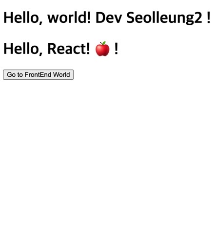

## 🌈필기는 안드로메다로 보내자

나는 필기를 하는 습관이 있는데 실수를 되풀이 하지 않기 위해 필기구를 덮었다.

처음 배우는 입장에서 막 시험 공부하듯이 적는 거는 아아주 안좋다는 걸 깨달았던 적이 있기 때문이다.

필기구를 내려놓는 고통 때문에 낮에 고생을 좀 했다.

그래서 바로 코드로 넘어가자.

## 🍎codesandbox

https://codesandbox.io/

여기에서 처음 만들 때 리액트를 고르면 app.js 하고 index.js 파일이 보이는데

대충 보고 넘기자.

App.js 는 제낀 체로 index.js 에서,

```js
import React from 'react'
import ReactDOM from 'react-dom'
```

단 두줄 코드만 남기고 싹 지워버린다.

헷갈리니까

## 👨🏻‍🚀1. ReactDOM 의 렌더링 방식

```js
ReactDOM.render(
  <div>
    <h1>Hello, world!</h1>
    <h1>Hello, React!</h1>
    <button>Go to FrontEnd World</button>
  </div>,
  document.getElementById('root')
)
```

기본적으로 리액트 DOM 의 최상위 노드는 root 라는 id 를 가진 아이인 거로 보인다.

의심받기 싫어서 복사해왔다.

```html
<div id="root">
  <div>
    <h1>Hello, world!</h1>
    <h1>Hello, React!</h1>
    <button>Go to FrontEnd World</button>
  </div>
</div>
```

루트 안에 다 때려 넣는거다. 일단은 그렇게 이해했다.

render 에 들어가는 첫번째 인자는 그러니까 html 같이 생긴 (누가봐도 html) JSX 를 입력해 넣어 주는 것 같다.

근데 저 상태로는 괜찮은데 나중가서 코드가 줄줄이 비엔나 소세지 면,

느낌상 무식? 하게 모든 코드를 우격 다짐으로 넣어질 거 같다.

그러면 뭐.. 가독성이 떨어질 테다.

따로 변수를 만들어서 거기에 JSX 코드를 넣고 그 변수를 render 내 인자로 넣어주면 좋을 거 같다.

## 👨🏻‍🚀2. JSX 를 이용한 React Element 생성과 JSX 표현식 등록하기

```js
const name = 'Dev Seolleung2'
const emoji = '🍎'
const elementsForGreeting = (
  <div>
    <h1>Hello, world! {name} !</h1>
    <h1>Hello, React! {emoji} !</h1>
    <button>Go to FrontEnd Dev</button>
  </div>
)

ReactDOM.render(elementsForGreeting, document.getElementById('root'))
```

1 에서 보다 개선한 점은 render 내에 막바로 JSX 코드 를 넣지 않고 임의의 변수 'elementsForGreeting' 를 지정해 그 안에 넣어 주었다.

그리고 curly bracket 의 사용을 통해 JSX 표현식을 등록해 보았다.

용어가 드럽게 어려워 보일 뿐 사실 그렇게 쫄 거는 아니다.



## 👨🏻‍🚀3. 함수 만들어 써먹어 보기

앞선 2번에서 좀 더 발전된 형태로 가지고 놀기 위해 유저 이름을 리턴하는 함수와, 함수에 파라미터로 전달되는 user 객체를 선언해 보았다.

밋밋해서 avatar 라는 변수를 선언해 img src 를 가져올 JSX 를 만들어 넣었다.

curly bracket 으로 JSX 표현식을 써먹을 기회를 창출했다.

```js
function formatName(user) {
  return user.emoji + ' ' + user.firstName + ' ' + user.lastName
}

const user = {
  firstName: 'Potato',
  lastName: 'King',
  emoji: '🍟‍',
  avatarUrl:
    'https://lh3.googleusercontent.com/proxy/YHBywAATkAodibRWgJ5NqVwB2QkqSoxn4iIKeRHnezYKTky-iB1t09tOyQ_31NYcPslBJTUiFJBYCL8kapBdXA9YboIP_6nrkR0xSCtFWVrqYWEb3lK7frNWZWUDn_NpDw_cjbgeD0rPCjeHZ9NalOcKOnUTSPR7dmi29O8PBvc7EMyGiA',
}

const avatar = 

ReactDOM.render(이봐 여기에 뭔가 넣어야 하지 않겠어?, document.getElementById('root'))

```

리액트 DOM 은 뭘 렌더하라는지 아직 명령을 받지 못했다.

그래서 'elementsForGreeting' 라는 변수에 내가 넣고 싶은 것들을 다 때려 넣었다.

```js
const elementsForGreeting = (
  <div>
    <h1>Hello, world! {formatName(user)} !</h1>
    <h1>Hello, React! {formatName(user)} !</h1>
    <button>Go to FrontEnd Dev</button>
    <div>
      <h1>messages : {getGreetingUser(user)} </h1>
      <p align="center">{avatar}</p>
    </div>
  </div>
)
```

JSX 표현식 컬리 브라켓 안에 함수를 넣을 수도 있는 거다.

그리고 user 감별을 통해 리턴되는 메시지를 다르게 적용하는 함수를 만들어 보았다.

```js
function getGreetingUser(user) {
  if (user) {
    return <h1>Greetings! {formatName(user)}! 🏄🏻‍♂️</h1>
  }
  return <h1>You're a stranger..😭</h1>
}
```


완성 코드는 아래와 같다.

```js
function formatName(user) {
  return user.emoji + ' ' + user.firstName + ' ' + user.lastName
}

const user = {
  firstName: 'Potato',
  lastName: 'King',
  emoji: '🍟‍',
  avatarUrl:
    'https://lh3.googleusercontent.com/proxy/YHBywAATkAodibRWgJ5NqVwB2QkqSoxn4iIKeRHnezYKTky-iB1t09tOyQ_31NYcPslBJTUiFJBYCL8kapBdXA9YboIP_6nrkR0xSCtFWVrqYWEb3lK7frNWZWUDn_NpDw_cjbgeD0rPCjeHZ9NalOcKOnUTSPR7dmi29O8PBvc7EMyGiA',
}

const avatar = 

function getGreetingUser(user) {
  if (user) {
    return <h1>Greetings! {formatName(user)}! 🏄🏻‍♂️</h1>
  }
  return <h1>You're a stranger..😭</h1>
}

const elementsForGreeting = (
  <div>
    <h1>Hello, world! {formatName(user)} !</h1>
    <h1>Hello, React! {formatName(user)} !</h1>
    <button>Go to FrontEnd Dev</button>
    <div>
      <h1>messages : {getGreetingUser(user)} </h1>
      <p align="center">{avatar}</p>
    </div>
  </div>
)

ReactDOM.render(elementsForGreeting, document.getElementById('root'))
```

## 👨🏻‍🚀4. 함수 안에서 element 선언과 ReactDOM.render() 실행하기

공식 문서에 있는대로 만들어 봤다.

함수 function 선언식 body 내에 React element 를 선언 및 JSX 코드, JSX 표현식을 입력해 넣고,

마찬가지로 ReactDOM.render() 을 통해 화면에 뿌리는 역할까지 하는 함수 tick() 을 만들었다.

그리고 setInterval 를 통해 tick 을 콜백 함수로 넣고 1초 마다 반영되도록 하였다.

```js
function formatName(user) {
  return user.emoji + ' ' + user.firstName + ' ' + user.lastName
}

const user = {
  emoji: '👨🏻‍🚀',
  firstName: 'Seolleung2',
  lastName: 'Dev',
}
function tick() {
  const element = (
    <div>
      <h1>Greetings! {formatName(user)}.</h1>
      <h2>It is {new Date().toLocaleTimeString()}.</h2>
    </div>
  )
  ReactDOM.render(element, document.getElementById('root'))
}

setInterval(tick, 1000)
```


## 👨🏻‍🚀5. Component 와 props 다루기

### 5-1. Component

얘는 약간의 이론 설명이 필요하다. 조금 어렵기 때문이다.

컴포넌트는 하나의 커스텀 태그와도 같다.

```js
ReactDOM.render(<Tweet></Tweet>, document.getElementById('root'))
```

이렇게 렌더하는 부분에 컴포넌트를 넣어 놓았다.

ReactDOM 은 대체 저 Tweet 이라는 컴포넌트가 뭔가 찾으려 든다. 하지만 아직 없다.

컴포넌트는 함수 컴포넌트와 클래스 컴포넌트 2종류 가 있다.

나중에 신나게 할거니까 일단 함수 컴포넌트를 만들어 보자.

```js
function Tweet() {
  return <div>트윗 컴포넌트</div>
}
```

ReactDOM 은 Tweet 컴포넌트를 보고 화면에 "트윗 컴포넌트" 를 뿌려준다.

그래.. 근데 props 는 뭐야?

### 5-2. props

말보다 코드가 쉽다.

5-1. 의 진화형 코드를 만들어 보았다.

```js
function TweetList() {
  // const TweetList 로 바꾸어 작성해도 그에 맞게 대응할 수 있다.
  return (
    <div>
      <Tweet name="애플이" content="To learn react component is painful.">
        1빠
      </Tweet>
      <Tweet name="대치동강건마" content="나의 108계단 콤보는 자비심이 없다!">
        2빠
      </Tweet>
      <Tweet name="코드테이스트" content="저희는 WE-EAT 제도를 만들었습니다.">
        3빠
      </Tweet>
    </div>
  )
}

ReactDOM.render(<TweetList />, document.getElementById('root'))
// 첫번째 인자에 TweetList() 이렇게 넣어줘도 된다.
```

위의 코드는, 아래와 같이 변경도 가능하다. 뭐가 더 좋은지는 아직 모르겠다.

```js
const TweetList = ( // 사용자 정의 컴포넌트로 작성한 엘리먼트
  <div>
    <Tweet name="애플이" content="To learn react component is painful.">
      1빠
    </Tweet>
    <Tweet name="대치동강건마" content="나의 108계단 콤보는 자비심이 없다!">
      2빠
    </Tweet>
    <Tweet name="코드테이스트" content="저희는 WE-EAT 제도를 만들었습니다.">
      3빠
    </Tweet>
  </div>
)

ReactDOM.render(TweetList, document.getElementById('root'))
```

다시 이론.

컴포넌트 에는 props 라는 존재가 있다고 한다.

properties? 속성? 맞다. 속성을 나타내는 data 라고 한다. 일종의 임의의 입력, 파라미터, 인풋, 입력값이라 보면 된다.

```js
<Tweet name="코드테이스트" content="저희는 WE-EAT 제도를 만들었습니다.">
{ name : '코드테이스트' }
{ content : '저희는 WE-EAT 제도를 만들었습니다.' }
```

name, content 가 가리키는 저 객체가 props 라고 한다.

여튼 그래서 ReactDOM 은 대체 정의된 Tweet 은 뭐하는 컴포넌트인가 네비를 찍고 간다.

그래서 코드를 타고 올라가 보니 위에 이런 코드가 있넹?

```js
function Tweet(props) {
  // {name, content} 로 태워도 된다.
  // 마 ! 이게 바로 컴포넌트다!
  return (
    <div>
      <div>작성자 : {props.name}</div>
      <div>댓글내용 : {props.content}</div>
      <div>작성순서 : {props.children}</div>
      <br />
    </div>
  )
}
```

Tweet 컴포넌트에 props 를 파라미터로 받을 수 있다. 이제 props. 을 통해 사용할 수 있게 된 것이다.

추가로, 아래 부분을 다시 보면 Tweet 태그 와 닫는 태그 사이에 뭔가 텍스트로 1빠 2빠 하면서 내용이 들어가 있다.

저기에 접근하는 방법은 props.children 을 사용한다는 것을 검색을 통해 알게 되었다.

```js
const TweetList = (
  <div>
    <Tweet name="애플이" content="To learn react component is painful.">
      1빠
    </Tweet>
    <Tweet name="대치동강건마" content="나의 108계단 콤보는 자비심이 없다!">
      2빠
    </Tweet>
    <Tweet name="코드테이스트" content="저희는 WE-EAT 제도를 만들었습니다.">
      3빠
    </Tweet>
  </div>
)
```


## 생각.

필기를 하지 말자 맹세했는데 결국 필기를 했다.

손도 안댈거다 인제..


