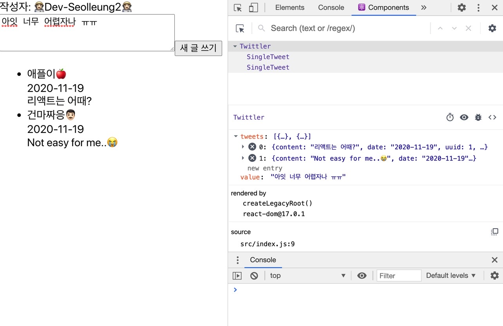

# 👨🏻‍🚀React Starter CheetSheet

## 👨🏻‍🎨사전 준비

1. 빠른 react app 생성 (터미널 입력)

```js
npx create-react-app <프로젝트이름>
```

뭔가 신나게 깔아대고 "프로젝트이름" 으로 되어 있는 디렉토리가 하나 생긴다.

2. cd <프로젝트이름>

3. code . 로 실행

4. npm start 로 서버 돌리고 테스트 체크 : http://localhost:3000

## 👩🏻‍🦳파일 확인하기

index.js 그리고 App.js 가 있다.

일단 index.js 는 root 경로 안으로 렌더 하고자 하는 컴포넌트를 통째 render 해 주는 함수가 위치하고 있다.

생김새는 아래와 같다.

```js
import React from 'react'
import ReactDOM from 'react-dom'
import './index.css'
import Twittler from './App'
import reportWebVitals from './reportWebVitals'

ReactDOM.render(
  <React.StrictMode>
    <Twittler />
  </React.StrictMode>,
  document.getElementById('root')
)

// If you want to start measuring performance in your app, pass a function
// to log results (for example: reportWebVitals(console.log))
// or send to an analytics endpoint. Learn more: https://bit.ly/CRA-vitals
reportWebVitals()
```

내 앱 이름은 "Twittler" 로 해줄 거라서 import 부분 및 render 부분을 Twittler 라는 이름으로 갈아 치워버렸다.

이제 여긴 건들게 없다.

App.js 로 가면 뭔가 코드가 있기는 한데, 싹 다 지워버리고

```js
import React from 'react'
import './App.css'

export default Twittler
```

요렇게 바꿔준 뒤 시작하면 된다.

세세히 따질라고 했는데 그랬다가는 한도 끝도 없다 일단 그냥 받아들이기로 했다.

## 👩🏿‍🦰Twittler Component 생성하기

컴포넌트 생성에는 함수형 과 클래스 형 두가지 생성 방법이 있다.

변할 수 있는 정보 (상태) 를 갖게 하려면 닥 클래스형 컴포넌트로 만들어야 한다.

그리구 이름은.. Twittler 로 하기루 했으니까,

```js
class Twittler extends React.Component {
  constructor(props) {
    super(props)
    this.state = {
      // 어떤 상태를 줘야 할진 앱마다 다르겟지🍎
    }
  }
  render() {
    // 기본적 UI 를 띄우기 위한 함수.
  }
}
```

## 👨🏻‍🚀this.state 에 변할 수 있는 정보들을 입력하기

유어클래스에 나와 있는 기본 상태 (Mockup-data) 를 가져다 넣어 주었다.

뭔가 추측으로는 추후에 저 this.state.tweets 라는 배열에 우리가 입력할 값을 배열.push 로 넣으면 될 거 같은데

state 는 직접 수정이 불가하다고 한다.

setState 를 사용하면 된다고 하는데 일단 그건 나중으로 미룬다.

```js
class Twittler extends React.Component {
  constructor(props) {
    super(props)
    this.state = {
      tweets: [
        {
          uuid: 1,
          writer: '애플이🍎',
          date: '2020-11-19',
          content: '리액트는 어때?',
        },
        {
          uuid: 2,
          writer: '건마짜응👨🏻‍',
          date: '2020-11-19',
          content: 'Not easy for me..😭',
        },
      ],
    }
  }
  render() {
    // 기본적 UI 를 띄우기 위한 함수.
  }
}
```

## 👩🏿‍🦰기본적 UI 를 띄우는 render() 를 구현하기

일단 서버를 띄웠을 때, 기본적인 인터페이스 정도는 보여줘야 할 테니까 이 또한 일단 유어클래스에서 가져와 넣어보자.

```js
// class Twittler 내 render 함수 구현
render() {
  <div>
    <div>작성자: 김코딩</div>
    <div id="writing-area">
      <textarea id="new-tweet-content"></textarea>
      <button id="submit-new-tweet">새 글 쓰기</button>
    </div>
    <ul id="tweets">
      <!-- 이 부분은 this.state.tweets를 바탕으로 SingleTweet 컴포넌트가 반복 출력될 것입니다. -->
    </ul>
  </div>
}
```

여튼 밋밋하지만 됐고 이제 ul 태그 하위에 넣어져 있는 주석 대신에 아까 넣었던 목업 데이터를 불러다 넣어야 한다. 어떻게 넣을까?

## 👨🏻‍🚀JSX 표현식과 map, SingleTweet Component

ul 태그 하위에 글 목록을 불러 와야 하는데 목업 데이터는 현재 어디에 있지?

this.state.tweets 에 있다. 얘는 심지어 배열이다.

그러면 일단 JSX 표현식을 쓰기 위해 ul 아래에,

{ } Curly Bracket 을 입력하고 그 안에서 배열을 반복을 돌면서 tweet 하나 하나 마다 어떻게 어떻게 가공을 할 것이다.

```js
<ul id="tweets">
  {this.state.tweets.map(tweet => {
    return <SingleTweet />
  })}
</ul>
```

뭘 리턴할 건고 하니 SingleTweet 이라는 컴포넌트를 리턴할 거라 한다.

그리고 SingleTweet 컴포넌트에 세 가지 속성을 지정해 주었다.

```js
<ul id="tweets">
  {this.state.tweets.map(tweet => {
    return (
      <SingleTweet
        writer={tweet.writer}
        date={tweet.date}
        content={tweet.content}
      />
    )
  })}
</ul>
```

그럴듯 해졌다. writer, date, content 속성이 있고 속성 값으로는 다시 Curly bracket 으로 반복 요소 하나 하나의 writer, date, content 를 받아 넣었다.

이제 render 함수는 내부적으로 SingleTweet 이라는 컴포넌트가 어떻게 정의 되어 있는지 그 본체를 찾으러 간다.

## 👩🏿‍🦰props 를 파라미터로 받는 SingleTweet 본체

오 뭔가 더 구체적으로 생겼다. 본체는 더 구체적이구나.

li 태그를 리턴하는데 내부에 세 개의 div 태그가 자리하고

각각의 content 영역에 위에 정의했던 writer, date, content 속성을 props 를 통해 받아 넣는다.

```js
function SingleTweet(props) {
  return (
    <li>
      <div>{props.writer}</div>
      <div>{props.date}</div>
      <div>{props.content}</div>
    </li>
  )
}
```

이제 트윗 하나 당 위와 같은 형태로 리턴된다.

이제는 textarea 에 글자를 입력해볼 차례이다.

## 👨🏻‍🚀 textarea 글쓰기를 컨트롤하는 handleChange 함수

이제 기본 데이터를 보여주는 데에는 성공했으니 이제 저 textarea 에 글자를 하나씩 입력할 때마다 값이 들어가게 해보자.

글자가 들어가서 화면에 보여지는 건 일단 미루고

먼저 값이 들어간다는 것을 두 눈으로 확인 해봐야 겠다.

트윗 내용 (값) 을 입력하고 내용을 추가해서 화면에 보여지게 하는 것 자체가 state 객체를 수정하는 행위와 같다.

그래서 state 내 tweets 라는 키 다음으로 value 라는 키를 만들고 빈 문자열을 두었다.

this.state.value = "" 는

우리가 입력하는 텍스트가 잠시 머물다 갈 휴게소 같은 느낌이다.

```jsx
class Twittler extends React.Component {
  constructor(props) {
    super(props)
    this.state = {
      tweets: [
        {
          uuid: 1,
          writer: '애플이🍎',
          date: '2020-11-19',
          content: '리액트는 어때?',
        },
        {
          uuid: 2,
          writer: '건마짜응👨🏻‍',
          date: '2020-11-19',
          content: 'Not easy for me..😭',
        },
      ],
      value: '', // 임시 휴게소
    }
  }
}
```

그리고 클래스 내부에 textarea 의 상태 변경을 위한 (setState) 함수 handleChange 를 선언한다.

```jsx
handleChange(event) {
  this.setState({ value: event.target.value });
}
```

document.querySelector('#new-tweet-content').value 를 통해 입력한 값을 확인할 수 있다.

이를 event.target.value 로 받아서 state 객체의 value 키값 만을 바꾸어 주었다.

그리고 contructor 안에 handleChange 이 window 객체를 가져다쓰지 않게 bind 로 고정 해준다.

```jsx
class Twittler extends React.Component {
  constructor(props) {
    super(props)
    this.state = {
      tweets: [
        {
          uuid: 1,
          writer: '애플이🍎',
          date: '2020-11-19',
          content: '리액트는 어때?',
        },
        {
          uuid: 2,
          writer: '건마짜응👨🏻‍',
          date: '2020-11-19',
          content: 'Not easy for me..😭',
        },
      ],
      value: '', // 임시 휴게소
    }
  }
  this.handleChange = this.handleChange.bind(this);
}
```

마지막으로 render() 함수 내에 textarea 태그에 onChange 이벤트를 걸어준다.

JSX 문법을 쓸 때는 컬리 브라켓 을 써서 안에 넣어주는 것을 잊지 말자.

```jsx
<textarea
  id="new-tweet-content"
  cols="30"
  rows="3"
  onChange={this.handleChange}
  value={this.state.value} // 얘는 안써줘도 될거같은데 정확히는 모르겠도다.
></textarea>
```

그리고 React Developer Tools 를 받고

https://chrome.google.com/webstore/detail/react-developer-tools/fmkadmapgofadopljbjfkapdkoienihi

npm start 로 서버를 돌려 나오는 페이지에서 개발자 도구를 열고,

react 모양 Components 를 누르면 props, state 등을 확인하기 좋다.



state 객체 내 value 에 내가 입력한 값이 들어간 것을 확인할 수 있다.

이제는 버튼을 클릭했을 때, 내가 입력 한 위의 값이 실제로 this.state.tweets 배열에 객체 형태로 들어가게끔 해줘야 한다.

## 👩🏿‍🦰 버튼을 클릭했을 때 입력한 내용을 렌더링하는 handleClick 함수

React Dev Tools 를 써서 지정한 value 에 내가 써넣은 메시지가 들어가도록 한 거는 알거 같다.

이제 이 임시 저장소 에 저장한 내역을 실제 배열에 객체 형태로 담아 넣어 주어야 한다.

handleClick 이라는 함수를 마찬가지로 class 내에 만들어 준다.

```jsx
handleClick(val) {
  // val 은 9에서 넣은 실제 타자 친 그 값이 들어가는 거다.
  // mockdata 의 형태와 같아야 하니까 베껴오자, 쓰기 쉽게 변수에 담고!
  let newTweet = {
    uuid: this.state.tweets.length + 1, // 배열의길이 + 1
    writer: "CodeTasteJung",
    date: new Date().toLocaleString(),
    content: val,
  };

}
```

인자로 들어가는 val 은 아까 실제 타이핑한게 임시휴게소에 저장된 그 값 (this.state.value) 을 의미한다.

그리고 목업 데이터와 똑같게 newTweet 이라는 객체를 하나 선언해 주고,

그 안에 키와 값들을 넣는다. content 영역에는 파라미터로 받은 그 값 val 을 넣어준다.

그리고 setState 로 전체 tweets 배열의 상태를 설정한다.

기존에 있던 mockup data 플러스 newTweet 객체를 추가로 넣어주는 것이다.

```jsx
this.setState({ tweets: [...this.state.tweets, newTweet] })
this.setState({ value: '' })
```

그리고 마지막으로 임시 휴게소인 value 의 값을 다시 초기화 시켜 놓는다.

다른 값들도 들어 오게끔 해야 하니까.

그러면 handleClick 의 코드는 아래와 같게 된다.

```jsx
handleClick(val) {
  // val 은 9에서 넣은 실제 타자 친 그 값이 들어가는 거다.
  // mockdata 의 형태와 같아야 하니까 베껴오자, 쓰기 쉽게 변수에 담고!
  let newTweet = {
    uuid: this.state.tweets.length + 1, // 배열의길이 + 1
    writer: "CodeTasteJung",
    date: new Date().toLocaleString(),
    content: val,
  };
  this.setState({ tweets: [...this.state.tweets, newTweet] })
  this.setState({ value: '' })
}
```

마찬가지로 constructor 내에 함수 바인딩 해주고

```js
this.handleClick = this.handleClick.bind(this)
```

버튼 태그를 찾아서 onClick 이벤트를 걸어 준다.

```jsx
<button
  id="submit-new-tweet"
  onClick={() => {
    this.handleClick(this.state.value)
  }}
>
  새 글 쓰기
</button>
```

아직 정확히 긴가민가 하지만 처음에는 onClick 내 함수를 어떻게 처리해 주어야 하나 싶었다.

일단 받아들이자..

## 🤖최종 Code

```jsx
import React from 'react'
import './App.css'

class Twittler extends React.Component {
  constructor(props) {
    super(props)
    this.state = {
      tweets: [
        {
          uuid: 1,
          writer: '애플이🍎',
          date: '2020-11-19',
          content: '리액트는 어때?',
        },
        {
          uuid: 2,
          writer: '건마짜응👨🏻‍',
          date: '2020-11-19',
          content: 'Not easy for me..😭',
        },
      ],
      value: '',
    }
    this.handleChange = this.handleChange.bind(this)
    this.handleClick = this.handleClick.bind(this)
  }

  handleChange(event) {
    this.setState({ value: event.target.value })
  }
  handleClick(val) {
    let newTweet = {
      uuid: this.state.tweets.length + 1,
      writer: 'CodeTasteJung',
      date: new Date().toLocaleString(),
      content: val,
    }
    this.setState({ tweets: [...this.state.tweets, newTweet] })
    this.setState({ value: '' })
  }
  render() {
    return (
      <div>
        <div>작성자: 👨🏻‍🚀Dev-Seolleung2👨🏻‍🚀</div>
        <div id="writing-area">
          <textarea
            id="new-tweet-content"
            cols="30"
            rows="3"
            onChange={this.handleChange}
            value={this.state.value}
          ></textarea>
          <button
            id="submit-new-tweet"
            onClick={() => {
              this.handleClick(this.state.value)
            }}
          >
            새 글 쓰기
          </button>
        </div>
        <div>
          <ul id="tweets">
            {this.state.tweets.map(tweet => {
              return (
                <SingleTweet
                  writer={tweet.writer}
                  date={tweet.date}
                  content={tweet.content}
                />
              )
            })}
          </ul>
        </div>
      </div>
    )
  }
}

function SingleTweet(props) {
  return (
    <li>
      <div>{props.writer}</div>
      <div>{props.date}</div>
      <div>{props.content}</div>
    </li>
  )
}

export default Twittler
```
