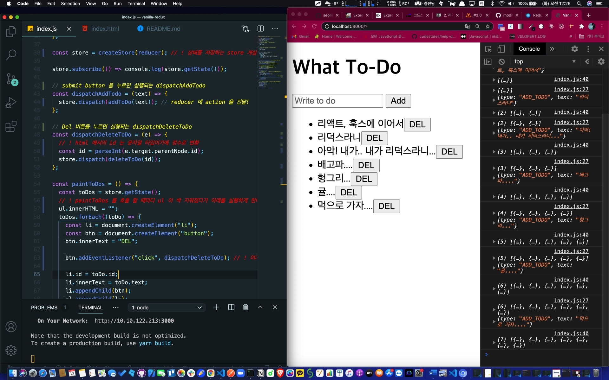

## 🐤잠자기 전 이불 속에서 볼 용도 - 1



```js
import { createStore } from 'redux'

const form = document.querySelector('form')
const input = document.querySelector('input')
const ul = document.querySelector('ul')

const ADD_TODO = 'ADD_TODO'
const DELETE_TODO = 'DELETE_TODO'

// ! action creator addToDo, it only returns object
const addToDo = text => {
  return {
    type: ADD_TODO,
    text,
  }
}

// ! action creator deleteToDo, it only returns object
const deleteToDo = id => {
  return {
    type: DELETE_TODO,
    id,
  }
}

const reducer = (state = [], action) => {
  console.log(state, action)
  switch (action.type) {
    case ADD_TODO:
      return [...state, { text: action.text, id: Date.now() }]
    case DELETE_TODO:
      return state.filter(todo => todo.id !== action.id)
    default:
      return state
  }
}

const store = createStore(reducer) // ! 상태를 저장하는 store 개설, 하지만 reducer 가 필요하지

store.subscribe(() => console.log(store.getState()))

// submit button 을 누르면 실행되는 dispatchAddTodo
const dispatchAddTodo = text => {
  store.dispatch(addToDo(text)) // reducer 에 action 을 전달!
}

// Del 버튼을 누르면 실행되는 dispatchDeleteToDo
const dispatchDeleteToDo = e => {
  // ! html 에서의 id 는 문자열 타입이기에 정수로 변환
  const id = parseInt(e.target.parentNode.id)
  store.dispatch(deleteToDo(id))
}

const paintToDos = () => {
  const toDos = store.getState()
  // ! paintToDos 를 호출 할 때마다 ul 이 싹 지워졌다가 아래를 실행하게 한다.
  ul.innerHTML = ''
  toDos.forEach(toDo => {
    const li = document.createElement('li')
    const btn = document.createElement('button')
    btn.innerText = 'DEL'

    btn.addEventListener('click', dispatchDeleteToDo) // ! 여기 주목

    li.id = toDo.id
    li.innerText = toDo.text
    li.appendChild(btn)
    ul.appendChild(li)
  })
}

// ! 구독, 스토어의 상태가 바뀔 때마다 알려주는 (실제 화면에 반영되게 하는) 역할을 한다.
store.subscribe(paintToDos)

const onSubmit = e => {
  e.preventDefault()
  const toDo = input.value
  input.value = ''
  dispatchAddTodo(toDo)
}

form.addEventListener('submit', onSubmit)
```

다 모르겠고 이것만 뚫어져라 보다가 자련다.
