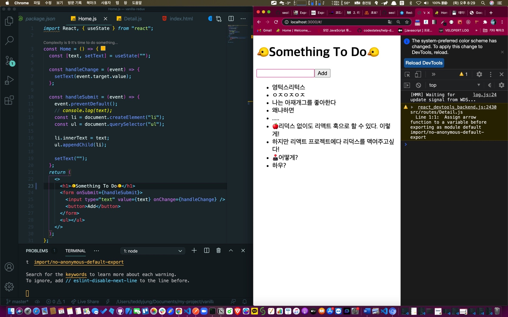

## 🐤코몽어스의 투두앱을 리덕스로 갈아엎기 위한 전초기지.

그것은 바로 이 글에서 부터..!


## 1. React 프로젝트 생성 및, react-redux, react-router-dom 설치

## 2. App.js 에서 Route 로 클라이언트 엔드포인트 분기 및 Home.js, Detail.js 생성

```js
import React from 'react'
import { HashRouter as Router, Route } from 'react-router-dom'
import Home from '../routes/Home'
import Detail from '../routes/Detail'

const App = () => {
  return (
    <Router>
      <Route path="/" exact component={Home}></Route>
      <Route path="/:id" exact component={Detail}></Route>
    </Router>
  )
}

export default App
```

## 3. Home.js 코드 작성하기

루트 경로에서 보여지게 될 투두 앱을 그대로 만든다?

그냥 Hooks, DOM 으로 추가까지 만든다.

```js
import React, { useState } from 'react'

const Home = () => {
  const [text, setText] = useState('')

  const handleChange = event => {
    setText(event.target.value)
  }

  const handleSubmit = event => {
    event.preventDefault()
    // console.log(text);
    const li = document.createElement('li')
    const ul = document.querySelector('ul')

    li.innerText = text
    ul.appendChild(li)

    setText('')
  }
  return (
    <>
      <h1>🐤Something To Do🐤</h1>
      <form onSubmit={handleSubmit}>
        <input type="text" value={text} onChange={handleChange} />
        <button>Add</button>
      </form>
      <ul></ul>
    </>
  )
}

export default Home
```

응?



## 4. 리덕스로 바까치기 하기


으잌ㅋㅋㅋㅋㅋㅋ

이제 대략 난감해졌다.. gg..
