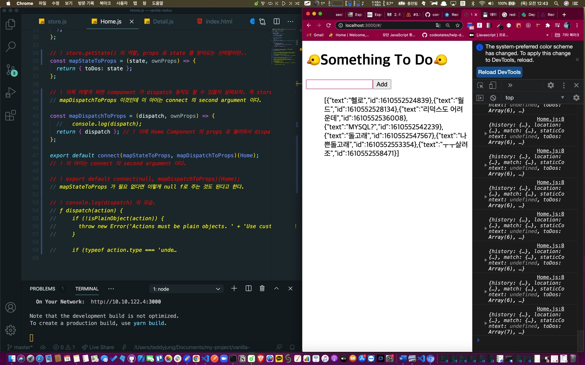

## 1. store.dispatch() 의 역할


저번 포스팅에 바닐라JS 에서 store.getState() 의 역할을 수행하게 하는 mapStateToProps 함수를 통해,

Home Component 에서 props 로 state 를 받아오게 하는 기적을 보았다.

이제 어떻게 하면 component 가 dispatch 동작도 할 수 있을지 살펴보자.

## 2. mapDispatchToProps 함수 선언하기

Home.js 컴포넌트에 저번 mapStateToProps 를 선언하듯이 만들어 주었다.

```js
const mapDispatchToProps = (dispatch, ownProps) => {
  console.log(dispatch)
}
```

아직 완전히 객체를 리턴하게 코드를 다 작성하지는 않았지만 일단 이대로 두고,

mapDispatchToProps 이 아이도 마찬가지로 connect 의 second argument 에 들어간다.

```js
export default connect(mapStateToProps, mapDispatchToProps)(Home)

// export default connect(null, mapDispatchToProps)(Home);
// mapStateToProps 가 필요 없다면 이렇게 null 로 주는 것도 된다고 한다.
```

그렇게 해서 콘솔.log 로 확인해본 dispatch 의 모습은 아래와 같다.

```js
ƒ dispatch(action) {
    if (!isPlainObject(action)) {
      throw new Error('Actions must be plain objects. ' + 'Use custom middleware for async actions.');
    }

    if (typeof action.type === 'unde…
```

## 3. mapDispatchToProps 함수에서 dispatch 를 리턴하게 하기

```js
const mapDispatchToProps = (dispatch, ownProps) => {
  return { dispatch }
}
```

이제 Home Component 의 props 로 불러와서 dispatch 를 할 수 있게 된다.

```js
import { addToDo } from '../store'
```

액션 크리에이터 함수인 addToDo 를 불러와서,

handleSubmit 함수에 props 으로 받아온 dispatch 를 실행한다.

```js
const handleSubmit = event => {
  event.preventDefault()

  setText('')
  props.dispatch(addToDo(text))
}
```

이렇게 props 로 받아와서 dispatch 를 날리면? 작동이 된다, 그러나? 이렇게 하는 것 대신 새로운 props 을 받아와 사용해보자.

작동이 잘 된다.



Home.js 에서 직접적으로 dispatch 를 처리하지 않게 만들어 보자. 일단 이유는 찬찬히 생각해 보겠다.

이제 mapDispatchToProps 로 가서 수정해 보자.

## 4. store.js 의 Action Creator Function

앞에 export 를 해제 했다. Why? 이제 더 이상 Action Creator Function 을 직접 사용 하지 않게 한다.

```js
const addToDo = text => {
  return {
    type: ADD,
    text,
  }
}

const deleteToDo = id => {
  return {
    type: DELETE,
    id,
  }
}
```

그리고 코드 하단에 아래와 같이 export 를 한다.

```js
export const actionCreators = {
  addToDo,
  deleteToDo,
}
```

이제 Home.js 에서 actionCreators 를 불러 오게 하면 된다.

```js
// Home Component
import { actionCreators } from '../store'
```

## 5. mapDispatchToProps 함수에서 addToDo 라는 function을 만들어 리턴하기.

```js
import { actionCreators } from "../store";

..... 중략 .....

const mapDispatchToProps = (dispatch, ownProps) => {
  return {
    addToDo: (text) => dispatch(actionCreators.addToDo(text)),
  };
};
```

addToDo 라는 function을 만들었다. 얘는 text argument 를 필요로 하고 이 함수가 실행되면서 dispatch 를 호출한다.

즉 addToDo 함수를 props 로 보내서 Home Component 에서 props 로 addToDo 를 받아와서 사용하기 전에

console.log(props) 로 확인해 보면?

```js
{history: {…}, location: {…}, match: {…}, staticContext: undefined, toDos: Array(0), …}
addToDo: text => {…}
history: {length: 5, action: "POP", location: {…}, createHref: ƒ, push: ƒ, …}
location: {pathname: "/", search: "", hash: "", state: undefined}
match: {path: "/", url: "/", isExact: true, params: {…}}
staticContext: undefined
toDos: []
__proto__: Object
```

addToDo: text => {…} 가 포함되어 있다!!!!!!!

## 6. handleSubmit 에서 addToDo 함수 실행하기

```js
const handleSubmit = event => {
  event.preventDefault()

  props.addToDo(text) // 성공적으로 reducer 에게 dispatch 하고 있다.

  setText('')
}
```

최종적으로 이제 내 Home component 는 직접적으로 dispatch 나 action creators 를 처리할 필요가 없게 된다.

dispatch 를 home component 에서 사용하지 않는다.

함수를 만들어서 props 로 전달하게 한다는 것이 요점인 듯 하다.

## 7. 완성 코드

헉헉 리덕스 ㅠㅠ 어렵다. 하지만 계속 시도해 보니 뭔가 더 편할 거 같다는 느낌? 은 온다.

```js
import React, { useState } from 'react'

import { connect } from 'react-redux'

import { actionCreators } from '../store' // ! 얘도 임포트 해와야 한다.

// dispatch 를 home component 에서 사용하지 않는다. 함수를 만들어서 props 로 전달하게 한다.
const Home = props => {
  console.log(props)

  const [text, setText] = useState('')

  const handleChange = event => {
    setText(event.target.value)
  }

  const handleSubmit = event => {
    event.preventDefault()
    props.addToDo(text) // 성공적으로 reducer 에게 dispatch 하고 있다.

    setText('')
  }
  return (
    <>
      <h1>🐤Something To Do🐤</h1>
      <form onSubmit={handleSubmit}>
        <input type="text" value={text} onChange={handleChange} />
        <button>Add</button>
      </form>
      <ul>{JSON.stringify(props.toDos)}</ul>
    </>
  )
}

// ! store.getState() 의 역할, props 로 state 를 받아오는 신박함이란..
const mapStateToProps = (state, ownProps) => {
  return { toDos: state }
}

const mapDispatchToProps = (dispatch, ownProps) => {
  return {
    addToDo: text => dispatch(actionCreators.addToDo(text)),
  }
}

export default connect(mapStateToProps, mapDispatchToProps)(Home)
```
