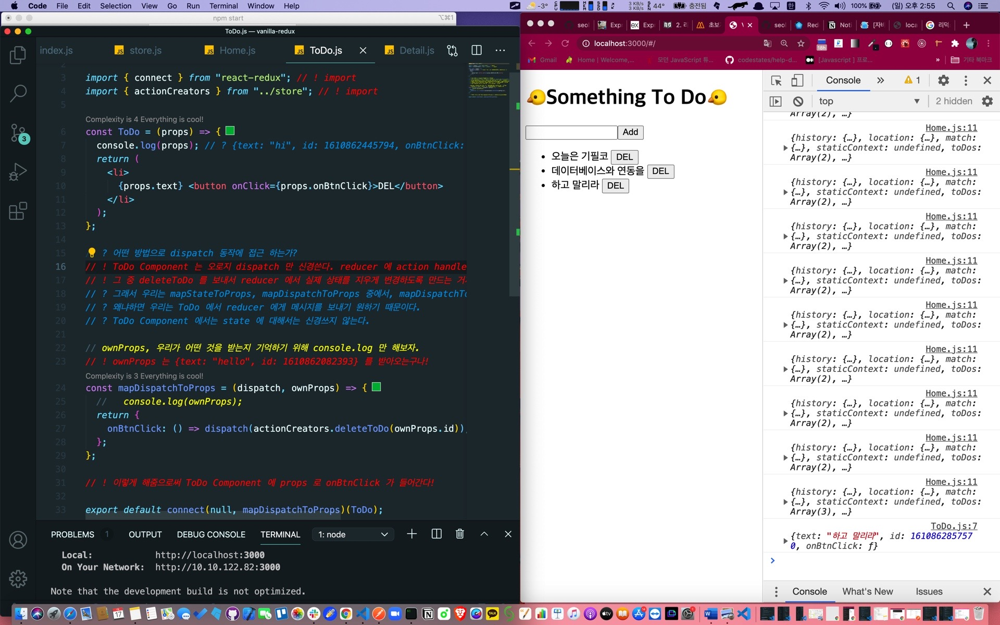

## 1. Home.js 내 ul 렌더링 수정

```jsx
return (
  <>
    ..... 중략 .....
    <ul>
      {props.toDos.map(toDo => (
        <ToDo {...toDo} key={toDo.id} />
        // {text: "asd", id: 1610861319410}
      ))}
    </ul>
  </>
)
```

props 를 위와 같은 방식으로 props 의 이름을 명시하지 않고도,

객체 안에 spread operator 만으로도 내릴 수 있다는 것을 알게 되었다.

## 2. li 를 뿌려줄 ToDo 컴포넌트 생성하기

```jsx
const ToDo = props => {
  return (
    <li>
      {props.text} <button>DEL</button>
    </li>
  )
}
```

컴포넌트 인자에 ({ text }) 로 받을 수 있지만은 나는 console 로그로 다시 잘 확인해 보고 싶어서 일부러 props 로 이어 받게 했다.

그러면 Home.js 에 있는 handleSubmit 함수가 mapDispatchToProps 를 통해 전달한 props.addToDo(text) 를 실행해서,

reducer 에서 toDos 의 state 를 변경하게 만든다.

즉, 클라이언트에서 추가 되는 기능을 제대로 확인할 수 있게 된다.

## 3. deleteToDo 구현하기

작성한 todo 를 삭제 하는 것을 하려면 reducer 에서 상태 변경을 일으키게 만들어야 한다.

상태 변경을 일으키게 하는 메서드가 바로

store.dispatch(actionHandler()) 이다.

ToDo Component 는 오로지 dispatch 만 신경쓴다.

reducer 에 deleteToDo 를 수행하는 action handler 함수를 보낸 뒤 reducer 에서 실제 상태를 지우게 변경하도록 만드는 거지!

그럼 어떤 방법으로 dispatch 동작에 접근 하는가?

mapStateToProps, mapDispatchToProps 중에서, mapDispatchToProps 를 쓸 것이다. 바로 이 컴포넌트에!

왜냐하면 ToDo 에서 reducer 에게 메시지를 (상태를 지우도록) 보내기 원하기 때문이다.

ToDo Component 에서는 state 에 대해서는 신경쓸 필요가 없으므로 mapDispatchToProps 는 사용하지 않는다.

## 4. mapDispatchToProps 과 ownProps

```js
const mapDispatchToProps = (dispatch, ownProps) => {
  console.log(ownProps)
}
```

이번에는 ownProps 도 사용할 것이라 파라미터에 dispatch, ownProps 도 같이 넣었다.

console.log 로 ownProps 가 어떤 것을 받는지 확인해 보았다.

```js
{text: "hello", id: 1610862082393}
```

이제 mapDispatchToProps 를 통해 현재 ToDo Componenet 에 props 로 mapDispatchToProps 가

리턴하는 것을 받을 수 있게 export 부분을 고쳐 놓자.

```js
export default connect(null, mapDispatchToProps)(ToDo)
```

mapStateToProps 를 사용하지 않을 때는 null 로 두면 된다.

## 5. mapDispatchToProps 가 리턴하는 객체

```js
const mapDispatchToProps = (dispatch, ownProps) => {
  //   console.log(ownProps);
  return {
    onBtnClick: () => dispatch(actionCreators.deleteToDo(ownProps.id)),
  }
}
```

onBtnClick 은 이제 현재 컴포넌트에서 props 로 받을 수 있다.

그런데 onBtnClick 이 실행하는 것은 바로 dispatch 이다.

안에 액션 핸들러 함수인 deleteToDo 를 실행시키고 파라미터로 ownProps 의 id 를 받아올 수 있다.

## 6. ToDo 컴포넌트 수정, button 에 onClick 적용하기

```js
const ToDo = props => {
  console.log(props)
  // ? {text: "hi", id: 1610862445794, onBtnClick: ƒ}
  return (
    <li>
      {props.text} <button onClick={props.onBtnClick}>DEL</button>
    </li>
  )
}
```

위에서 확인할 수 있듯 이제 props 에 onBtnClick 속성이 들어와 있다.

이제 이 함수를 버튼의 onClick 에 연결하자.


