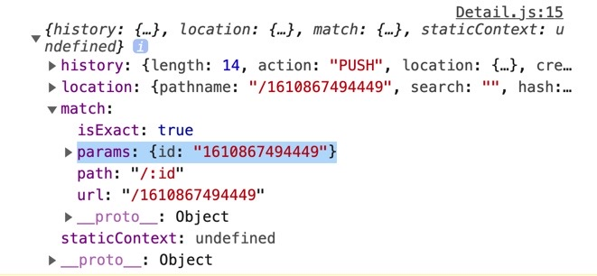
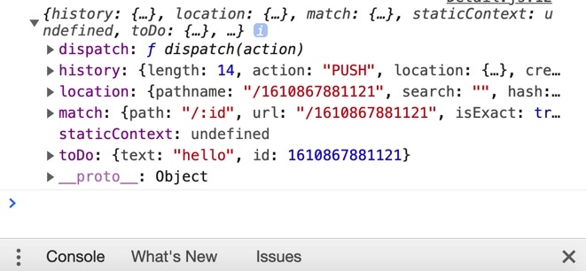

## 1. Detail 컴포넌트 만들기

```js
const Detail = () => {
  return <h1>Detail</h1>
}
```

App.js 에 아래와 같은 경로로 연결했을 시 Detail 컴포넌트로 접근이 가능하게 props 를 내린 것을 확인할 수 있다.

```js
<Router>
  <Route path="/" exact component={Home}></Route>
  <Route path="/:id" exact component={Detail}></Route>
</Router>
```

## 2. ToDo 컴포넌트에서 Link 사용하기

```jsx
import { Link } from "react-router-dom";

..... 이하 중략 .....

return (
  <li>
    <Link to={`/${props.id}`}>
      {props.text} <button onClick={props.onBtnClick}>DEL</button>
    </Link>
  </li>
)
```

기존의 li 태그 내 컨텐츠를 Link 로 묶고 to 속성에 props.id 로 경로를 이동하면 해당 id 의 Detail 에 접근할 수 있도록 해 준다.

## 3. Detail.js 에서 id 를 받아오는 방법 - useParams

```js
import { useParams } from 'react-router-dom'

const Detail = () => {
  // useParams hooks 를 사용했을 때 id 를 가져오는 법
  const id = useParams()
  console.log(id) // {id: "1610867080250"}

  return <h1>Detail</h1>
}
```

useParams hooks 를 사용해서 해당 파라미터로 접근한 Detail 의 id 를 가져올 수 있다.

하지만 Redux 로는 어떻게 가져올 수 있을까?

## 4. Detail.js 에서 id 를 받아오는 방법 - mapStateToProps

ownProps 만으로도 id 를 가져올 수 있다.

```js
const mapStateToProps = (state, ownProps) => {
  console.log(ownProps)
}

export default connect(mapStateToProps, null)(Detail)
```



ownProps 가 찍히는데 이제 거기에서 match.params.id 가 필요하다.

```js
const mapStateToProps = (state, ownProps) => {
  console.log(ownProps)
  const {
    match: {
      params: { id },
    },
  } = ownProps
}
```

이렇게 하면 ownProps.match.params.id 로 적을 필요 없이 바로 id 로 접근할 수가 있게 된다.

그리고 리턴을 해주면서 해당 객체 내에 state 를 불러와서 find 함수를 통해 배열 내 toDo 의 id 와,

ownProps.match.params.id 가 같은 요소 하나를 리턴하게 한다.

```jsx
const mapStateToProps = (state, ownProps) => {
  console.log(ownProps)
  const {
    match: {
      params: { id },
    },
  } = ownProps
  return { toDo: state.find(toDo => toDo.id === parseInt(id)) }
}
```

Detail 컴포넌트에서 props 로 받아 콘솔 로그를 확인해 보면,



위의 그림과 같은 모습을 확인할 수가 있다.

## 5. Detail 컴포넌트 렌더 하기

```jsx
const Detail = props => {
  console.log(props)
  return (
    <>
      <h1>{props.toDo?.text}</h1>
      <h5>Created at : {props.toDo?.id}</h5>
      {/* 왜 물음표를 붙여야 에러를 피하는지는 아직 잘 모르겠다. */}
    </>
  )
}
```
