## 1. 스코프가 대체 뭐지? 배그의 그 스코프 인가..

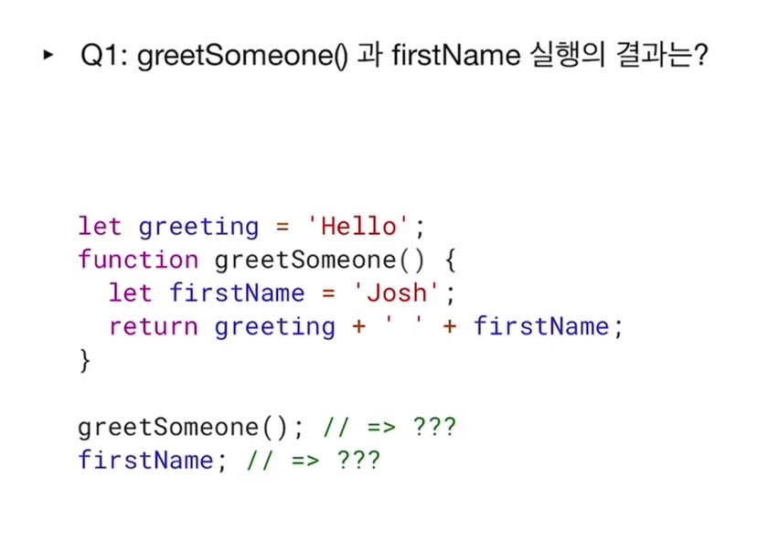

greetSomeone(); 을 실행했을 때 범위 바깥의 변수를 범위 안으로 가져와 쓸 수 있구나. 해서 Hello Josh 를 보여주게 된다.

firstName(); 이거는 에러가 발생한다. ReferenceError 를 일으키는데,

firstName is not defined 라면서 참조 에러가 뜬다. 즉, 함수 내 정의된 변수를 범위 바깥에서 써먹을 수 없다 라는 의미인데 여기서 우리 눈에 안보이는 바운더리가 있다고 한다.

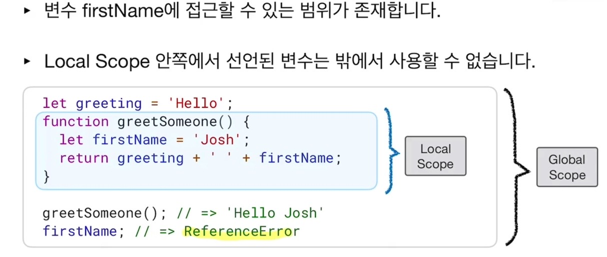

위 그림에서 보듯이,

1. 변수 firstName 에 접근할 수 있는 범위가 존재하며
2. Local Scope 안쪽에서 선언된 변수는 밖에서 사용할 수 없다.

## 2. Scope 의 정의

함수가 생성될 때 자신만의 범위를 가지게 된다고 한다. 그리고 그 함수 안쪽에서만 변수를 사용할 수 있다고 배웠다.

Scope 는 변수 접근 규칙에 따른 유효 범위를 뜻한다.

- 변수는 어떠한 환경 내에서만 사용 가능하며, 프로그래밍 언어는 각각의 변수 접근 규칙을 가지고 있다 한다.

- 변수와 그 값이, 어디서부터 어디까지 유효한지를 판단하는 범위를 뜻한다.

- Javascript 는 기본적으로, 함수가 선언되는 (lexical) 동시에 자신만의 scope 를 가진다.

## Rule 1 : Local vs Global

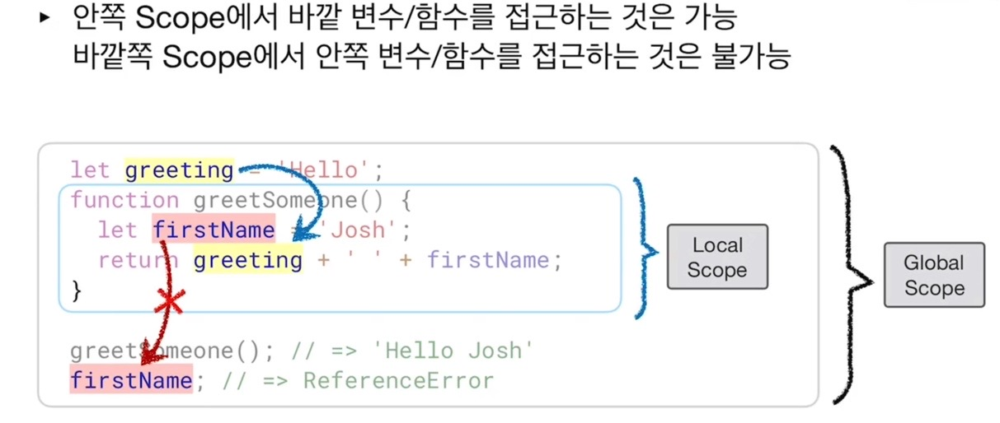

```js
- 안쪽 scope 에서 바깥 변수/함수 를 접근하는 것은 가능하다.
- 바깥쪽 scope 에서 안쪽 변수/함수 를 접근하는 것은 불가능 하다.
: 즉, local scope 에 정의된 변수를 바깥쪽에서 접근하는 것은 불가능하다.
```

- scope 는 중첩이 가능하다. (버블 같이, 함수 안에 함수를 넣을 수 있다고 한다.)

- Global Scope 는 최상단의 scope 로, 전역 변수는 어디서든 접근이 가능하다.

- 지역 변수는 함수 내에서 전역 변수보다 더 높은 우선 순위를 가진다.
  : 즉 inner 함수 안에서 임의의 변수를 찾고자 할 때, 지역 변수를 먼저 참고해서 가져오고, 지역 변수가 없다면 전역 변수의 값을 참조해 갖고 오는 느낌인 거 같다.

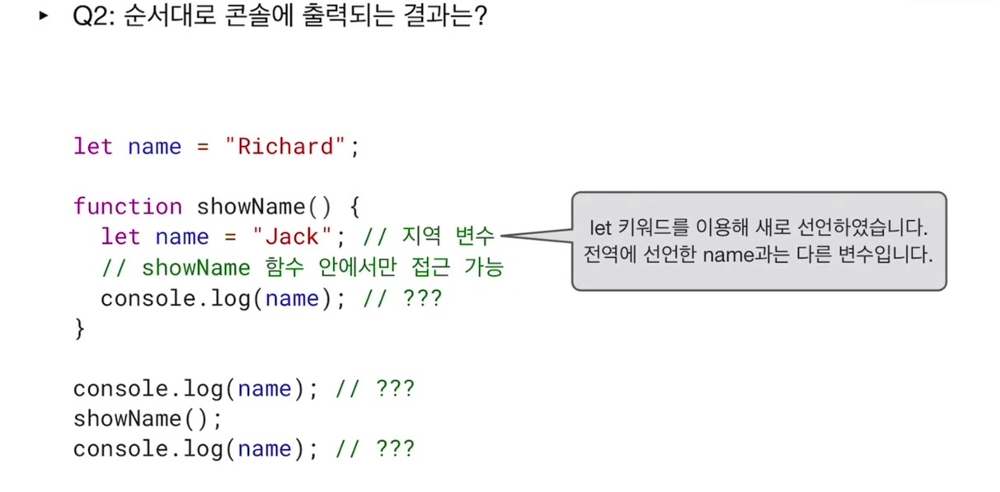

순서대로 콘솔에 출력되는 결과가 무엇인지 추리하는 과정을 가졌다.

여기서 지역 변수는 항상 전역 변수보다 우선 순위가 높다는 바로 위 마지막 정의가 맞아 떨어진다는 것을 체감할 수 있다.

문제 2에 대한 해답.
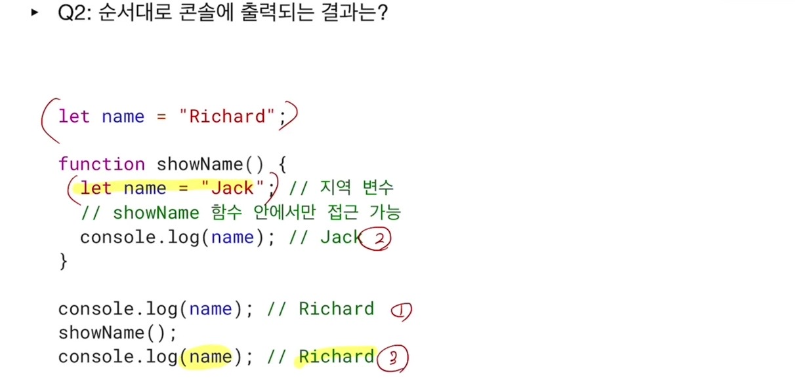

문제 3번은 바로 위의 문제 2번과 비슷하지만, 함수 내의 let 키워드 없이 'jack' 을 name 에 할당하였다.
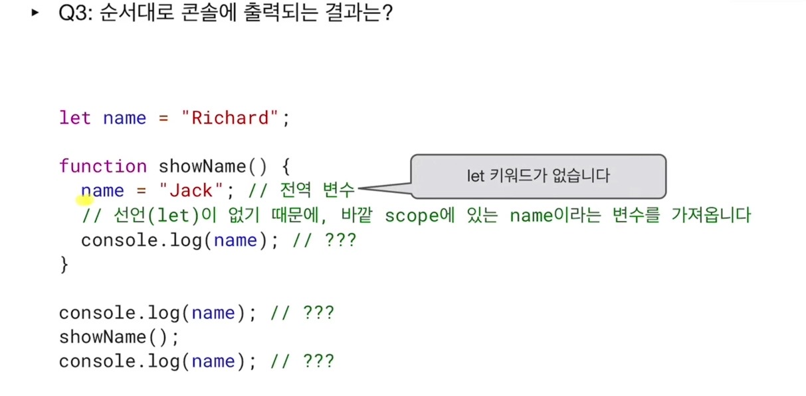
그래서 처음 콘솔로그에는 전역 변수인 name 의 값 "Richard" 를 가져오게 되나, 함수 showName() 을 실행하면서 "jack" 이 출력된다.
그리고 마지막 console.log(name); 은 처음과 마찬가지로 전역 변수 name 을 참조하는데, 함수 showName() 에 의해 전역 변수가 바뀌어 버려 "jack" 을 출력하게 된다.

문제 3에 대한 해답은 아래와 같다.
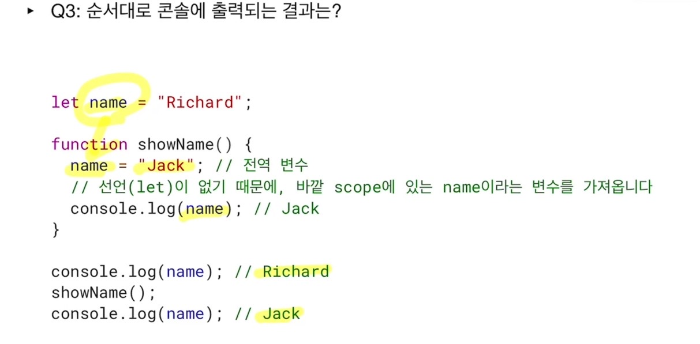

## Rule 2 : Function Scope VS Block Scope

블록이란 무엇인가? 첨에 영상을 보며 발음이 약간 불낙 같아서 나는 그 유명한 이게 불낙이야? 를 바로 떠올렸다..

<p align="center"></p>

음.. 여튼..

- Block : 중괄호 (curly bracket) 로 시작하고 끝나는 단위를 말한다.

그러면 Function Scope 랑 Block Scope 랑 뭔 차이지?

바로 이어지는 퀴즈 4번을 풀어보았다.

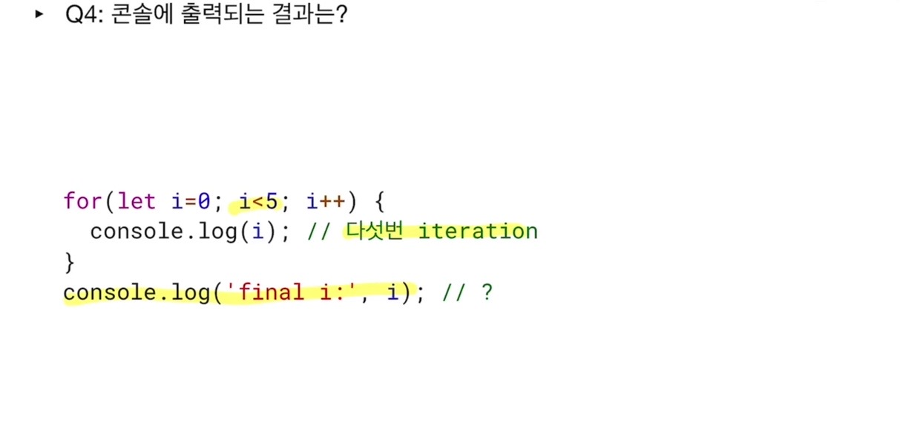
반복문 조건 내의 변수를 let i = 0 으로 했다는 점을 눈여겨 봐야 한다.
아까 배웠듯 블록 바깥에서 i 를 애타게 불러봐도 찾을 수가 없다.
에러를 일으킨다.

문제 4에 대한 해답이다.
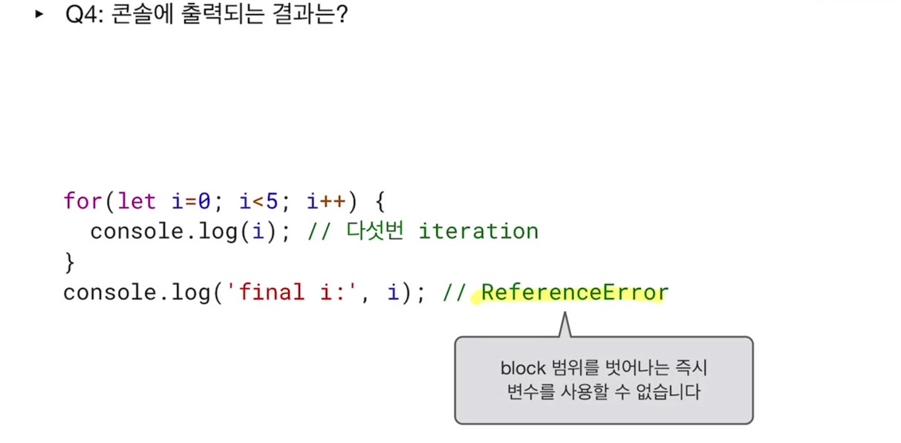
block scope 범위를 벗어나는 즉시 변수 를 사용할 수 없게 되는구나! 아까 맨 처음처럼 ReferenceError 를 일으키는구나!
정의된 i 를 찾을 수가 없다.
왜? let 키워드로는 block 범위 안에서만 변수 i를 쓸 수 있기 때문이다.

### var 키워드 VS let 키워드

변수를 정의하는 또다른 키워드. var

- Javascript 는 기본적으로, 함수 단위로 자신만의 scope 를 가진다.

  > > > var 키워드 (Old way)

- 그러나, Block 단위로 scope 를 구분했을 때에 예측하기 쉬운 코드를 작성할 수 있다고 한다.
  > > > let 키워드

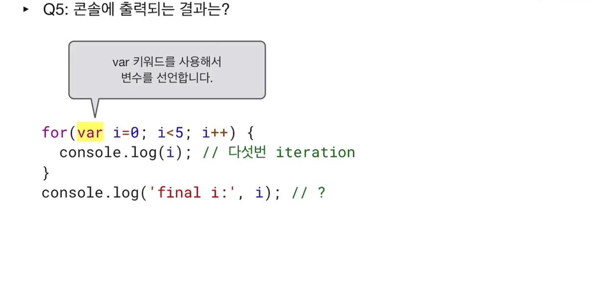
문제 5번을 통해서 반복에 var i = 0 을 사용한 콘솔 출력의 결과를 예측해 보았다. 4가 출력되는 줄 알았다.

var i = 0; 으로 선언한 반복문이다.
i 는 이제 block scope 내 에서만 쓸 수 있는 게 아니라,

```js
하나의 function scope 안쪽에서 사용이 가능하다.
여기 문제에서는 따로 function 구분은 없기에,
그 자체로 function scope 를 가지고 있다.
```

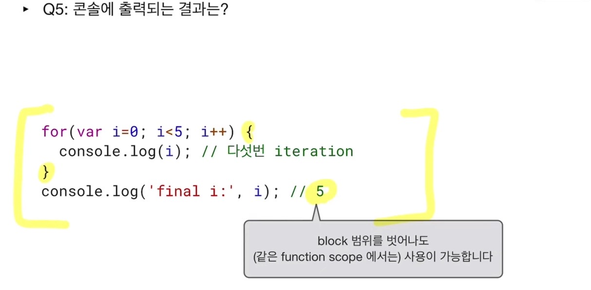

그리고 4가 아닌 5가 된 이유는, 0,1,2,3,4 하고 마지막 증감문 i++ 까지 했기 때문에 5가 된 것이였다.

언뜻 var 선언이 편하게 보이지만 block 안쪽에 있어야만 그 변수의 유효 범위가 눈에 확 들어올 수 있고,

위의 문제 5번의 경우는 i를 예상 못하게 뒤에서도 쓰거나 재사용 할 수 있는 위험성이 존재한다고 한다.

그래서 var 보다 let 을 쓴다고 한다.

### 개발자 콘솔로 확인하는 var 키워드와 let 키워드

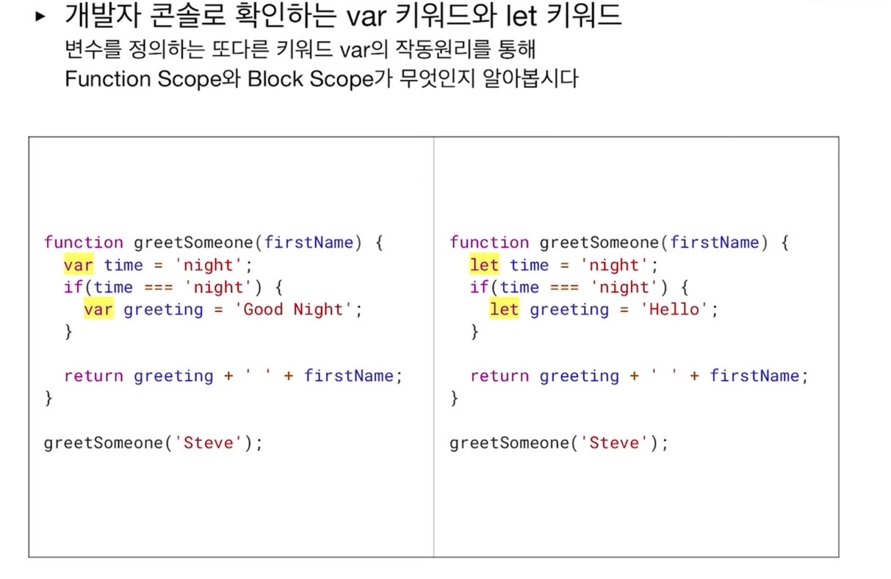

나는 오른쪽 let 에서 에러를 일으킬 거 같다 예상했고 맞았다.

위 그림의 코드를 개발자 콘솔로 옮겨보면, scope 라는 tab 을 확인할 수가 있다.
여기에서 Local 에 3개의 변수가 담겨 있는 걸 볼 수 있다.

- var
  : 함수 내 정의 된 3개의 변수. block 안에 var greeting 이라는 변수를 눈여겨 보자. 함수 내 정의 된 모든 변수를 local scope 에서 사용가능 하다.

- let
  : block scope 를 따르므로 block 안에 변수가 같힌다. block 안에 있는 greeting 을 찾을 수 없다. let greeting 은 안쪽 block 에서만 사용이 가능하다.

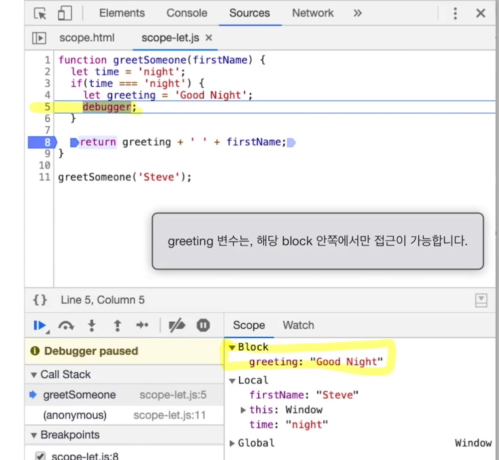

block 안에 debugger 입력을 통해 개발자 콘솔에서 block 의 변수를 확인할 수 있다.

즉, greeting 변수는 해당 block 안에서만 접근이 가능하다.
block scope 안에서는 local, global 변수를 모두 사용할 수 있다.

### const 키워드

값이 변하지 않는 변수, 즉 상수를 정의할 때 사용하는 키워드 라고 한다.

- let 과 동일하게 block scope 를 따른다.
- 값을 재정의 하려고 하면 TypeError 를 낸다. 즉 let 처럼 재할당이 불가능! 하다.

```js
const pi = 3.14;
pi = 3.1415;

>>> Uncaught TypeError : Assignment to constant variable
: 즉 새롭게 assignment 를 할 수 없다. 라는 의미의 에러.
```

### let, const 의 값 재정의 와 재선언의 차이?

재정의는 let 은 가능하다. const 는 바로 위의 예처럼 불가능하다.

근데 재선언은 let 과 const 모두 불가능하다.

```js
let num = 3.14;
let num = 8.15;

>>> SyntaxError 'num' has already been declared at
: const 도 마찬가지로 이미 선언된 변수를 또 선언할 수가 없다.
```

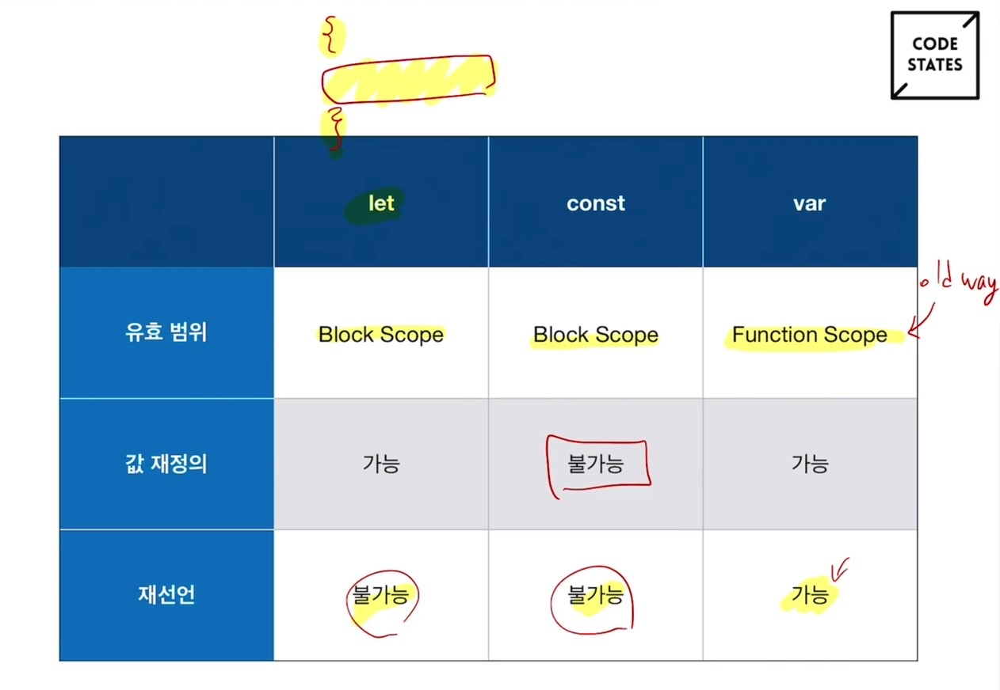

이렇듯 let 과 const 는 재선언이 불가능하지만 var 은 가능하다.

근데 실제 코딩시에 재선언을 해야 할 필요가 있을까 라고 영상에서 설명했다.
보통 그런 경우는 버그이고 var 키워드가 아닌, let 키워드를 통해 이러한 실수를 막아준다고 한다.

var 보다 let 을 추천하는 이유가 된다고 할까?

## Rule 3 : 전역변수와 window 객체

개발자 콘솔에 window 라 쓰고 엔터 치면 어떤 객체가 나오는데, 자세히 열어보면 전부 전역에 쓸 수 있는 키들이 등장한다.

- Global Scope 에서 선언된 함수나,
- var 로 선언된 변수는

window 객체와 연결된다.

1. Global scope 에 선언된 함수 foo()
   : window 를 치고 들어가보면 객체 내에 foo 라는 것을 찾을 수 있다.

```js
foo === window.foo() >>> true
```

2. var myName = "paul";
   : window 치고 들어가보면 찾을 수 있다.

```js
myName === window.myName >>> true
```

3. let yourName = 'tim';
   : window.yourName 쳐보면 "undefined" 라 뜬다. let 키워드를 썼을 땐 window 객체에서 찾을 수가 없다.

### 전역 범위에 너무 많은 변수를 선언하지 않도록 주의

잘은 이해 되지 않는데, 전역은 최상위 scope 영역이다. 어떤 library 가 어떤 변수를 쓸 지 알 수 없으므로,
혹시나 i 라는 이름이 겹쳐진다면 오류를 일으킬 수도 있다 한다.

그래서 bracket 안에 let 을 선언해 (하나의 스코프를 만들어서) 변수를 설정하는 게 좋다고 한다.

## Rule 4 : 선언 없이 초기화된 전역 변수

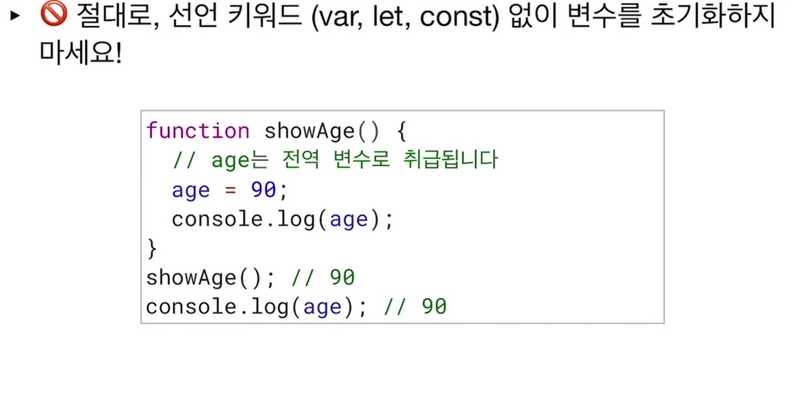

절대로 선언 키워드 없이 (var, let, const) 변수를 초기화 하지 말라고 한다.

위의 예시 그림처럼 age = 90; 은,

```js
age === window.age
```

와 같으며 심지어 에러도 안떠서 그래서 더 위험하고 좋은 방법이 아니라 한다.

이러한 실수를 방지하고 싶을 때, 자바스크립트 파일 상단에 'use strict'; 라는 문자열을 넣는다.

### strict mode 를 사용하자

자바스크립트 파일 상단에 적힌 문자열, 'use strict'; 는 문법적으로 실수할 수 있는 부분들을 에러로 판단한다.

파일을 저장한 상태에서만 strict mode 가 사용 가능해 진다.

콘솔에서 바로 사용은 안된다.

의도하지 않게 age = 90; 같은 문제룰 Reference Error 를 일으켜 걸러낼 수 있다.
