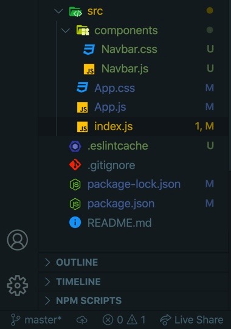

## 👩🏻‍🦳GET, SET, Ready... GO!

React Hooks 에 대해 공부해 보면서 복습겸 나의 컨텐츠를 팔 수 있는? SPA page 를 만들어 보려 한다.

유튜브에 나오는 외국 분의 목소리가 좋아서 영상을 보면서 조금씩 내가 이해하며 입맛에 맞게 변형시키고 진화 시킬 거다.

그 중 오늘은 훅에 대한 이해를 해보고자 react 공식 문서를 참고해 보았다.

근데 먼저 문서를 본 것은 아니고.. 일단 코드를 보면서 따라 해 본 후에,

그 다음에 공식 문서를 보니까 (무조건봐야됨)

https://ko.reactjs.org/docs/hooks-state.html

아아주 느낌이 굿굿이다. 이런 납득할 수 있는 거 너무 좋다.

오늘은 페이지의 navigation bar 부분을 만들어 보았다.

가즈아!!

## 🥳리액트 프로젝트 초기화 및 구조 설정하기

### 1. npx create-react-app self-intro-spa

### 2. npm start 로 서버가 돌아가는 것 확인.

### 3. 파일 제거 및 component 디렉토리 생성하기

src/ 내에 프로젝트 파일들이 위치하고 있다.

```jsx
src / App.js
src / App.css
src / App.test.js
src / logo.svg
```

몇개 더 있긴 했는데 아무튼 필요없는 거 싸그리 싹 지운다.

App.css 내 코드도 싹 다 지운다.

그리고 src/components 컴포넌트들이 위치하는 디렉토리 (components) 를 만들어 준다.

### 4. component 디렉토리 내에 Navbar.js, Navbar.css 파일 생성하기

오늘의 미션은 네비게이션 바 컴포넌트를 만드는 거니까 파일들을 생성해 준다.

### 5. react-router-dom 설치하기

브라우저에서 사용되는 리액트 라우터를 설치한다.

엔드포인트의 경로를 설정하게 해주는 건가 보다.

```js
npm install react-router-dom
```

그렇게 시작하기 위한 준비를 마쳤다!



## 🌈index.js 파일의 역할

```jsx
import React from 'react'
import ReactDOM from 'react-dom'
import App from './App'

ReactDOM.render(<App />, document.getElementById('root'))
```

브라우 저에 App component 를 렌더 하는 역할을 맡고 있으며 바로 이 index.js 가 npm start 를 통해 서버가 실행되면서 읽어들이는 파일이다.

## 🌈App.js 파일의 역할 및 코드 작성

index.js 가 실행을 담당한다 라면 App.js 는 전체 앱의 심장부 역할을 하는 느낌이라 해야 될까?

```jsx
import React from 'react'
import Navbar from './components/Navbar'
import './App.css'

function App() {
  return (
    <>
      <Navbar />
    </>
  )
}

export default App
```

기존 코드를 싸그리 갈아 엎고, 미리 선빵(?) 으로 Navbar 를 import 해온다.

만들면 되지 머!

```jsx
return (
  <>
    <Navbar />
  </>
)
```

덩그러니 Navbar 컴포넌트를 하나 넣어주었다.

여기서 꼭 굳이 div 로 감싸지 않고 <> 로 감쌀 수도 있단 거를 알게 되었다.

## 🧚‍♀️Navbar.js 만들기

rafc 키워드 와 이거 물건이다. rafc 치고 엔터 치니까 자동으로..

함수형 컴포넌트 코드가 똬악 만들어 져 버린드아..

## 🦹🏼‍♂️Nav 바에 넣을 아이콘? FontAwesome 이 있지!

예전에 가입한 거 같은데 안되어 있길래 가서 가입하고 제공해 주는 코드가 있다.

```js
Add Your Kit's Code to a Project
<script src="https://kit.fontawesome.com/12345678.js" crossorigin="anonymous"></script>
```

이거를 public/index.html 의 head 내에 삽입해 주면 이제 폰트 어썸 을 쓸 수가 있다!

이제 로고를 넣으러 가자.

## 🧚‍♀️Navbar.js 로고 만들기 - hooks 의 useState, react-router-dom 의 Link 컴포넌트

hook 이 뭐여.. 하면서 어리둥절 했었는데 아.. 이것도 또한 물건이다..


```jsx
import React, { useState } from 'react'
// useState Hook을 React에서 가져온다.
import { Link } from 'react-router-dom'
// react-router-dom 에서 Link 라는 컴포넌트를 불러온다.
// <a></a> 태그 같은 역할을 하면서 경로를 설정해 주는 역할 같다!

function Navbar() {
  const [click, setClick] = useState(false)
  // Destructing Assignment (구조 분해 할당을 사용한다)
  // 첫번째 click 은 state 변수이다.
  // 두번째 setClick 은 해당 click 상태를 갱신할 수 있는 함수이다.
  // useState 의 인자로 false 를 넘겨준 건 click 변수의 값을 false 로 초기화한거다.
  return (
    <>
      <nav className="navbar">
        <div className="navbar-container">
          <Link to="/" className="navbar-logo">
            Dev.SL2 <i className="fas fa-dove" />
          </Link>
        </div>
      </nav>
    </>
  )
}

export default Navbar
```

Link 컴포넌트는 react-router-dom 에서 불러왔는데 역할은 a 태그 같은 거라 보면 된다.

to 라는 props 를 통해 컴포넌트 내 dove 아이콘을 눌렀을 때 루트 경로로 라우팅 되는 거다.

기가 맥히다.

https://ko.reactjs.org/docs/hooks-state.html

주커버그 뽀뽀해주고 싶다. 와 심지어 한글이다..

헤헤 난 이제 비둘기쨩을 로고로 쓸거야~🕊


와아 벌써 다한 기분이야!🥰🥰

일단 중간 저장쓰.. 일일커밋..
