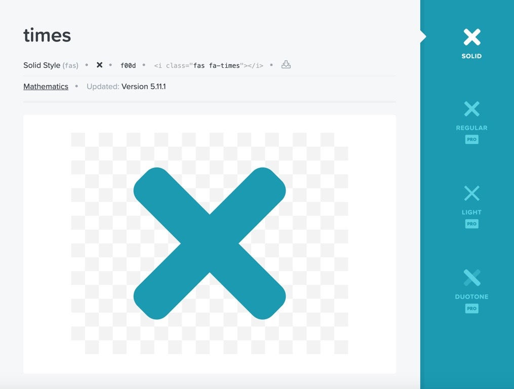
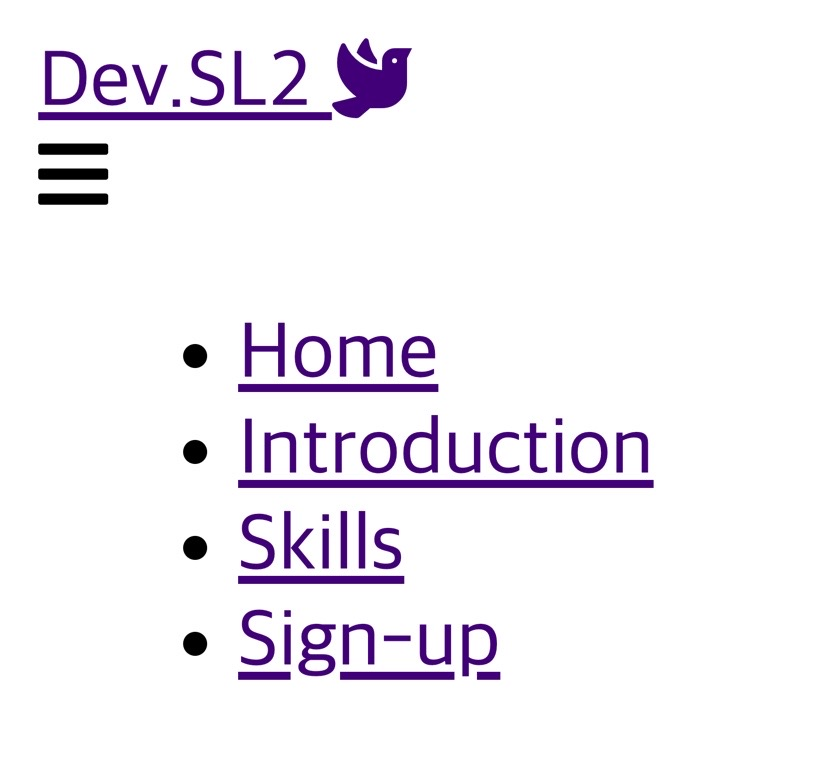

## 🍔햄버거 아이콘 넣기 with 삼항 연산자

평화의 상징 비둘기 아이콘을 넣어주었으니 그 다음은 햄버거 아이콘을 넣었다.

왜 그런거 있지 않나. 누르면 메뉴판 마냥 촤락~ 펼쳐지는 거


아 햄버거 먹고 싶다..

여튼 Navbar 1편에 이어서..

https://dev-seolleung2.netlify.app/development/Self-intro-app-1/

내 메뉴판을 보여줄 햄버거를 삼항 연산자를 통해 넣었다.

```jsx
<div className="menu-icon">
  <i className={click ? 'fas fa-times' : 'fas fa-bars'} />
</div>
```

click 이 true 이면, 'fas fa-times' 즉 X 아이콘을 보여주고,

아니면 (클릭 안했을 떄) 햄버거 아이콘을 보여주겠단 거다.

그러면 클릭 이벤트가 발생해야 하는데 해서 여기에 onClick 이벤트를 걸어주는 거다.

```jsx
<div className="menu-icon" onClick={handleClick}>
  <i className={click ? 'fas fa-times' : 'fas fa-bars'} />
</div>
```

그리고 handleClick 을 선언해 준다,.

```jsx
const handleClick = () => setClick(!click)
```

handleClick 을 통해서 click 의 state 를 바꿔 줄 수 있는 setClick 함수가 발동한다.

click 의 default state 는 false 로 설정했었으니까 !click 을 통해 이제 click 의 상태를 true 로 바꾸겠단 거다!

즉 클릭을 했어? 그럼 난 X 표 보여줄꺼임.



크.. 이제 햄버그 아이콘도 만들고, onClick 이벤트로 아이콘이 바뀌어지게도 해줬다!


## 🍔햄버거와 연동할 Nav 리스트 만들기.

일단 전체 코드를 넣어 보자.

```jsx
import React, { useState } from 'react'
import { Link } from 'react-router-dom'

function Navbar() {
  const [click, setClick] = useState(false)
  const handleClick = () => setClick(!click)
  const closeMobileMenu = () => setClick(false)

  return (
    <>
      <nav className="navbar">
        <div className="navbar-container">
          <Link to="/" className="navbar-logo">
            Dev.SL2 <i className="fas fa-dove" />
          </Link>
          <div className="menu-icon" onClick={handleClick}>
            <i className={click ? 'fas fa-times' : 'fas fa-bars'} />
          </div>
          <ul className={click ? 'nav-menu active' : 'nav-menu'}>
            <li className="nav-item">
              <Link to="/" className="nav-links" onClick={closeMobileMenu}>
                Home
              </Link>
            </li>
          </ul>
        </div>
      </nav>
    </>
  )
}
```

기존 코드에서 추가 된 것은 바로 ul 태그 이다.

ul 에도 click 의 state 가 true 일 때 'nav-menu active' 로 className 이 바뀌게 해 주었다.

이건 나중에 css 처리를 해줄 것이다.

```jsx
<ul className={click ? 'nav-menu active' : 'nav-menu'}>
  <li className="nav-item">
    <Link to="/" className="nav-links" onClick={closeMobileMenu}>
      Home
    </Link>
  </li>
</ul>
```

li 태그 내에 Link 컴포넌트를 불러오고 onClick 이벤트로 closeMobileMenu 함수를 걸어 주었다.

변수명을 명기 할 때 의미가 충분히 전달되는 이름을 지어야 한다는 걸 깨닫고 있다.

이제 closeMobileMenu 함수를 만들어야지!

```jsx
const closeMobileMenu = () => setClick(false)
```

closeMobileMenu 함수는 click 의 status 를 false 로 만든다.

click 의 status 가 false 로 바뀌면, ul 에 걸은 삼항 연산자에 의해서 className 이 'nav-menu' 인 상태를 보여줄 것이다.

이렇게 하고 화면을 보면 오류 메시지를 확인할 수 있다.

## 🥳App.js 에 import BrowserRouter 하기

이 부분은 내일 시작 전 찾아봐야 하는 부분이다.

```jsx
import React from 'react'
import Navbar from './components/Navbar'
import { BrowserRouter as Router, Switch, Route } from 'react-router-dom'
import './App.css'

function App() {
  return (
    <>
      <Router>
        <Navbar />
        <Switch>
          <Route path="/" exact />
        </Switch>
      </Router>
    </>
  )
}

export default App
```

뭔가 통박 때려 맞추기(?) 로 생각해 보면,

저것들을 불러 와야 route 경로를 'react-router-dom' 에서 불러온 컴포넌트와 합을? 이루는 거 같다.

일단 받아들이자.

이제 li 목록을 더 넣어 주었다. 총 4개!



## 최종 완성된 코드

```jsx
import React, { useState } from 'react'
import { Link } from 'react-router-dom'

function Navbar() {
  const [click, setClick] = useState(false)
  const handleClick = () => setClick(!click)
  const closeMobileMenu = () => setClick(false)

  return (
    <>
      <nav className="navbar">
        <div className="navbar-container">
          <Link to="/" className="navbar-logo">
            Dev.SL2 <i className="fas fa-dove" />
          </Link>
          <div className="menu-icon" onClick={handleClick}>
            <i className={click ? 'fas fa-times' : 'fas fa-bars'} />
          </div>
          <ul className={click ? 'nav-menu active' : 'nav-menu'}>
            <li className="nav-item">
              <Link to="/" className="nav-links" onClick={closeMobileMenu}>
                Home
              </Link>
            </li>
            <li className="nav-item">
              <Link
                to="/services"
                className="nav-links"
                onClick={closeMobileMenu}
              >
                Introduction
              </Link>
            </li>
            <li className="nav-item">
              <Link
                to="/products"
                className="nav-links"
                onClick={closeMobileMenu}
              >
                Skills
              </Link>
            </li>
            <li className="nav-item">
              <Link
                to="/sign-up"
                className="nav-links-mobile"
                onClick={closeMobileMenu}
              >
                Sign-up
              </Link>
            </li>
          </ul>
        </div>
      </nav>
    </>
  )
}

export default Navbar
```

## 와우~~! 멋져멋져!🥳🥳🥳🥳🥳🥳🥳🥳🥳🥳🥳🥳🥳🥳🥳🥳🥳
