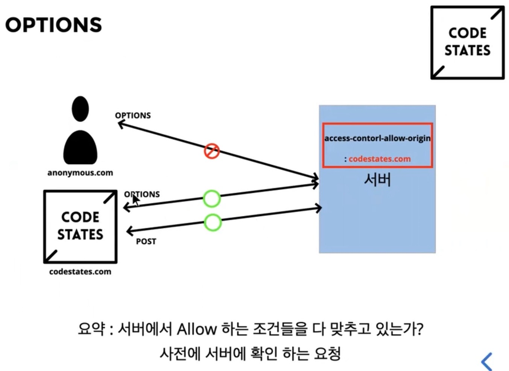

## 🚀CORS 리뷰 및 적용

### 1. 옛날

이전에는 서버가 자체 클라이언트를 가지고 있었음.

각각의 유저 클라이언트가 서버에서 내려받은 클라이언트로 통신 했다고 한다. 그 해당 클라이언트의 데이터를 사용자가 일방적으로 보는 방식으로 진행했다.

즉, 서버가 내려준 데이터에 대해 의심이 없을 것이다. same - origin 이기 때문에 굳이 서버는 요청을 막을 필요가 없었다.

### 2. 오늘날

SPA 라는 고도화된 웹 기술이 등장하였고 이제 각각의 유저 (클라이언트) 에서 여러 곳에 있는 리소스를 활용할 필요가 생겼다.

우리 서버에만 요청하는 게 아니라 내가 만든 어플리케이션 에서 유튜브나 깃허브 같은 다른 서버의 리소스를 요청하게 되는 경우가 많이 생기게 되었다.

이제는 즉 same origin 이 아니라 cross origin 요청을 해야 한다.

## 🚀Cross Origin Resource Sharing (CORS)

Cross origin 에서 리소스 (서버자원) 를 요청하여 사용한다.

유트브에서 깃헙으로, 깃헙에서 유튜브 로 즉, 다른 서버의 자원을 요청해서 사용하기 위해 등장한 개념.

BUT 브라우저에서 크로스 도메인 요청은 기본적으로는 제한되어 있다.

왜? 보안상의 이유로. 어떤 요청을 생성할지 알수 없기 때문에..

개발자들이 요청을 했음 좀 풀어줘 ㅠㅠ 요청해서 이제 서버가 Allow 한 범위내에서 Cross origin 요청 허용이 가능해 졌다.

## 🚀CORS 는 어떨때 발동되나?



저번에 작성한 내 블로그 글을 읽어보자.

https://dev-seolleung2.netlify.app/development/CORS/

POST 요청을 날릴 때, 그 전에 OPTIONS 메소드가 발동! preflight request 를 통한 허가를 받음. OPTIONS 에 대한 정상 응답을 받음.

이후 POST 요청 허용, 응답 진행.

https://developer.mozilla.org/ko/docs/Web/HTTP/CORS

## 🚀CORS 헤더에 담는 내용

```js
const defaultCorsHeader = {
  'Access-Control-Allow-Origin': '*',
  'Access-Control-Allow-Methods': 'GET, POST, PUT, DELETE, OPTIONS',
  'Access-Control-Allow-Headers': 'Content-Type, Accept',
  'Access-Control-Max-Age': 10,
}
```

모든 도메인을 허용한다 (와일드카드), 메소드는 저기 명기된 애들만 허용한다, 헤더에는 content-type 과 accept 만 쓸 수 있다.

preflight request 는 10초 까지 허용된다. 라는 의미이다.
