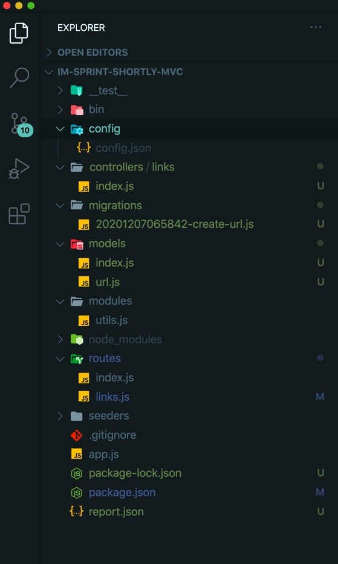

## 디렉토리 구조 TREE



실제 코드를 작성한 부분 위주로 블로그를 적어보겠다.

우리가 어떤 url 주소가 있을 때 긴 url 주소를 짧은 url 주소로 변환하여 주는 역할을 하는 것을 가지고 mysql, MVC 연습을 하는 스프린트 이다.

## 1. controllers 디렉토리 생성

models, routes, modules 등의 디렉토리 들과 동일 선상에 controllers 라는 디렉토리를 생성해 주고,

그 디렉토리 안에 links 라는 디렉토리를 하나 더 만들었다.

그리고 links 안에 index.js 파일을 만들어 넣었다.

```js
controllers / links / index.js
```

## 2. app.js

서버 통신을 위한 express 와 routes 디렉토리 내에 있는 라우팅 파일들을 불러와서

```js
app.use('/', indexRouter)
app.use('/links', linksRouter)
```

클라이언트가 해당 경로로 요청을 보냈을 때 indexRouter 와 linksRouter 를 실행하게 하는 듯 싶다.

(다른 부분은 잘 모르겠다.)

## 3. routes/links.js

index.js 와 links.js 이 두 파일이 있는데 index 파일은 이미 작성되어 있다.

그래서 links.js 내 코드를 작성해 주었다.

```js
const express = require('express')
const router = express.Router()

const linkController = require('../controllers/links')

/* GET links listing. */
router.get('/', linkController.get)

router.post('/', linkController.post)

router.get('/:id', linkController.redirect)

module.exports = router
```

라우팅 해주는 파일에서는 컨트롤러의 파일을 (기본 index 파일을) 불러오게 작성해 주는 구나.

그러면 저 linkController index.js 에 들어가 보면 get, post, redirect 함수가 구체적으로 적혀 있겠구나.

함수라는 것이 동작하는 기능을 수행하기 위해 만들어 졌으니까 get, post, redirect 가 구체적으로 어떤 역할을 하는지 어떤 동작을 하는지 정의하는 곳이 바로 controllers 의 역할이겠구나!

를 짐작하게 하는데 맞는지는 확실치 않다.

그리고 하나 더.

어떤 특정 페이지를 접속할 때 해당 페이지를 다시 재 렌더링?한다? 는 리다이렉션

이거는 찾아보니까 어떤 페이지에 접속했을 때 원하는 해당 url 의 화면이 아니라 로그인을 하라는 창으로 넘어가 버리는 것을 리다이렉션 이라 했던 거 같다.

페어님과 나는 이해가 안되서 이렇게 외워버리로 했다.

```js
//router 에 :id 이런 식으로 경로가 들어오면,
router.get('/:id', linkController.redirect)

//" /: " 이거는 req.params 이다.
```

/:id 에서 /: === req.params

풀로 적으면

/:id === req.params.id

추가로 리다이렉션도 get 방식으로 가져온다는 것을 확인했다.

## 4. modules/utils.js

getUrlTitle 이라는 함수가 정의됨과 동시에 export 되어 있다.

url 주소에서 meta 태그 중 title 이라는 것의 알맹이를 뽑아 오는 기능을 하는 듯 싶다.

이것을 controllers 에서 사용할 것이다.

## 5. controllers/links 의 index.js

컨트롤러 역할을 하는 파일에서 해당 (url) models 를 불러와야지,

models 에서 controller 를 참조하게 하면 MVC 패턴에 어긋난다고 한다.

그래서 models 의 url model 을 불러 오고

(마치 django 의 models.py, urls.py, views.py 같은 느낌적인..?)

modules 내 utils 도 동일하게 불러왔다.

```js
const utils = require('../../modules/utils')
const { url } = require('../../models')
// const Url = require('../../models').url 로 써줄 수도 있다.

module.exports = {
  get: (req, res) => {
    // get method
  },
  redirect: (req, res) => {
    // redirect method
  },
  post: (req, res) => {
    // post method
  },
}
```

공식 문서 url

https://sequelize.org/master/manual/model-querying-finders.html

을 참고해가면서 이제 각 메소드는 어떤 역할을 하는지 하나씩 표현해 보자.

### 5-1. urls 의 테이블 모든 내역 다 불러와 (GET)


```sql
SELECT \* FROM urls
```

이 SQL 문을 sequelize 으로 표현하라는 거다.

#### 방법 1 : .then 으로 이어 붙이기

```js
module.exports = {
  get: (req, res) => {
    // SELECT * FROM urls
    url.findAll().then(data => res.status(200).json(data))
  },
}
```

get 만 작성하고 콘솔 로그를 하면 빈배열이 나오지만, 모든 코드를 작성한 뒤 찍어보면 data 의 모습은 아래와 같이 나오게 된다.

```js
 [
  url {
    dataValues: {
      id: 4,
      url: 'https://www.github.com',
      title: 'GitHub: Where the world builds software · GitHub',
      visits: 2,
      createdAt: 2020-12-07T12:12:34.000Z,
      updatedAt: 2020-12-07T12:23:48.000Z
    },
    _previousDataValues: {
      id: 4,
      url: 'https://www.github.com',
      title: 'GitHub: Where the world builds software · GitHub',
      visits: 2,
      createdAt: 2020-12-07T12:12:34.000Z,
      updatedAt: 2020-12-07T12:23:48.000Z
    },
    _changed: Set {},
    _options: {
      isNewRecord: false,
      _schema: null,
      _schemaDelimiter: '',
      raw: true,
      attributes: [Array]
    },
    isNewRecord: false
  },
  url {
    // 다음 id 의 데이터 value 가 들어온다.
  }, ......
```

#### 방법 2 : async 와 await 을 사용하기

공식문서에서 적당한 코드를 복붙해와서 따라해 봤더니 된다.

그러나 post 와 redirect 작성 전에는 맨 아래 console.log 는 빈 배열만을 보여주더라.

```js
module.exports = {
  get: async (req, res) => {
    let allUrlLink = await url.findAll()
    console.log(allUrlLink.every(one => one instanceof url))
    res.status(200).json(allUrlLink)
    console.log('All URL Link here --->>>>>>>', JSON.stringify(allUrlLink)) // 빈배열..
  },
}
```

### 5-2. url 테이블에 값 넣어보기 (POST)

#### 방법 1. .then 사용하기

utils.js 를 들어가 보면 해당 url 사이트의 메타 정보 title 을 긁어올 수 있는 코드가 있다.

첫 번째 인자로는 url 을 받고 두 번째 인자로는 콜백 함수를 받는 듯하다.

해서 첫 번째 인자에 req.body.url 을 적었는데

당최 왜 req.body 인가 보니까 얘도 콘솔로 찍어보니,

```js
console.log(req.body)
// { url: 'https://www.github.com' } 가 나온다.
```

문제는 왜 req.body 를 써줘야 하는지 이해가 잘 되지 않는다. 그냥 외워야 할까?

그리고 sequelize 구문인 create 로 작성해 넣었다.

```js
module.exports = {
  post: (req, res) => {
    utils.getUrlTitle(req.body.url, (err, title) => {
      url
        .create({
          url: req.body.url,
          title: title,
        })
        .then(data => res.status(201).json(data))
    })
  },
}
```

#### 방법 2. async, await 사용하기

```js
module.exports = {
  post: async (req, res) => {
    utils.getUrlTitle(req.body.url, async (err, title) => {
      let result = await url.create({
        url: req.body.url,
        title: title,
      })
      res.status(201).json(result)
    })
  },
}
```

### 6. redirect 작성하기

유어클래스에 적혀 있는 내용을 옮겨 왔다.

```js
GET /links/:id

status code: 302 (성공적으로 리디렉션했을 시)
해당 id 값 바탕으로 url 모델을 찾아 리디렉션합니다.
원본 URL이 https://www.github.com 인 모델 id가 1일 경우
http://localhost:3000/links/1 로 접속하면 원본 URL로 리디렉션
/links/:id URL로 접근할 경우 visits 필드에 카운트가 1씩 증가해야 합니다.
```

이제 코드를 작성하려는데 얘를 SQL 문으로 작성하면?

```sql
UPDATE urls SET visits = visits + 1 WHERE id = req.params.id
```

접속한 url 파라미터가 (아까 처음 설명한) "/:" 이거이거!!

이거는 req.params 로 외워버렸다.

그럼 "/:id" 는? req.params.id 로 이해한다! (이렇게 하는게 맞는 길인가..)

#### 방법 1 : .then 으로 이어 붙이기

```js
module.exports = {
  redirect: (req, res) => {
    url.findOne({ where: { id: req.params.id } }).then(data => {
      url.update({ visits: data.visits + 1 }, { where: { id: req.params.id } })
      res.redirect(data.url)
      res.status(302).send()
    })
  },
}
```

다른 건 그냥 아 이렇게 넣는구나 이해하려 노력했지만

업데이트 구문에서 중복을 그렇게나 싫어한다는 코딩이....

```js
{
  where: {
    id: req.params.id
  }
}
```

이 코드를 두번이나 적어줬네? 왜 일까?

#### 방법 2 : async, await 을 사용하기

```js
module.exports = {
  redirect: async (req, res) => {
    // update urls SET visits = visits + 1 where urls.id = 찾는값;
    let result = await url.findOne({ where: { id: req.params.id } })
    url.update({ visits: result.visits + 1 }, { where: { id: req.params.id } })
    res.redirect(result.url)
    res.status(302).send()
  },
}
```


