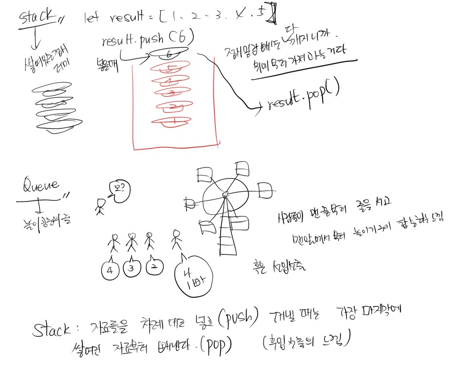

## 🎉들어가기에 앞서

9시 부터 한 시간 동안 유어 클래스에서 학습한 내용을 정리해 본다.

자료 : 문자, 숫자, 소리, 그림 등의 형태로 된 의미 단위를 뜻하며, 이러한 자료를 의미 있게 정리하면 정보가 된다.

컴퓨터는 0과 1만 이해하는 물리적인 한계가 있으므로 인간의 언어를 중간에서 번역해주는 컴파일러를 통해, 컴퓨터 (기계어) 에게 명령할 수 있게 되었다.

그럼에도 불구하고 사람들은 0과 1로 쓴 데이터를 보기 싫어서 데이터 타입을 지정하게 된다.

마치 여덟 자리의 (1byte) 이진수를 10진수로 표현할 수 는 있지만 그것마저도 보기가 싫은 것이다.
그래서 그것도 문자로 표현이 가능하도록 만들었다.

그게 바로 ASCII TABLE 이다.

https://ko.wikipedia.org/wiki/ASCII

즉 데이터 타입의 정의는,

- 컴퓨터에 0과 1로 저장되어 있는 데이터를 인간이 사용하는 여러가지 데이터들의 종류로 해석하기 위한 장치

- 같은 이진 데이터라도 인간의 해석에 따라 다른 데이터가 될 수도 있음을 의미한다. 다른 문자로 표기가 가능해서?

- 하나의 데이터를 어떻게 해석할 지 정의 한 것

그럼 자료 구조의 정의는?

- 여러 데이터들의 묶음을 어떻게 저장하고 사용할 지 정의한 것을 의미한다.

자료구조애는 배열도 있고, stack, queue, tree 등등이 있는데 오늘은 stack, quene 에 대해 알아가는 시간이였다.

## Stack, Queue

스택은 스택 오버 플로우의 그 스택 인데 대체 뭔 뜻이지.

잘 이해가 안가므로 유어클래스의 설명을 보면서 그림을 그려봤다.

- Stack : 자료들을 차례대로 넣고 (push), 꺼낼 때는 가장 마지막에 쌓여진 자료부터 빼낸다 (pop). 후입선출의 느낌. 접시를 아래부터 차례대로 쌓아 놓고 사용할 때는 제일 나중에 쌓은 (맨 위에 있는) 접시를 꺼내 사용한다.

- Queue : 자료를 집어 넣고 (Enqueue) 빼낼 때는 먼저 들어간 값부터 빼낸다(dequeue). 선입선출의 느낌. 놀이공원에서 사람들이 맨 끝부터 줄을 서고 맨앞에서 부터 놀이기구에 탑승하는 느낌, 혹은 주방에서 식자재를 보관하고 사용할 때 상미기한이 제일 임박한 (먼저 들어간) 식자재를 사용하는 느낌.

페어님과 완성한 과제를 하나씩 스스로 이해해 가며 블로그를 작성해 보겠다.
