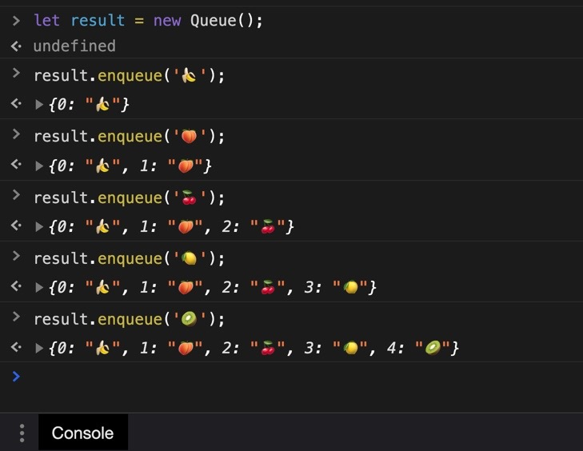
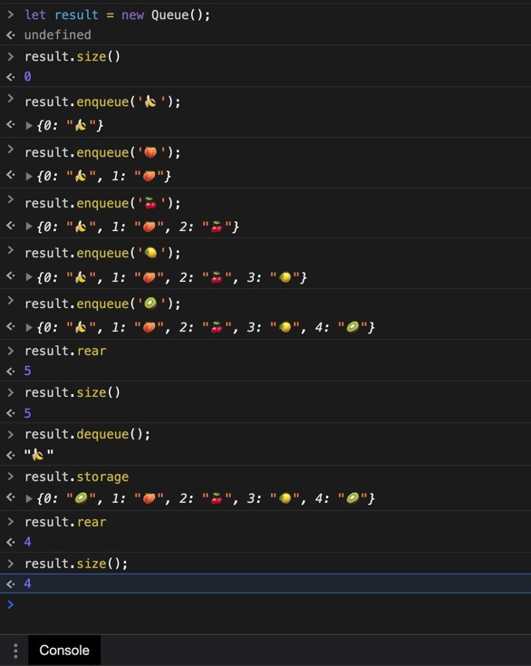

## 🏃🏻‍♂️사전 준비

일단 이 글을 처음 본다면,

https://dev-seolleung2.netlify.app/development/Stack-Queue/

https://dev-seolleung2.netlify.app/development/Stack-Queue-2/

이렇게 두개를 선행 학습 해준다. 아님 말고..

queue 큐우에에우에 는 무슨 특징을 가지고 있었더라?

아! 선입 선출하는 역할을 했었구나.


```js
queue
다음과 같은 method를 구현하세요 :
enqueue(element) - 요소를 큐의 뒤에 추가합니다.
dequeue() - 요소를 큐의 앞에서 제거하고 반환합니다.
size() - 큐의 현재 요소 개수를 반환합니다.
```

Queue 의 기능을 구현하기 위한 내부 메소드를 구현하는 과정이다.

고고싱!

## 🤮큐우에우엑 Queue

part-1/src/queue.js 파일을 확인하면 아래 코드와 같다.

```js
class Queue {
  constructor() {
    this.storage = {}
    this.front = 0
    this.rear = 0
  }

  size() {}

  enqueue(element) {}

  dequeue() {}
}

module.exports = Queue
```

stack 을 진행했을 때 처럼 storage 라는 어떤 데이터를 담을 객체가 있다. 그런데 front, rear?

## 🤔과정 1. constructor 내의 this.front, this.rear 의 역할 이해

stack 을 만들 때는 top 이라는 변수 하나면 되었는데, 왜 이번엔 2개지?

일단 this.front 는 0 이고, 초기화 값이자 앞으로도 안바뀌는 고정된 값! 이라는 것에 주목해야 한다.

그리고 먼저 넣은 자료가 나중에 빼려고 할 때 제일 먼저, 그러니까 맨 앞에서 빠지게 될 거라는 거다.

얘는 0이다 0.

```js
// 맨 앞의 요소를 삭제할 때 쓸 인덱스 (예: 배열 메서드 unshift) --> 고정된 값
this.front = 0
```

그리고 this.rear 는 storage 에 들어가 있는 요소들의 개수 이면서,

들어가는 각 데이터 요소의 key 가 된다.

예를 들어 storage 에 데이터 한 개가 최초 들어갔을 때 들어간 갯수는 1이 되면서, 해당 들어간 데이터의 key 의 역할 (index 처럼!) 을 겸업하는 아이인 것이다!

즉 데이터의 갯수와 key 를 탐색하는 역할을 둘다 컨트롤하는 컨트롤러라 생각하면 된다!

(투타겸업의 대명사 오오타니...⚾️)


그 역할을 바로 this.rear 가 하는 것이고 초기값은 0 으로 두었다.

```js
constructor() {
  this.storage = {}; // 결과값
  this.front = 0; // 맨 앞의 요소를 삭제할 때 쓸 인덱스 (예: 배열 메서드 unshift) --> 고정된 값
  this.rear = 0; // 개수, 인덱스(개수-1) --> 컨트롤러
}
```

## 🤔과정 2. class 내 메소드 size() 는 무엇일까?

```js
인스턴스.size()
```

위의 코드를 통해 내가 storage 에 enqueue 이나 dequeue 을 통해 넣은 (아래에 다룸) 속성들의 갯수를 리턴한다.

왜? this.rear 는 데이터의 갯수를 알려주는 역할을 하기 때문이다. 위에 설명 😃!

return this.rear; 를 통해 어떠한 자료를 넣고 뺄 때, 변수 rear 가 하나 커지거나 작아지는 것을 컨트롤 할 수 있게 했다.

```js
constructor() {
  this.storage = {}; // 결과값
  this.front = 0; // 맨 앞의 요소를 삭제할 때 쓸 인덱스 (예: 배열 메서드 unshift) --> 고정된 값
  this.rear = 0; // 개수, 인덱스(개수-1) --> 컨트롤러
  }
  size() {
    return this.rear;
  }
```

## 🤔과정 3. class 내 메소드 enqueue() 는 무엇일까?

stack 의 push 처럼 값을 밀어 넣어주는 역할이다. 아까 stack 에 값을 넣는 것과 똑같은 방식이다.

```js
enqueue(element) {
  this.storage[this.rear] = element; // this.storage = { 0: element1, 1: element2, 2: element3 }
  this.rear++;
  return this.storage;
}
```

## 🤔과정 4. class 내 메소드 dequeue() 는 무엇일까?

선입 선출이라고 생각했듯이 dequeue() 의 역할은 storage 의 맨 앞 요소를 빼고 해당 요소를 리턴하는 역할일 것이다.

### 🤧과정 4-1. 빼고 싶지만 뺄 게 없는 예외상황

```js
// this.rear 가 (storage 내 갯수가 하나도 없다면)
if (this.rear === 0) {
  return this.storage
}
```

if 로 예외 처리를 해준 뒤 아래 코드 부터 이제 일반적인 요소 빼기를 진행한다.

### 🌳과정 4-2. storage 내의 맨 앞의 데이터 요소 선택해서 변수에 담기

맨 앞의 데이터 요소를 빼려면 일단 해당 요소를 선택할 줄 알아야 한다.

이 때, 바로 this.front 가 쓰이게 된다.

```js
this.storage[this.front]
```

위의 코드는 사실상..

```js
this.storage[0]
```

storage 객체의 0번 데이터 라는 말과 동의어 이다.

이제 이 것을 변수에 따로 담는다.

```js
let omitValue = this.storage[this.front]
```

### 🌳과정 4-3. 맨 앞 요소 지워버리기

```js
delete this.storage[this.front]
```

오 지웠다. 근데 이제부터가 중요해 진다. 예를 들어 본다.

아래와 같이 요소를 인스턴스.enqueue() 를 통해 넣었다.



이제 앞의 요소를 지워 버리면 어떻게 될까?

```js
let result = new Queue();

result.enqueue('🍌');
{0: "🍌"}
result.enqueue('🍑');
{0: "🍌", 1: "🍑"}
result.enqueue('🍒');
{0: "🍌", 1: "🍑", 2: "🍒"}
result.enqueue('🍋');
{0: "🍌", 1: "🍑", 2: "🍒", 3: "🍋"}
result.enqueue('🥝');
{0: "🍌", 1: "🍑", 2: "🍒", 3: "🍋", 4: "🥝"}
result.size()
5
result.dequeue();
"🍌"
```

바나나를 리턴하며 하나가 없어지는 것 까진 좋았는데 내가 원한 모습이 아니다.

```js
result.storage
{1: "🍑", 2: "🍒", 3: "🍋", 4: "🥝"}
result.size();
4
```

{0: "🍑", 1: "🍒", 2: "🍋", 3: "🥝"} 이 되는 모습을 원하는 것이다. 왜냐하면 위의 상태에서 다시 한번 dequeue() 를 하면 이제 더이상 실행되지 않는다. 왜냐면 delete this.storage[this.front]; 를 통해 객체 key 가 0 인 것을 지우도록 했기 때문이다.

아래는 다시 dequeue() 를 했을 때, 더 이상 안되는 모습이다.

```js
result.dequeue();
undefined // 뺀 게 없으니 undefined 를 내뱉는다.
result.storage
{1: "🍑", 2: "🍒", 3: "🍋", 4: "🥝"}
```

그대로이다 ㅠㅠ 어떻게 하지..?

이제 dequeue() 를 두번째로 했을 때, 0번째의 value값이 undefined 를 리턴하는 상황에 대한 코드를 작성한다.

### 🎆과정 4-4. 0번째의 value값이 undefined 를 리턴하는 상황

위의 설명처럼 dequeue() 를 두번째로 한 상황이 되었을 때를 정의해 주었다.

최초 {0: "🍌", 1: "🍑", 2: "🍒", 3: "🍋", 4: "🥝"} 에서 맨 앞 바나나가 하나 빠졌을 때,

storage 의 갯수를 뜻하는 this.rear 는 4가 될 것이다.

```js
if (this.storage[this.front] === undefined) {
  //
  this.storage[this.front] = this.storage[this.rear - 1]
}
```



오 이렇게 하고 rear 를 하나 뺀 뒤에 제거한 요소를 리턴하게 하고 테스트를 돌려보면, 통과가 된다!

근데 정말 끝일까? 아니다.

### 🎆과정 4-5. 갯수도 하나 줄고 사이즈도 하나 줄었는데 대체 저끝에 저건 뭐지?

맨앞에 있었던 바나나를 없앴다. 오 원하던 그림이 나왔네? 통과도 되고? 하나 뺏으니까 rear 도 4 고 result.size() 도 4인데 아니 근데 저 storage 맨 끝에 키위는 뭔데..?

아마 여기에서 내가 헬프 데스크에 질문을 올려야 할 것 같은데,

마지막으로 넣은 키위가 맨 앞으로 온거는 또 뭐고 맨 마지막 에도 키위가 들어가 있다는게 이상하다.

더욱 엽기적인 사실은 이게 npm run test 가 통과가 된다는 사실이다.

헬프 데스크 감이다.

```js
result.storage
{0: "🥝", 1: "🍑", 2: "🍒", 3: "🍋", 4: "🥝"}
result.rear
4
result.size();
4
```

그래서 페어님과 나는 저 마지막 4:"🥝" 를 undefined 로 만들 생각을 했다.

위에 만든 if 문 안에 하나를 더 추가했다.

```js
if (this.storage[this.front] === undefined) {
  this.storage[this.front] = this.storage[this.rear - 1] // this.storage = { 0: element2 , ...}
  // rear = 1인 상태
  this.storage[this.rear - 1] = undefined
  // { 0: element2, 1: undefined }
}
```

this.storage[this.rear - 1] = undefined;

이 코드의 의미는,

{0: "🍌", 1: "🍑", 2: "🍒", 3: "🍋", 4: "🥝"} 이 상태에서..

현재 rear 는 5이다. 그래서 바나나를 뺌과 동시에

this.storage[5 - 1] = undefined;

this.storage[4] = undefined;

즉 storage 의 key 가 4인 키위를 undefined 로 만든다는 점인데..

dequeue() 을 통해서.. 맨앞 바나나가 지워지는 것은 좋았는데..

```js
result.storage
{0: "🥝", 1: "🍑", 2: "🍒", 3: "🍋", 4: undefined}
```

왜 나중에 넣은 키위가 맨앞에 오게 된 것일까...

이러면 선입 선출이 아니자나...

한번 더 dequeue() 를 하니..

```js
result.dequeue()
"🥝"
result.storage
{0: "🍋", 1: "🍑", 2: "🍒", 3: undefined, 4: undefined}
```

아 뭐지.. 선입 선출이 아닌데.. 뭐지 ㅠㅠ

통과가 되었다는 점이 아이러니 이다..
일단 최종 코드를 남겨 본다.

## 🎆과정 5. 최종 코드

```js
class Queue {
  constructor() {
    this.storage = {} // 결과값
    this.front = 0 // 맨 앞의 요소를 삭제할 때 쓸 인덱스 (예: 배열 메서드 unshift) --> 고정된 값
    this.rear = 0 // 개수, 인덱스(개수-1) --> 컨트롤러
  }
  size() {
    return this.rear
  }
  enqueue(element) {
    this.storage[this.rear] = element // this.storage = { 0: element1, 1: element2, 2: element3... }
    this.rear++
    return this.storage
  }
  dequeue() {
    if (this.rear === 0) {
      return this.storage
    }
    let minusValue = this.storage[this.front] // element1
    delete this.storage[this.front]
    // 결과값: { 0: undefined, 1: element2, 2: element3 }
    // { 0: element2, 1: element2 }
    // 기대할 값: { 0: element2, 1: element3 }
    // 0번째의 value값이 undefined라면 아래의 작업을 해준다.
    if (this.storage[this.front] === undefined) {
      this.storage[this.front] = this.storage[this.rear - 1] // this.storage = { 0: element2 , ...}
      // rear = 1인 상태
      this.storage[this.rear - 1] = undefined
      // { 0: element2, 1: undefined }
    }
    this.rear--
    return minusValue
  }
}
module.exports = Queue
```

으아아악!!! ㅠㅠㅠㅠ
