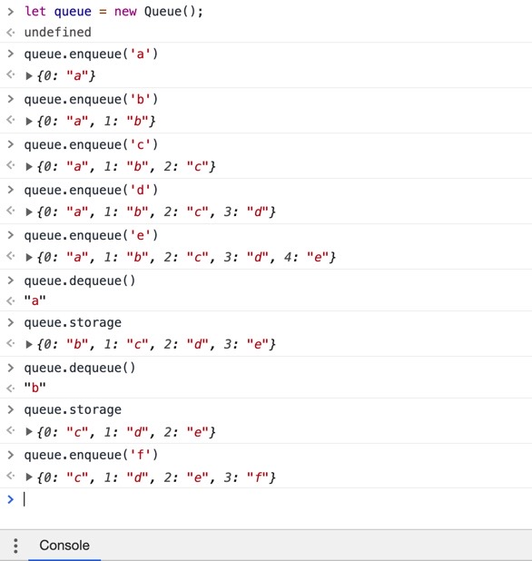

## 📦Queue 의 키워드는 선입 선출.

https://dev-seolleung2.netlify.app/development/Stack-Queue-3/

"Queue 의 기능 구현하기" 라고 하면서 야심차게 블로그를 작성하다가 이상한 경우를 발견하게 되었다.

npm run test 를 통해 분명 페어님과 내가 작성한 코드가 통과되는 것을 확인했다. 분명 맨 처음 넣은 바나나가 리턴되면서 빠져나갔는데... 갑자기 마지막에 넣은 키위가 맨앞에 와있고, 두 번째 dequeue() 를 하니까 아니 글쎄 맨 마지막에 넣었던 그 키위가 빠져나가고.. 또 마지막에 있던 과일이 빠져나가고..

선입 선출이 안되는 거라고 생각했다.

그래서 아침에 페어님과 다시 프로그래밍을 진행했다.

## 🍌코드 리뷰

```js
class Queue {
  constructor() {
    this.storage = {} // 결과값
    this.front = 0 // 맨 앞의 요소를 삭제할 때 쓸 인덱스 (예: 배열 메서드 unshift) --> 고정된 값
    this.rear = 0 // 개수, 인덱스(개수-1) --> 컨트롤러
  }
  size() {
    return this.rear
  }
  enqueue(element) {
    this.storage[this.rear] = element // this.storage = { 0: element1, 1: element2, 2: element3... }
    this.rear++
    return this.storage
  }
  dequeue() {
    if (this.rear === 0) {
      return this.storage
    }
    let minusValue = this.storage[this.front]
    delete this.storage[this.front]
    // 모든 요소들의 인덱스를 -1씩 해줘야 한다.
    // 반복문 돌리는 방법을 사용
    for (let i = 1; i < this.rear; i++) {
      // this.storage.length는 undefined 떠서 this.rear 로 바꾸었다.
      this.storage[i - 1] = this.storage[i]
    }
    // 첫 번째 요소가 삭제가 되었다면 위의 코드를 통해 요소가 앞으로 한칸 땡겨져오므로,
    // 마지막 요소에 undefined를 넣어준다.
    // this.storage[this.rear - 1] = undefined; // 여기서 this.rear 는 최종 갯수 (아직 줄지 않았다.), 마지막 요소를 의미.
    delete this.storage[this.rear - 1] // 마지막 값에 undefined 를 주지 않고 지워 버렸다.
    // { 0: element2, 1: undefined }
    this.rear--
    return minusValue
  }
}
module.exports = Queue
```



선입 선출이 되는 Queue 를 원했던 의도대로 구현해 볼 수 있었다.
