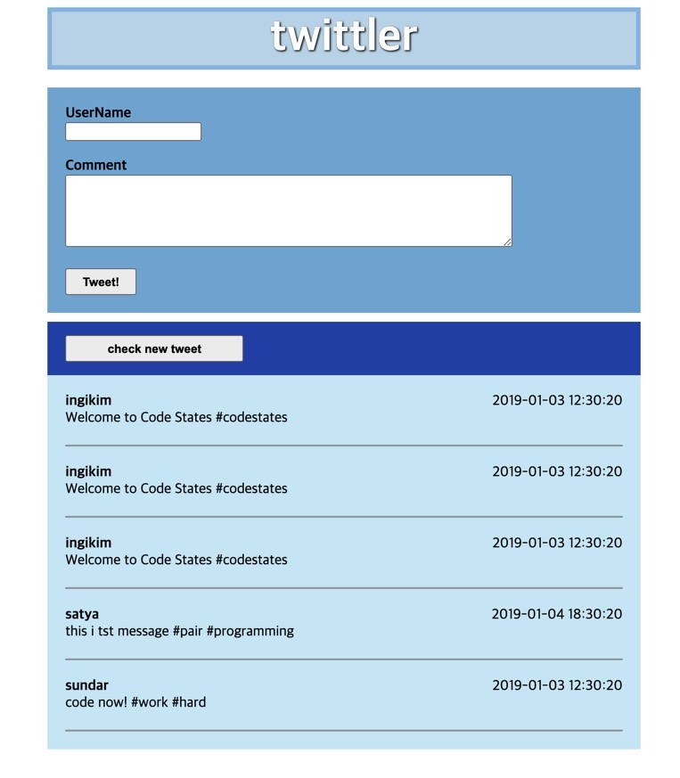
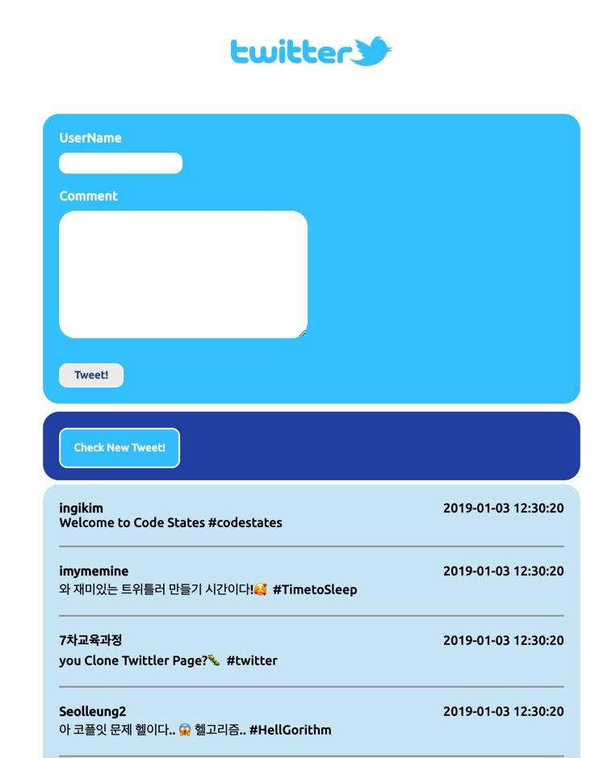

## 1. 트위틀러 와이어 프레임 설계하기

페어 프로그래밍이 새로 시작되었다.
간단한 이야기를 나누고 페어님의 화면을 보면서 그림판으로 어떻게 설계하는지 확인해 봤다.

클래스 명을 의미가 담기도록 계획해 짓는 것을 알게 되었다.

## 2. HTML 에 직접 넣어보기

우리는 크게 트위틀러가 세 파트로 나뉜다고 생각했다.

1. title class 가 있는 제목
2. inputForm class 가 있는 (아이디, 내용쓰는) 인풋 폼
3. twittlerList class 가 있는 댓글 모음

해서 큰 div 를 3개를 넣고 시작했다.

페어의 화면을 보고 배운 점은

```js
<!-- title end-->
<!-- inputForm end-->
<!-- titwittlerListtle end-->
```

이런 식으로 div 한 덩어리가 끝날 때 주석을 넣어주는 것을 알게 되었다.
이렇게 하면 구획을 봤을 때 어디부터 어디까지가 무엇인지 알기가 쉬울 거라 생각했다.

### 새로운 지식 1.

그리고 제목이 들어갈 title 클래스 태그 내에

```js
<h1> twittler </h1>
```

이렇게 적었었는데 말미에 우리는 h1 태그를 지우고 css 에서 크기와 굵기를 직접 컨트롤 할 수 있게 해주었다.

### 새로운 지식 2.

그리고 form 태그 중에 label 과 input 태그는 세트 메뉴로 함께 붙어 다니게 하는 것을 알게 되었다.

```js
<label for = "UserName">UserName</label>
<input type = "text" name="UserName">
```

라벨 for 과 input type 내 name 의 속성의 값이 서로 같아야 한다는 것을 알게 되었다.

그리고 label 과 textarea 도 마찬가지로 연결해 줄 수 있었고 rows 나 cols 같은 속성으로 크기를 지정해 줄 수 있었다.

button 은 인라인 css 를 적용해서 굵기와 가로세로 폭을 적용했다.

### 새로운 지식 3.

개행 문자 였는데, /n 말고 < / br > 태그에 대한 내용이다. 단순히 나는 p 태그 와 비슷하게 문단에서 한 줄 내리는 역할인 줄만 알았는데 위에 만든 form 의 각 input 요소를 위아래 간격을 띄워 쓸 수 있게 해주는데 무척 효과적이였다.
물론 디테일 하게는 마진이나, 패딩을 지정해 주겠지만 신박한 방법이였다고 생각했다.

그리고 twittlerLidst div 내에 newTweet 과 comment 라는 2개의 덩어리 div 를 넣어 주었다. 이렇게 덩어리 하나를 또 두개로 나누어 놓았다.

newTweet 안에는 버튼을 넣고 인라인 css 로 버튼 폰트 두께나 버튼 사이즈를 지정해 주었다.

comment 안에는 2개의 div 를 또 넣어 잘게 쪼갰는데,

- 하나는 유저 이름과 댓글을 넣는 div 이고
- 다른 하나는 시간 (time) 을 넣는 div

유저 이름, 댓글, 시간은 딱 자기 컨텐츠 만큼의 공간을 차지 하도록 < span > 태그를 넣어주었디.

html 을 완성하고 마지막에 주석으로,

```js
<!-- titwittlerListtle end-->
```

를 낳어 주었다.

## 3. CSS 를 적용하기

페어님과 css 를 적용해 보기 전에 적용방법 3가지를 다시 복습해 보았다.

- inline css 방식
- html 에 css 코드를 넣기
- 따로 별도의 css 파일을 두기

페어님 께서 정말 잘 설명해 주셨다.
제목의 색을 뭐로 할까 하다가 내가 알고 있는 color zilla 에 대해 알려드렸다.

경계션 border 의 속성을 지정하는 법은 아래처럼 이어 쓸 수도 있다.

```js
.class {
  border: 5px solid black;
}
```

글자 색상은 color: black; 이렇게 지정해 줄 수 있었고 text-align 과 font-size, font-weight 에 대해 알게 되었다.

### 새로운 지식 4.

트위틀러 제목에 text-shadow 속성을 적용시켜 보았다. border 의 속성을 지정해주는 것처럼 비슷하다.

각각의 덩어리 간의 간격을 주기 위해서는 margin-top 을 주는 것을 알게 되었다.
input 요소가 박스 왼쪽으로 너무 붙어 있어서 padding 으로 간격을 넓혔다.
padding 은 상, 우, 하, 좌 시계방향으로 값을 적용해 줄 수 있다.

간격 조절은 웬만한 건 마진 아니면 패딩이구나.

### 새로운 지식 5.

```js
.twittlerList .newTweet {
  // input css value;
}
```

위 처럼 부모 요소 틀래스 를 앞에 적고 다음 하위 자식의 클래스 선택자를 선택?할 때 이렇게 한다고 한다.

그리고 comment 클래스 (내부에 2개 div 가 아래로 이어져 있다.) 에 display: flex 와 justify-content: space-between 을 적용해서 2개 div 가 옆으로 이어 붙게 하고 조절해 보았다.

그리고 border-bottom 을 줘서 댓글 부분 아래에만 선이 표시되게 해주었다.



## 4. 혼자서 해보기

함께 페어 프로그래밍을 한 지 12시 가 거의 되지 않았는데 완료했다.
페어님의 능력이 상당하다.

그리고 나는 다시 3시까지 다시 처음부터 혼자 만들어 보았다.


