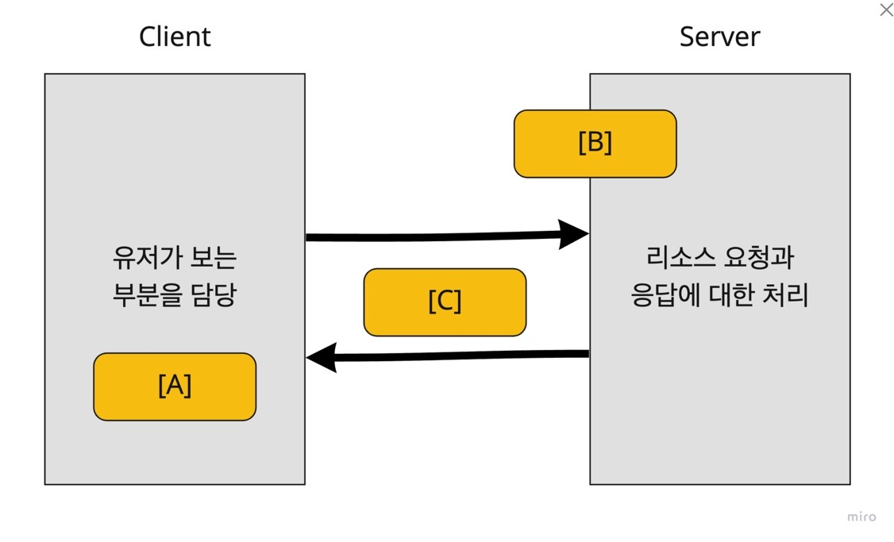
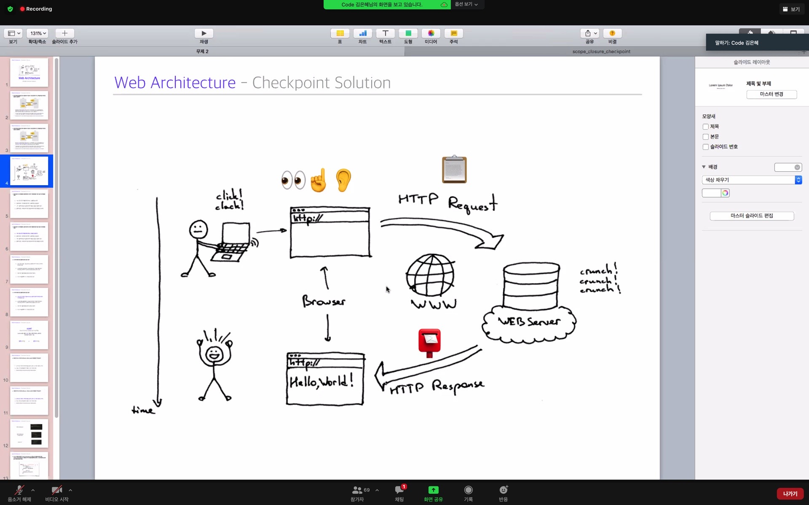
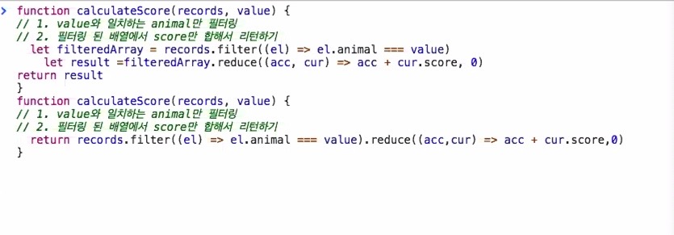
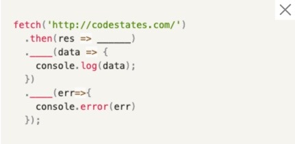

## ✍🏻Socrative 오답노트

## 1. 𝐐. 웹 아키텍쳐 전반을 간단히 설명하고자 합니다. 다음 문장에서 빈 칸에 들어갈 키워드를 알맞게 나열하면?

클라이언트는 인터넷에 연결된 사용자의 디바이스, 또는 웹에 접근할 수 있는 소프트웨어를 뜻한다.

대표적인 예로 [ A ] 가 있는데, [ A ] 는 HTML, CSS, JavaScript 등으로 작성된 코드를 내부 엔진으로 해독하여 사용자가 쉽게 이해할 수 있는 형태의 컨텐츠로 보여주는 역할을 한다.

서버는 클라이언트가 어떤 자원을 요청하면 해당 요청을 적절하게 처리하는 역할을 한다.

클라이언트는 서버의 자원을 어떻게 사용할 수 있는지 명시해 둔 인터페이스 [ B ] 에 따라 요청을 전송한다.

이렇게 클라이언트와 서버가 서로 요청과 응답을 주고받을 수 있는 것은 [ C ] 라는 통신 규약 덕분이다.

정답 : 브라우저, api, http

## 🏅클라이언트, 서버, api 를 도식화한 그림 참조

api 는 클라이언트에서 요청하면 적절하게 서버의 자원을 가져다 쓸 수 있는 메뉴판 같은 거다. 상호작용을 하는 도구이다.

상호작용을 하는 주체는 클라이언트와 서버이다.

## 2. 𝐐. 클라이언트-서버 모델에서, 클라이언트와 서버의 역할에 대한 다음의 설명 중 틀린 것은?

A. 서버: 웹 브라우저를 통해 원하는 정보를 요청한다.𝗫 ——->>> 클라이언트가 맞다.

B. 클라이언트: 유저와의 전반적인 상호작용을 담당한다.

C. 서버: 클라이언트의 요청에 따라 적절한 응답을 되돌려 준다.

D. 클라이언트: 서버로부터 받은 응답에 따라 다른 화면을 표시한다.

정답 A

## 3. 𝐐. AJAX에 대한 다음 설명 중 옳지 않은 것은?

A. AJAX 도입 전에는 XMLHttpRequest를 이용하여 정적으로 페이지 랜더링을 했다.𝗫 - 정적이 아니라 동적으로 가 맞다.

B. AJAX를 통해 클라이언트는 필요한 데이터만 서버를 통해 비동기적으로 받고, 페이지의 일부만 동적으로 업데이트 할 수 있다.

C. 비동기적인 웹앱 제작을 위한 웹 개발 기법이다.

D. Fetch API를 통해 AJAX 요청을 보낼 수 있다.

정답 A

AJAX는 사실 Fetch(혹은 XMLHttpRequest) + DOM + 비동기 이런걸 그냥 다 짬뽕한 용어라고 한다. 따로따로 분리해서 생각하는게 좋다고 함.

AJAX 는 JS 를 사용한 비동기 통신, 클라와 서버간에 데이터를 주고받는 기술이다.

AJAX가 없었다면 검색어 자동완성 추천은 거의 불가능했을 거라고 했음.

AJAX 라는 용어보다 SPA 라는 용어를 더 잘 사용한다.

에어비엔비 사이트 나 구글 검색창에 뭔가 입력할 때 그 부분만 렌더링이 되어 나타난다는 것을 확인할 수 있다.

https://sungmooncho.com/2012/12/04/gmail-and-ajax/

## 4. 𝐐. 다음 중 fetch, XMLHttpRequest, jQuery ajax 메소드의 공통점은 무엇일까요?

A. 클라이언트 측에서, 서버에 자원을 요청하고 받아 오기 위해 사용하는 API다.O

B. 메소드 체이닝 방식을 통해 사용할 수 있어 가독성이 좋다. - fetch, jquery ajax 에만 해당됨

C. 웹 API로서 별도의 라이브러리 설치 없이 사용 가능하다. - jquery ajax 는 라이브러리를 설치하고 사용 가능하다.

메소드 체이닝의 예시 - 고차 함수

## 5. 𝐐. fetch API를 사용하여 http://codestates.com/에 get 요청을 보내고, 받은 response의 body를 json 형태로 바꾸어 콘솔에 출력하려 합니다. 빈 칸에 들어갈 내용을 순서대로 채워 주세요.

정답 : res.json(), then, catch

## 기타 수강생분들의 질문 모음

서버는 JSON 으로 변형된 객체만 해석할 수 잇는건가요?
JSON 외에도 XMLhttp 등등 이 있지만 대체로 제이슨이 많다.

일반 객체를 서버가 해석하게 하기 위해서는 JSON.stringyfy() 가 필요하다!

HTTP 참조 링크.

https://developer.mozilla.org/ko/docs/Web/HTTP/Messages

Fetch 내의 url 주소는 api 를 제공? 하는 주소에 한해서만 해당된다!

http 는 편지지 양식 같은 것 (request, response 를 담아서)

fetch 에서 get 요청은 생략해서 할 수 있다.

근데 나머지는 post 나 이런 아이들은 써줘야 한다네? 이건 모질라 사이트 fetch 에서 찾아볼 수 있었다.
