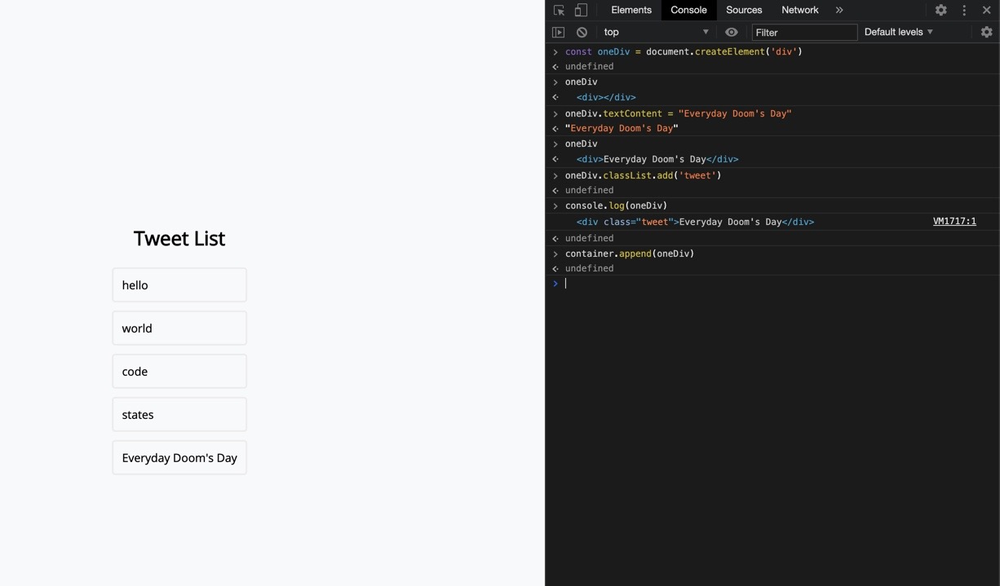

## 1. DOM (Document Object Model)

HTML (document) 에 접근하여 자바스크립트 Object 처럼 HTML 을 조작할 수 있는 모델

### 1-1. console.log() VS console.dir()

- console.log(document.body);

```js
<body class>...</body>
```

그냥 html 문서 전체가 통째로 보여진다.

- console.dir(document.body);
  키와 밸류의 형태로 body 아래에 무수히 많은 값들이 들어 있는 형태 (Object) 이다.
  DOM을 객체의 모습으로 보여주는 친구라 한다.

### 1-2. body element 에서 자식 요소 찾기

```js
console.log(document.body.children[0])
<div class="contentWrapper">...</div>

console.log(document.body.children[0].children)

HTMLCollection(3) [div.title, div.inputForm, div.twittlerList]
0: div.title
1: div.inputForm
2: div.twittlerList
length: 3
__proto__: HTMLCollection
```

```js
console.log(document.body.children[0].children[1])

<div class="inputForm">
  <label for="UserName">UserName</label><br>
    <input type="text" name="UserName" style="height: 20px"><br><br>
    <label for="Comment">Comment</label><br>
    <textarea name="Comment" rows="10" cols="100"></textarea><br><br>
    <button style="font-weight: bold; width: 80px; height: 30px; color: #3a5996;">Tweet!</button>
</div>
```

### 1-3. body element 에서 부모 요소 찾기

https://developer.mozilla.org/ko/docs/Web/API/Element/closest

```js
let inputFormat = document.body.children[0].children[1]
console.dir(inputFormat)
div.inputForm // 열면 다양한 객체들이 또 있다. 여기 차일드에서 내가 집어넣은 태그들을 만날 수 있다.


inputFormat.closest("body")
<body class>...</body>

inputFormat.closest("div") // div 를 가진 가까운 부모요소. 자기자신을 보여준다.
<div class="inputForm">...</div>

inputFormat.closest(":not(div)") // div 를 안가진 가까운 부모요소는?
<body class>...</body>

inputFormat.closest(".contentWrapper") // inputFormat 보다 더 상위 개념이므로 보여준다.
<div class="contentWrapper">...</div>
```

### 1-4. DOM 탐색하기


DOM 구조의 특성은 부모와 자식 관계 (가계도 혹은 한 기업의 조직도) 와 비슷한데 이를 두고 Tree 구조 라고 부른다.

부모가 자식을 여러개 가지고, 부모가 하나인 구조가 계속 반복된다는게 특징이라 한다. 즉, 부모가 가진 하나, 혹은 여러개의 자식 엘리먼트를 조회하는 코드를 계속 반복해서 실행될 것이다.

## 2. CRUD

document 객체를 통해서 HTML 엘리먼트를 만들고(CREATE), 조회하고(READ), 갱신하고(UPDATE), 삭제하는(DELETE) 방식

```js
createElement - CREATE
querySelector, querySelectorAll - READ
textContent, id, classList, setAttribute - UPDATE
remove, removeChild, innerHTML = "" , textContent = "" - DELETE
appendChild - APPEND
innerHTML과 textContent의 차이 이해하기
```

## 3. Create

```js
document.createElement('div') >> <div></div> // 오 만들어 진다. 지저스..

const tweetDiv = document.createElement('div') // 변수에 담아 Dom 활용준비
```

변수에 담고 난 후 현재 상태는 아래 그림과 같다.


공중에 떠있는 엘리먼트를, APPEND 해야만 실제 웹 페이지 상에도 보이는 것을 확인할 수 있다고 한다.

## 4. append, appendChild

```js
document.body.append(tweetDiv) // 3.의 마지막 진행했던 tweetDiv 를 추가함
```

콘솔의 Elements 탭을 누른 뒤 포인터를 눌러서 확인해 보면 맨 아래에 빈 div 가 추가되어 있다.


### 4-1. append() VS prepend()

- append() : 콘텐츠를 선택한 요소 내부의 끝부분에 삽입
- prepend() : 콘텐츠를 선택한 요소 내부의 시작 부분에서 삽입

### 4-2. append() VS appendChild()

- append() : Javascript 함수이며, 얘는 문자열 삽입이 가능하다.

- appendChild() : DOM 함수, 얘는 문자열 삽입이 불가하다. 여기에는 파라미터와 같은 element 가 필요하다.

## 5. READ - querySelector, querySelectorAll

html, css 의 선택자 (selector) 를 이용해 DOM 을 들여다보는 형식

1. querySelector

```js
const oneTweet = document.querySelector('.tweet')
oneTweet
<div class="tweet">hello</div>
```

tweet이란 이름을 가진 클래스가 여러 개가 있는데, 맨 상위 한개만 달랑 가져 왔다.

나는 다 가지고 오고 싶은데..

2. querySelectorAll

```js
const tweet = document.querySelectorAll('.tweet')
tweet
NodeList(4)[(div.tweet, div.tweet, div.tweet, div.tweet)]
```

이렇게 조회해온 HTML 엘리먼트들은 배열과 유사하게 for문을 사용할 수 있다고 한다.
이런 '배열 아닌 배열'을 유사배열, 배열형 객체 등 다양한 이름으로 부른다고 한다. 이 모든 Array-like Object 라는 용어를 한국어로 번역한 거라 한다.

### 추가. get으로 시작하는 DOM 조회 방식

```js
const getOneTweet = document.getElementById('container')
getOneTweet
<div id="container">...</div>

const queryOneTweet = document.querySelector('#container')
queryOneTweet
<div id="container">...</div>

console.log(getOneTweet === queryOneTweet)
true
```


```js
const container = document.querySelector('#container')
const tweetDiv = document.createElement('div')
container.append(tweetDiv)
```

tweetDiv 를 #container 마지막에 추가해 주었다.

## 6. UPDATE - textContent, classList.add

div 태그 요소를 append 로 추가하긴 했는데 뭐 실제 보이는 게 없다.

```js
const oneDiv = document.createElement('div')
undefined
oneDiv
<div></div>
```

저 비어있는 div 에 뭔가 내용을 넣어주고 싶다.

```js
oneDiv.textContent = "Everyday Doom's Day";
"Everyday Doom's Day"
oneDiv
<div>Everyday Doom's Day</div>
```

이제 스타일 적용을 위해 div 에 class 선택자를 지정해 본다.

```js
oneDiv.classList.add('tweet')
console.log(oneDiv)
<div class="tweet">Everyday Doom's Day</div>
```

append 로 container 에 붙여 본다.

```js
const container = document.querySelector('#container')
container.append(oneDiv)
```



### .setAttribute()

.setAttribute()는 선택한 요소(element)의 속성(attribute) 값을 정합니다.

```js
element.setAttribute( 'attributename', 'attributevalue' )
attributename에는 속성 이름을, attributevalue에는 속성값을 넣습니다.

<p><a id="abc" href="#">Welcome My Blog</a></p>
<script>
  document.getElementById( 'abc' ).setAttribute( 'href', 'https://dev-seolleung2.netlify.app/' );
  </script>
```

## 7. DELETE - remove, removeChild

```js
const container = document.querySelector('#container')
const tweetDiv = document.createElement('div')
container.append(tweetDiv)
tweetDiv.remove() // 이렇게 append 했던 엘리먼트를 삭제할 수 있다.
```


```js
document.querySelector('#container').innerHTML = ''
// 컨테이너의 모든 자식 요소를 날려 버릴 수 있다.
```

하지만 이 방법은 보안상의 문제를 가지고 있다고 한다.

removeChild 는 자식 엘리먼트를 지정해서 삭제하는 메소드 이다. while 문으로 모두 삭제할 수 있다.

```js
const container = document.querySelector('#container')
while (container.firstChild) {
  container.removeChild(container.firstChild)
}
```

한두번으로는 잘 이해가 되지 않는 Dom 이다.
하지만 객체의 키 값을 이용해서 값을 넣고 조회하고 수정 및 삭제가 가능한 점은 신기하다.
