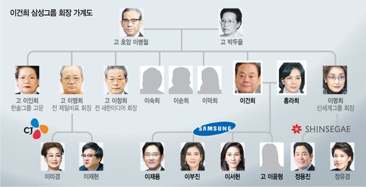

## 그래프와 트리의 차이점을 설명하기 전에

### 1-1. 사전지식 : 클라이언트 - 서버 - 데이터베이스의 관계

먼저 우리는 각자의 지인과 함께 미슐랭 가이드에 소개되어 있는 고급 레스토랑에 갔다고 생각해 봅시다.

맛있는 곳에 왔으니 우리는,

1. 테이블에 앉아 있다가 **“메뉴판"** 을 봅니다.
2. **“나"** 는 음식을 나르고 도와주는 **“서버"** 에게 “가지 라구 파스타, 바질 페스토, 오렌지필. 페코리노 치즈" **메뉴**를 **“요청"** 합니다.
3. **“서버”** 는 주방에 가서 요청한 메뉴를 주방장에게 알려줍니다.
4. 주방장은 메뉴를 만들기 위해 **“워크인 냉장고”** 에 들어가서 **“메뉴에 맞는 식재료를 찾아”** 냅니다.
5. 그렇게 해서 만든 **메뉴**를 **“서버"** 가 테이블에 앉아 있는 “나" 에게 **음식을 서빙 (응답)** 해 줍니다.

컴퓨터 세계도 이와 비슷합니다.

**사용자 (Client) - 서버 (Server) - 데이터베이스 (Database)** 의 관계는 위에서 구술한,
**“나" - “서빙해주는 종업원 & 요리사" - “워크인냉장고"** 와 비슷하다고 볼 수 있습니다.

용어는 간략하게 **Client 는 웹 브라우저 혹은 쉽게 사용자**라고 정해 둡시다.

**Server** 는 바로 이 사용자에게 네트워크를 통해 **어떤 자원을 제공하는 주체**라 이해하시면 될 것 같습니다.

마지막으로 **Database** 는 서버가 제공하려는 어떤 **자원들이 구조적으로 조직화되어 있는 창고**라고 이해합시다.
자세한 정보는 구글 검색을 통해 각자 알아보도록 해요.

우리가 웹 브라우저에서 쇼핑을 하고 장바구니에 담고 좋아요를 누르고 구매를 하며 댓글을 남기는 과정은,
**위의 방식과 닮아 있습니다.**

1. 클라이언트가 브라우저 화면 상에서 쇼핑 목록을 조회하기 위한 버튼을 클릭합니다.
   → 이 경우가 **서버에게 “쇼핑 목록을 주문하는” 일종의 요청** 입니다.
2. **서버는 쇼핑 목록을 데이터 베이스에 가서 찾으러 갑니다.**
3. 데이터 베이스에 있던 쇼핑 목록을 어렵사리 드디어 찾아냈습니다. 이제 이걸 클라이언트에게 보내 주는데 (응답) 이제 클라이언트는 화면에서 쇼핑 목록을 확인하였습니다.

### 1-2. 자료구조를 알아야 하는 이유

자, 설명이 길었습니다. 우리는 이제 **“2번" 에 주목**해야 합니다.

서버는 클라이언트가 요청한 정보 (쇼핑목록) 을 찾기 위해 데이터 베이스에서 정보를 찾아 옵니다.
이 과정은 서버(백엔드) 개발자가 코드 작성을 통해 해당 정보를 가져올 것입니다.

그런데 개발자는 해당 **데이터를 클라이언트에게 전달해 주기 위해 가장 효율적인 방식으로 데이터에 빠르게 접근**하고 수정, 삽입, 삭제를 할 수 있도록 코드를 짜야 할 것입니다.

데이터를 빠르고 안정적으로 처리할 수 있으며 필요한 데이터를 메모리에 구조적으로 잘 정리해서 담아두고 관리할 수 있기 위해 필요한 지식은 바로 “이 **자료구조**" 라는 것입니다.

### 1-3. 자료구조 (선형구조, 비선형구조)

데이터가 정리된 어떤 방식을 나타내는 **자료구조는 크게 선형 구조와 비선형 구조**로 나눌 수 있습니다.

**선형 구조**는 데이터가 순차적으로 나열된 구조를 의미하며 여기에서는 다루지 않겠지만 배열, 스택, 큐 등이 있습니다.

**비선형 구조**는 말 그대로 선형구조에 해당하지 않는, 순차적이지 않은 자료구조를 뜻합니다.
바로 이 **비선형 구조에 제가 소개하려는 트리 (Tree) 와 그래프 (Graph)** 가 있습니다.

소개해 보기 전에, 클라이언트와 서버와의 인터랙션을 알아보고 싶으시다면 제가 작성해둔 블로그 내용을 읽어보셔도 좋을 거 같아 첨부해 놓습니다.

[간단용어정리 - Interaction with Server](https://dev-seolleung2.netlify.app/development/interaction-with-server/)

이제 그래프와 트리에 대해 설명해 보겠습니다.

## 트리 (Tree)

먼저 트리에 대해 설명해 볼텐데요. 먼저 가족 가계도를 떠올려 봅시다. 제가 조금 유명한 한 가족의 가계도를 가져와 보았습니다.

먼저 트리 구조라고 부르는 이유에 대해 알아보자면, 마치 나무의 형태를 거꾸로 놓은 듯한 모습을 보여주기 때문이라 하는데요.

만약에 이재용 삼성전자 부회장의 정보를 알기 위해서 데이터베이스를 찾는다고 가정해 봅시다.
그런데 그 데이터의 구조가 순차적으로 나열된 구조, 배열이라고 한다면 어떨까요?

단순 나열된 구조에서는 구성원들의 정보만 알 수 있지 해당 인원의 직계 부모는 누구인지, 혹은 직계 자손은 누구인지 상호 연결 관계를 알 수 없다는 점이 문제입니다.

일렬로 나열된 가계도. 사용자가 보기에 이해가 되지 않겠지요? 이러한 비선형적인 구조를 위해, **데이터의 연결 구조를 표현하기 위해 트리 구조를 사용**합니다.

가계도와 마찬가지로 **트리는 부모와 자식관계 구조**를 띄고 있습니다.

동그라미 요소 하나 하나는 노드 (Node) 라고 부르며, **노드는 데이터 구조를 구성하는 각각의 개체**를 의미합니다.

트리 구조의 가장 상위에 있는 노드 (여기서는 숫자 2) 를 해당 트리의 **최상위 노드, 즉 루트 노드(root node)** 입니다. 루트 노드를 제외한 모든 노드는 단 하나의 부모 (parent) 노드를 가집니다.

루트 노드를 제외한 **나머지 노드들은 하나 이상의 자식 (child) 을 가지며**, 자식이 없는 노드는 Leaf 라고 부릅니다.

그리고 노드들을 연결하는 화살표가 보이시나요? 해당 화살표는 바로 **노드를 연결하는 엣지 (Edge, 간선)** 라고 부릅니다. 이미지에서 확인할 수 있듯이, Edge 의 방향은 위에서 아래로 내려오고 있습니다.

방향이 **부모에서 자식으로 이어져 있는, 방향이 위에서 아래로만 내려오는 형태**라는 점을 기억해 주세요.

즉, 위의 동그라미 6 노드를 기준으로 보자면 해당 노드로 들어오는 Edge 는 하나이고 해당 노드에서 나가는 곳은 여러개가 될 수 있다는 점입니다.

## 그래프 (Graph)

그런데 이러한 트리의 자료구조 법칙을 가뿐히 무시한(?) 형태가 있습니다.

그것은 위에 설명했던 (\***\*중요중요!\*\***)

1. 엣지방향을 위나 아래로 **제맘대로 조정**할 수 있거나
2. 심지어 **방향을 아예 안 가질 수도** 있으며 (무향)
3. 하나의 노드에 엣지가 들어오는 방향이, 즉 **여러 엣지 화살표가 하나의 노드를 향할** 수도 있고
4. 두 노드끼리 **서로 화살표를 주고받을** 수도 있으며
5. 엣지가 **돌아서 자기 자신을 가리키기**도 하고
6. 노드끼리 엣지가 막 돌면서 원 (Circle) 이 생기기도 하는데

**이러한 형태의 자료 구조를 그래프 (Graph) 라 부릅니다.**

위의 이미지처럼 그래프는 방향이 있을 수도 있고, 없을 수도 있습니다.

그래프를 활용하는 사례는 **SNS에서 사람들의 관계를 나타내는 데이터**가 될 수 있고, **네비게이션의 길찾기** 구현이 좋은 예시가 될 거 같습니다.   

### 그래프의 실생활 예시

자 네비게이션 관련해서 예시를 들어 보죠.

저 (A) 는 서울에 살고 있습니다. 친구 (B) 는 대전에 살고 있고 직장동료 (C) 는 부산에 살고 있습니다.
저는 대전에 있는 친구를 차에 태워 C 가 있는 부산에 가서 결혼식에 참석해야 합니다.

해당 데이터의 형태는 트리 구조로 표현하면 좋을까요? 아니면 그래프로 표기하면 좋을까요?
지도에서 서울, 대전, 부산을 선으로 연결해 본다면 바로 그래프 구조가 떠오르시리라 생각됩니다.

**3개의 점**을 가지고 있고 이 정점은 서로 이어지는 관계 (간선) 을 가지고 있습니다.

추가로 선이 연결되어 있으나 현재로써는 도시간의 거리 같은 정보들이 표시되지 않아서 이 경우를 가중치가 없는 그래프다 해서 비가중치 그래프라고 부릅니다.

비가중치 그래프와는 달리 더 자세한 정보 (거리 등)를 담는 가중치 그래프는

서울 - 140km - 대전, 대전 - 200km - 부산

과 같이 표현할 수 있겠습니다.

그리고 SNS 에서 사용자들간의 팔로잉, 팔로워 또한 그래프를 활용하는 사례가 될 텐데요. 맞팔로우가 아니라면 단방향 그래프로 표시할 수 있겠지요.

## 요약

**요약하자면 트리는 아래의 특성을 가지고 있습니다.**

- **부모 자식 관계가 존재**히고 최상위 노드가 있으며 최상위 노드로 부터 내려오는 **계층 (레벨) 이 존재**한다.
- **방향성이 존재**하고 (위에서 아래로), 사이클이 존재하지 않는 **비순환 구조**이다.
- 루트 노드를 제외한 노드들은 1개의 부모 노드를 가지고 있다.
- 트리의 간선 수는 → Node 의 갯수 - 1

**트리와 다른 그래프의 특성을 요약해 보겠습니다.**

- 그래프는 **순환 또는 비순환 구조**를 가진다.
- 방향이 있는 그래프와 방향이 없는 그래프가 있다.
- 루트 노드의 개념이 없다. 즉 **부모 자식 관계라는 개념이 없다**.
- 데이터를 찾기 위한 **2개 이상의 경로가 가능**하다 (무방향 or 양방향)
- 그래프의 간선 수는 → 자유
