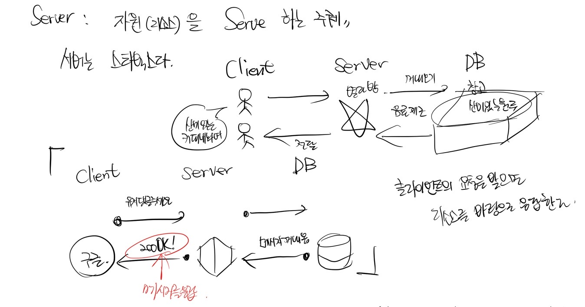
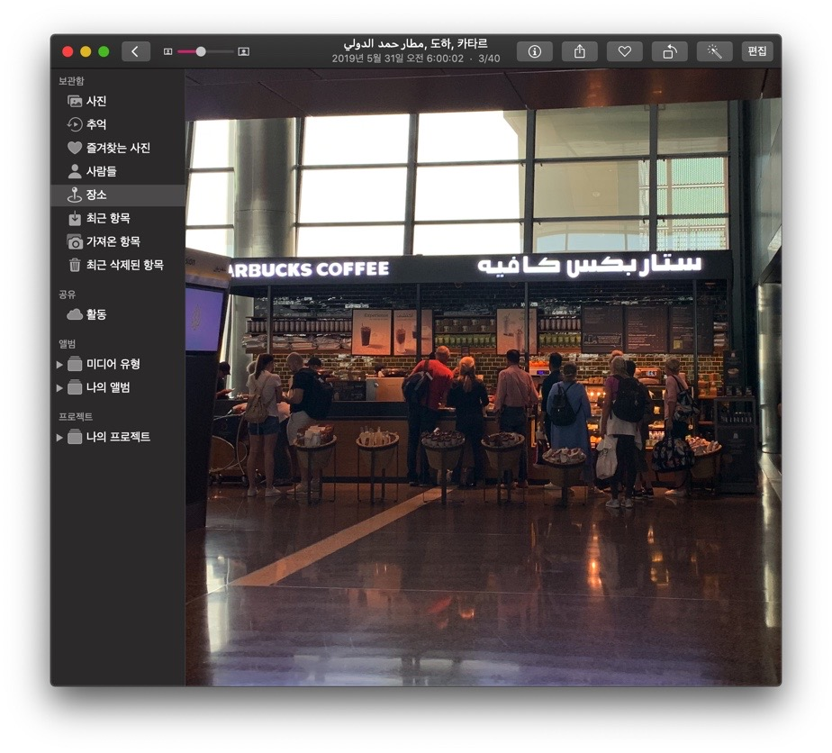

## 👩🏿‍🦰간단 용어 정리 for ChatterBox

(계속 업데이트해 나갈 예정입니다😙)

앞으로 만들 웹 서비스는 클라이언트와 서버로 구성될 것이라 한다.

### Web Browser

HTML 문서와 그림, 멀티미디어 파일 등, 월드 와이드 웹을 기반으로 한 인터넷의 컨텐츠를 검색 및 열람하기 위한 응용 프로그램의 총칭.

그래픽 UI 기반의 응용 소프트웨어, 웹 서버와 쌍방향 통신이 가능.

컴퓨터는 2진수밖에 모르기 때문에 우리가 작성한 HTML, CSS, Javascript 코드를 바로 이 브라우저를 통해 컴퓨터가 이해하게 하는 것이다.

브라우저는 작성한 코드를 컴퓨터가 이해하게 하는 역할을 담당한다.

## Client

서버가 제공하는 서비스를 사용자의 환경에서 구현할 수 있도록 하는 프로그램과 프로그램의 실행에 필요한 확장 파일 및 서비스에 필요한 암호화된 데이터 등으로 구성된다.

더 쉽게 정의해서 Client - Server 구성에서 사용자가 서버에 접속하기 위해 사용하는 프로그램 또는 서비스를 의미한다.

대표적인 예는 구글 크롬이 있겠다. 그리고 구글 크롬은 Web Brower 의 대표 주자이기도 하다.

<p align="center"></p>

## Server

클라이언트에게 네트워크를 통해 서비스 하는 컴퓨터를 의미한다.

자원(resource) 을 Serve 하는 주체

수많은 서버들이 거미줄 처럼 얽혀서 형성되어 있다.

서버는 스타벅스이다.



### API : Application Programming Interface

프로그래밍 되어 있는 애플리케이션과 의사소통이 가능한 매개체

음식점의 메뉴판 같은 느낌이다.

<p align="center"></p>

서버와 DB 에 대한 출입구 역할을 담당한다.

API 는 프로그램들이 서로 상호작용하는 것을 도와주는 매개체 이다.

웹 API 는 웹 애플리케이션 개발에서 다른 서비스에 요청을 보내고 응답을 받기 위해 정의된 명세 이다.

API 는 어디까지나 사양 (specification) 만을 정의하기 때문에 구현 (implementation) 과는 독립적이다.

프로그램을 작성하기 위한 "부 프로그램" 을 정의하여 상호 작용을 하기 위한 인터페이스 사양을 의미한다.

### API 한번 더 정리

클라이언트가 서버가 어떻게 구성되어 있는지 모른다면, Database 에 어떤 리소스가 들어 있는지 모를 때,

클라이언트는 리소스를 어떻게 활용할 수 있을까?

서버는 클라이언트에게 데이터 베이스 내의 리소스를 잘 활용할 수 있도록 Interface 를 제공해 줘야 한다.

그게 바로 API 인데 이것은 클라이언트로 하여금 서버의 자원을 잘 가져다 쓸 수 있게 만들어 놓은 인터페이스 이다.

카타르 도하에 있는 스타벅스 사진을 불러와 보자.



클라이언트 (손님) 가 메뉴판을 보고 주문 "요청" 을 넣으면 서버 (점원) 는 창고 (Database) 에 가서 원두를 뒤져서 요청에 맞는 음료 (resource) 를 만들어 제공할 수가 있는 것이다.

### Interface

사물과 인간 간의 의사소통이 가능하도록 만들어진 물리적, 가상적 매개체 (접점) 을 의미.

### HTTP - 서버와 클라이언트 간의 통신을 위한 규칙

Hyper Text Transfer Protocol 의 약자인데 Protocol 이라는 단어만 중요하다.

HTML 문서와 같은 리소스들을 가져올 수 있도록 해주는 프로토콜이다.

HTTP 는 웹에서 이루어지는 모든 데이터 교환의 기초이다.

Client 와 Server 가 통신 규약을 지켜서 통신을 하는 근간이다.

#### 1. 작동방식

항상 요청과 응답으로 이루어진다.

<p align="center"></p>

있으면 주고 없으면 없다고 응답을 주는 구조이다.

#### 2. 구성


#### 2-1. Header

어디서 보내는 요청인가? (Origin)

컨텐츠 타입은 무엇인가? (Content-type)

어떤 클라이언트를 이용해 보냈는가? (user-agent)

#### 2-2. Body

서버에 데이터를 보내기 위한 공간으로 Body 를 활용한다.

메소드마다 바디를 가지는 지는 따로 확인이 필요..

#### 3. HTTP 의 속성 2가지

- Stateless : http 의 각 요청은 모두 독립적이다. 매 요청마다 컨텍스트를 가져야 한다. 매번 보내는 요청이 독립적으로 형성되므로 'state (문맥)' 이라는 게 생기지 않는다.

- Connectionless : 한 번의 요청에는 한 번의 응답을 한다. 응답 이후에는 연결이 끊기기 때문에, 더 이상 응답을 할 수 없다. 이 경우 다시 요청을 보내야만 한다.

#### 4. HTTP Methods

- GET : 서버에 자원을 요청

- POST : 서버에 자원을 생성 (메시지 생성)

- PUT : 서버의 자원을 수정 (프로필 업데이트)

- DELETE : 서버의 자원을 제거

### Ajax - Javascript 를 사용한 비동기 통신

<p align="center"></p>

클라이언트와 서버 간에 데이터를 주고받는 방식, 서버 응답에 따라 동적으로 페이지의 구성 요소를 변경할 수 있다.

옛날 옛적 이전에는 어떤 페이지에서 로그인을 할 때 렌더링 된 페이지 전체가 다시 재 렌더링이 되어서 불필요한 자원을 낭비했었다고 한다.

< form > 태그를 이용한 정적렌더링은 모든 페이지를 다시 렌더링해야 하므로, 불필요한 자원이 소모되고 화면 깜빡임이 생긴다. (성능의 낭비를 유발)

그런데 이제는 로그인을 할 때 페이지의 일부만 업데이트 되게 하는 Dynamic Web Page 가 등장하였다. (동적 렌더링 방식)


개발자 도구 - Network - XHR 을 눌러 창을 확인해 보면 어떤 통신과 상태가 이루어지는지 확인할 수 있다.

여기서 예로 구글 검색창에 문자 하나를 입력할 때마다 상태가 바뀌는데 이것이 바로 동적 렌더링이다.

그리고 검색어를 입력 후 엔터를 쳐서 새로운 페이지로 로딩되는 것은 정적 렌더링이다.

Dynamic Web Page 의 특징으로는,

첫번째, 서버와 자유롭게 통신할 수 있고 (XMLHttpRequest 의 등장)

두번째, 페이지 깜빡임 없이 seamless 하게 작동하는 Javascript 와 Dom 을 이용.

이 특징을 가져온 기술이 바로

Asynchronous Javascript and XML

AJAX 이다.

<p align="center"></p>

(아약스... 홀란드...)

### 웹 클라이언트가 서버에 데이터를 요청하는 방식의 변천사

XML 방식 에서 >>> JQuery 방식 >>> fetch API 로 변화해 왔다고 한다.

웹 클라이언트에서 서버에 데이터를 요청하는 fetch 는 앞서 스프린트를 통해 여러번 연습해 보았다.

```js
fetch('서버주소')
  .then(function(response) {
    return response.json() // json 으로 변환. 서버 데이터 guaranteed.
  })
  .then(function(json) {
    console.log(json) // 가져온 것을 가지고 Dom 을 이용해 적용한다.
  })
```

최신 기술이라서 fetch API 가 마냥 좋은 것만은 아니고 XMLHttpRequest (XHR) 도 사용한다고 한다.

### WHY we use "fetch()" ?


fetch() 는 어떤 것을! 가져오는 function 이다.

무엇을 가져오는데?

바로 서버 자원을! 가져온다!

웹 서버로 부터 자원을 가져오기 위해 쓴다.

이는 XHR, JQuery Ajax, 기타 등등도 마찬가지 이다.

fetch API 는 네트워크 통신을 포함한 리소스 취득을 위한 인터페이스가 정의되어 있다.

아까도 언급한 XMLHttpRequest 와 같은 비슷한 API 가 존재하지만, 새로운 FetchAPI 는 좀 더 강력하고 유연한 조작이 가능하다.

### 메소드 체이닝

객체를 연결고리로 함수를 지속적으로 호출하는 방법이다.

고차함수 학습할 때의 그 배열 메서드 들을 떠올리면 된다.

객체를 리턴하는 메소드에 바로 메소드를 또 붙여주는 방법이다.

### 요약

1. 클라이언트는 서버에 데이터를 요청하고 (fetch) 받아서 보여준다 (render).

2. 데이터를 요청할 때는 메뉴판을 보고 (API) 규약에 맞춰서 (HTTP) 요청해야 한다.

3. 데이터를 받으면 자바스크립트로 DOM 을 수정한다. (AJAX)
