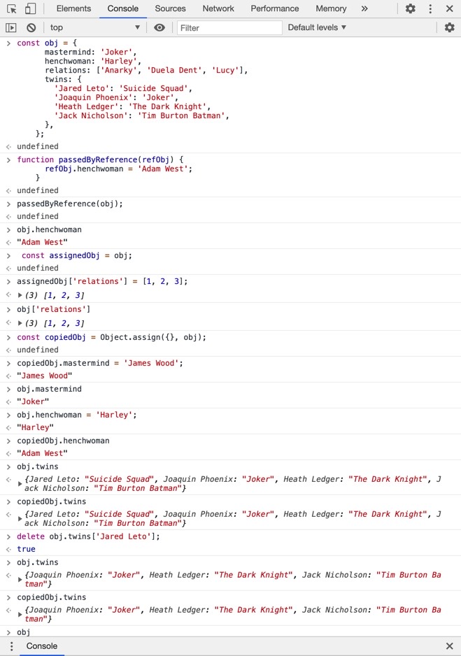
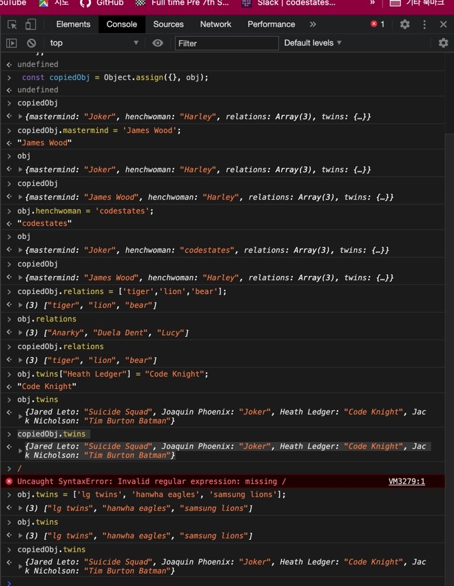

## 1. Koans 과제 07_Object 맨 마지막 문제 (true? false?)

자바스크립트 Koans 과제를 다시 천천히 풀며 읽어보다가 07번 주제 object 맨 아래에 있는 테스트 케이스를 작성하는 와중에 문제가 생겼다.

```js
it('Object를 함수의 인자로 전달할 경우, reference가 전달됩니다.', function() {
  const obj = {
    mastermind: 'Joker',
    henchwoman: 'Harley',
    relations: ['Anarky', 'Duela Dent', 'Lucy'],
    twins: {
      'Jared Leto': 'Suicide Squad',
      'Joaquin Phoenix': 'Joker',
      'Heath Ledger': 'The Dark Knight',
      'Jack Nicholson': 'Tim Burton Batman',
    },
  }

  function passedByReference(refObj) {
    refObj.henchwoman = 'Adam West'
  }
  passedByReference(obj)
  expect(obj.henchwoman).toBe('Adam West')

  const assignedObj = obj
  assignedObj['relations'] = [1, 2, 3]
  expect(obj['relations']).toEqual([1, 2, 3])

  const copiedObj = Object.assign({}, obj) // Object.assign(target, source);
  copiedObj.mastermind = 'James Wood'
  expect(obj.mastermind).toBe('Joker')

  obj.henchwoman = 'Harley'
  expect(copiedObj.henchwoman).toBe('Adam West')

  delete obj.twins['Jared Leto']
  expect('Jared Leto' in copiedObj.twins).toBe(false)
})
```

코드 맨 아래의 toBe 란에 true 로 적었는데 false 가 맞다는 것에 도저히 납득이 안된다는 것이 문제였다.

```js
delete obj.twins['Jared Leto']
expect('Jared Leto' in copiedObj.twins).toBe(false)
```



아무리 생각해도 믿기지 않아서 콘솔로도 찍어서 실행해 봤는데 마찬가지다. 왜일까?

이 문제에서 내가 이해하고 있는 부분은 const copiedObj = Object.assign({}, obj) 을 통해 복사된 copiedObj 변수는,
obj 변수와는 다른 주소의 객체를 가지고 있는 객체 라고 이해했다.

그렇기 때문에,
copiedObj.mastermind = 'James Wood'; 를 통해 copiedObj 의 키 mastermind 의 값이 'James Wood' 로 바뀌어도,
obj 변수의 키 mastermind 는 여전히 'Joker' 인 것이다.

즉 두 변수는 서로 상관이 없는 것인데,

하지만, delete obj.twins['Jared Leto']; 를 통해 obj 객체 내 뭔가 지워졌다 하더라도,
copiedObj 변수에는 전혀 영향을 주지 않는 거 일텐데 콘솔을 직접 찍어보니 copiedObj 의 객체에서도 copiedObj.twins['Jared Leto'] 가 지워졌다는 것이 납득이 안되는 것이였다.

그래서 헬프 데스크에 질문을 했다.

선생님께서는 깊은 복사와 얕은 복사를 키워드로 검색해서 공부해 보라 하셨다.

## 2. 객체의 얕은 복사, 깊은 복사.

그래서 키워드 검색을 해보니, 여러 페이지에서 확인해 보았는데 설명이 너무 어려워 읽다가 껐다.

https://ithub.tistory.com/301

위 사이트에서 얕은 복사와 깊은 복사의 의미를 짧게 다루는 문장을 그대로 옮겨 왔다.

```js

얕은 복사란, 객체의 첫 번째 부분만 복사하는 것을 의미합니다.
Object의 내장객체인 assign() 함수를 사용하여 구현합니다.


깊은 복사란, nested한 객체의 모든 하위 객체까지 복사하는 것을 말합니다.
JSON.parse()와 JSON.stringify() 함수를 사용하여 구현합니다.

```

얕은 복사 쪽 문장을 읽다가 assign() 함수를 보고 아까 값을 복사해 주는 데 썼던,

#### const copiedObj = Object.assign({}, obj);

를 떠올리고 이해해 보기 위해 콘솔 창을 열어 다시 입력해보기 시작했다.

## 3. 얕은 (Shallow) 복사 이해하기

헬프 데스크에 고민을 하면서 남긴 글을 그대로 옮겨와도 좋을 거 같다.

일반적으로 오브젝트형(배열, 객체, 함수) 을 임의의 변수에 할당하면, 메모리 상에 어떤 배열의 주소를 변수가 바라보고 있으므로 변수에 오브젝트형을 할당한 다는 것 자체가 해당 오브젝트의 주소를 할당 한다 라고 이해하고 있습니다.

그런데 만약,

```js
const obj1 = {key:'value', key2:'value2};
const obj2 = obj;
```

과 같은 형태로 선언을 하면 변수 obj1 하고 obj2 가 동일한 메모리상의 주소를 참조 (ref) 한다고 배웠습니다.

대신 이렇게 되면 obj2 의 키값을 수정하면 obj1 도 동일 메모리 주소를 참조하므로 obj1 도 obj2 의 수정사항 대로 바뀌게 됩니다.

아마 나중에 개발자가 되었을 때, 원본 객체를 저장한 변수와 그 변수와 똑같은 객체를 별도로 두어서 관리하고 수정을 해야 원본에 영향을 주지 않으므로, 자바스크립트의 오브젝트 자료형을 위해서 복사 라는 개념을 도입하게 되지 않았나 합니다.

객체 자료형에서의 복사는 Object.assign({}, obj); 을 이용하는데, 이것이 얕은 복사인 이유는 그 객체 내 키:값 의 1단계 형태만을 복사해 오기 때문이라는 것을 확인했습니다.

콘솔로 직접 어떻게 나오는지 확인해 보았습니다.

```js
const obj = {
      mastermind: 'Joker',
      henchwoman: 'Harley',
      relations: ['Anarky', 'Duela Dent', 'Lucy'],
      twins: {
        'Jared Leto': 'Suicide Squad',
        'Joaquin Phoenix': 'Joker',
        'Heath Ledger': 'The Dark Knight',
        'Jack Nicholson': 'Tim Burton Batman',
      },
    };

const copiedObj = Object.assign({}, obj);
copiedObj.mastermind = 'James Wood';
copiedObj
{mastermind: "James Wood", henchwoman: "Harley", relations: Array(3), twins: {…}}
obj
{mastermind: "Joker", henchwoman: "Harley", relations: Array(3), twins: {…}}

obj.henchwoman = 'codestates';
obj
{mastermind: "Joker", henchwoman: "codestates", relations: Array(3), twins: {…}}

copiedObj
{mastermind: "James Wood", henchwoman: "Harley", relations: Array(3), twins: {…}}

copiedObj.relations = ['tiger','lion','bear'];
copiedObj.relations
(3) ["tiger", "lion", "bear"]

obj.relations
(3) ["Anarky", "Duela Dent", "Lucy"]
```

이렇듯 복사가 잘 이루어져서 변수 copiedObj 가 무엇을 수정해도 원본인 변수 obj 에 아무 영향을 안주고 변수 제각각 독립적으로 움직이는 거 처럼 보입니다.

그런데 바로 아래 코드를 실행하면,

```js
obj.twins["Heath Ledger"] = "Code Knight";
"Code Knight"

obj.twins
{Jared Leto: "Suicide Squad", Joaquin Phoenix: "Joker", Heath Ledger: "Code Knight", Jack Nicholson: "Tim Burton Batman"}

copiedObj.twins
{Jared Leto: "Suicide Squad", Joaquin Phoenix: "Joker", Heath Ledger: "Code Knight", Jack Nicholson: "Tim Burton Batman"}
```

얕은 복사의 의미를 어렴풋이 이해한 바로는 어떤 객체를 Object.assign({}, obj); 로 복사하면 객체의 1단계 형태에서는 복사가 일어나지만,

객체의 2단계 그러니까 객체의 키 밸류가 또 객체일때,

2단계 객체의 값은 복사가 일어나지 않고 2단계 내에서는 obj, copiedObj 변수가 동일한 주소를 바라보게 된다고 합니다.

쉽게 말하면 객체 내 키 밸류에 객체가 있다면 그 2단계 객체 바깥 껍데기만 복사가 된다 이렇게 생각하면 될 거 같습니다.

여튼 그래서 obj 의 2단계의 (2단객체?!) 키밸류에 접근해 수정을 하면 그 2단계 안에서 만큼은 동일한 주소를 바라보므로 copiedObj 도 똑같이 바뀌어 버린다는 것을 알게 되었습니다.

완전한 복사가 일어나지 않은 말그대로 "얕은 복사" 인 용어가 이해가 되었습니다.



깊은 복사를 하려면.

```js
깊은 복사란, nested한 객체의 모든 하위 객체까지 복사하는 것을 말합니다.
JSON.parse()와 JSON.stringify() 함수를 사용하여 구현합니다
```

깊은 복사는 시도해 보지 않았지만 얕은 복사에 대해 얼마 정도 이해가 되었습니다.
그렇다는 것은 현업에 가면은 얕은 복사는 데이터를 다룰 때 가급적 피해야 겠다는 말도 되겠네요.

감사합니다.

## 4. conclusion

얕은 복사에 대해 어느 정도 이해할 수 있어 좋았다.
