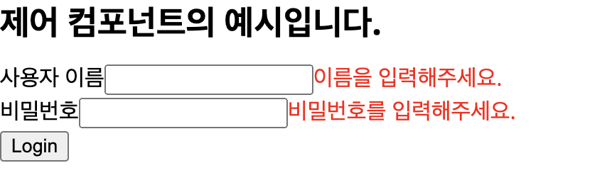
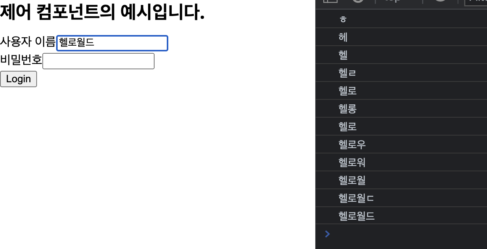

## 1. 들어가면서

프론트엔드 개발자의 입장에서 데이터를 다루는 방법은 여러가지가 있습니다.

- 차트 라이브러리 등을 활용해 데이터를 시각화하기
- 폼을 통해 데이터를 수집하기
- 테이블을 통해 데이터를 나열하기

이 중에 사용자의 입력 값 등을 받아 데이터를 수집하는 Form 을 효과적으로 제어할 수 있는 React-Hook-Form 에 대해 알아보게 될 텐데요.
<br /><br />그 전에 앞서 **Form 을 처리하는데 필요한 사전 지식**을 알아 봅니다.

필요한 사전 지식은 다음과 같습니다.

- 제어 컴포넌트
- 비제어 컴포넌트

## 2. 제어 컴포넌트

간단하게 설명하면 **사용자의 입력을 처리하는데 React 에 의해 값이 제어되는 입력 폼 엘리먼트**를 제어 컴포넌트라고 합니다.

[https://ko.legacy.reactjs.org/docs/forms.html#controlled-components](https://ko.legacy.reactjs.org/docs/forms.html#controlled-components)

사용자의 입력을 받는 컴포넌트 (대표적으로 input) 에 event 객체를 이용해 useState 의 setState() 함수를 통해 값을 제어하는 방식을 의미합니다. 리액트에 의해 값이 제어되기에 이를 제어 컴포넌트라고 부릅니다.

제어 컴포넌트는 **사용자가 입력한 값과 저장되는 값이 실시간으로 동기화** 됩니다. 즉 **항상 최신값을 유지**하는데, 이는 새로운 입력 값이 생길 때마다 상태를 새롭게 갱신합니다.

이러한 내용들을 구체적으로 설명하기 위해 사용자의 이름과 비밀번호를 받아 로그인을 가정하는 컴포넌트를 만들어 보았습니다.



이 컴포넌트를 통해 서버에 요청을 보낼 때 확인해야 할 사항은 다음과 같습니다.

- 사용자 이름, 비밀번호가 적절하게 입력이 되었는지
- 적절하게 입력되지 않았을 때의 에러 메시지 처리

이를 위해 프론트엔드 개발에 필요한 사항을 나열해 보겠습니다.

1. 이름, 비밀번호의 값을 상태 관리하기 위한 각각의 state

   ```tsx
   const [username, setUsername] = useState<string>('')
   const [password, setPassword] = useState<string>('')
   ```

1) 이름, 비밀번호의 에러 메시지 값을 상태 관리하기 위한 각각의 state

   ```tsx
   const [usernameError, setUsernameError] = useState<string>('')
   const [passwordError, setPasswordError] = useState<string>('')
   ```

1. 이름, 비밀번호의 입력값이 변경되는 이벤트를 관리하기 위한 onChange Handler 함수

   ```tsx
   const handleUsernameChange = (
     event: React.ChangeEvent<HTMLInputElement>
   ) => {
     setUsername(event.target.value)
   }

   const handlePasswordChange = (
     event: React.ChangeEvent<HTMLInputElement>
   ) => {
     setPassword(event.target.value)
   }
   ```

2. 이름, 비밀번호의 정합성을 판단하는 validation 함수

   ```tsx
   const validateName = (name: string) => {
     let isValidated = false

     if (name === '') {
       setUsernameError('이름을 입력해주세요.')
     } else if (name.length < 2) {
       setUsernameError('이름은 2자 이상 입력해주세요.')
     } else {
       isValidated = true
       setUsernameError('')
     }

     return isValidated
   }

   const validatePassword = (password: string) => {
     let isValidated = false

     if (password === '') {
       setPasswordError('비밀번호를 입력해주세요.')
     } else if (password.length < 8) {
       setPasswordError('비밀번호는 8자 이상 입력해주세요.')
     } else {
       isValidated = true
       setPasswordError('')
     }

     return isValidated
   }
   ```

3. 이름, 비밀번호를 가지고 API 를 요청하기 위한 onSubmit 함수

   ```tsx
   const handleSubmit = (event: React.FormEvent<HTMLFormElement>) => {
     event.preventDefault()
     const isValidatedName = validateName(username)
     const isValidatedPassword = validatePassword(password)

     if (isValidatedName && isValidatedPassword) {
       console.log('username', username)
       console.log('password', password)
       setUsername('')
       setPassword('')
       setUsernameError('')
       setPasswordError('')
     }
   }
   ```

### 2-1. 제어 컴포넌트의 문제 1

제어 컴포넌트로 입력값을 다루기 위해서 각각의 입력값 마다 하나 하나 상태를 선언해 주고, 핸들링 함수를 개별적으로 만들고, 에러를 위한 상태, 검증을 위한 함수 등을 적용하는데 이만큼이나 많은 코드들이 사용됩니다.

물론 다양한 입력값들을 하나의 state 객체를 통해 관리하고 공통의 이벤트를 관리하기 위한 onChange 함수를 아래와 같이 리팩토링하여 사용할 수도 있습니다.

```tsx
const [inputs, setInputs] = useState({
  username: '',
  password: '',
})

const handleInputChange = (event: React.ChangeEvent<HTMLInputElement>) => {
  const { value, name } = event.target
  setInputs({
    ...inputs,
    [name]: value,
  })
}
```

하지만 입력값이 다양해질 수록 (이메일, 휴대전화, 주소 등등) 값에 따른 validation 또한 다를 것이고 안내에 필요한 에러메시지도 추가되어야 할 것입니다. 이러한 점 때문에 작성해야 할 코드들이 더 많아지고 onSubmit 함수의 로직이 복잡하고 비대해 지게 될 것입니다.

### 2-1. 제어 컴포넌트의 문제 2

먼저 아시겠지만 리액트에서 리렌더링이 발생하는 조건에 대해 알아보고 넘어가겠습니다.

1. Props 가 변경되었을 때
2. **State 가 변경되었을 때 (!)**
3. forceUpdate() 를 실행하였을 때
4. 부모 컴포넌트가 렌더링 되었을 때

위에서 예시로 작성한 제어 컴포넌트에서는 모든 값이 state 로 개별 컴포넌트에 연결되어 있습니다. 이로 인해 하나의 값이 변할 때마다 **여러 개의 자식 컴포넌트 들에서 무수히 많은 리렌더링**이 발생하게 됩니다.

예를 들면 사용자가 username 의 입력값을 입력하는 동안 다른 자식 컴포넌트 (예: Selectbox, DatePicker 등) 등의 컴포넌트가 리렌더링이 되는 경우를 의미하며 이는 **불필요한 렌더링으로 성능상의 이슈를 야기**할 수 있습니다.

앞서 설명 드렸듯이 제어 컴포넌트는 화면에 입력한 데이터의 상태와 저장한 데이터의 상태가 항상 일치합니다. 이 말은 사용자가 입력하는 모든 데이터가 동기화 된다는 의미인데요.



단어 하나 하나 입력할 때마다 그 값이 갱신되어 버리기 때문에 불필요한 리렌더링, 불필요한 API 요청으로 자원 낭비의 문제로 연결될 수도 있습니다.

불필요한 요청 등을 방지하기 위해 스로틀링이나 디바운싱을 사용할 수 있는데 form 의 요소가 증가할 수록 모든 컴포넌트에 스로틀링이나 디바운싱을 걸기는 힘들 수 있습니다.

### 2-2. 제어 컴포넌트 대신 비제어 컴포넌트를 사용하기

이제 아래와 같은 개선을 위해 비제어 컴포넌트를 사용할 수 있고 그 대표적인 라이브러리 중 하나인 “react-hook-form” 에 대해 설명할 시간입니다.

아래는 비제어 컴포넌트의 대표적인 특징입니다. 자세한 설명은 다음 글에서 이어 나가 보겠습니다.

- 사용되는 코드와 로직을 간소화 해 줄 수 있고, 입력값과 에러메시지를 직접 관리하는 방법보다 훨씬 직관적이고 간결한 로직을 구성할 수 있으며
- 사용자가 입력하거나 값을 변경할 때 일어나는 리렌더링을 줄여주며
- 제어 컴포넌트 보다 페이지에 마운트되는 속도가 더 빠른 장점이 있음

## 예시 전체 코드

```tsx
import React, { useState } from 'react'

const TestPage = () => {
  const [username, setUsername] = useState<string>('')
  const [password, setPassword] = useState<string>('')
  const [usernameError, setUsernameError] = useState<string>('')
  const [passwordError, setPasswordError] = useState<string>('')

  const handleUsernameChange = (event: React.ChangeEvent<HTMLInputElement>) => {
    console.log(event.target.value)
    setUsername(event.target.value)
  }

  const handlePasswordChange = (event: React.ChangeEvent<HTMLInputElement>) => {
    setPassword(event.target.value)
  }

  const validateName = (name: string) => {
    let isValidated = false

    if (name === '') {
      setUsernameError('이름을 입력해주세요.')
    } else if (name.length < 2) {
      setUsernameError('이름은 2자 이상 입력해주세요.')
    } else {
      isValidated = true
      setUsernameError('')
    }

    return isValidated
  }

  const validatePassword = (password: string) => {
    let isValidated = false

    if (password === '') {
      setPasswordError('비밀번호를 입력해주세요.')
    } else if (password.length < 8) {
      setPasswordError('비밀번호는 8자 이상 입력해주세요.')
    } else {
      isValidated = true
      setPasswordError('')
    }

    return isValidated
  }

  const handleSubmit = (event: React.FormEvent<HTMLFormElement>) => {
    event.preventDefault()
    const isValidatedName = validateName(username)
    const isValidatedPassword = validatePassword(password)

    if (isValidatedName && isValidatedPassword) {
      console.log('username', username)
      console.log('password', password)
      setUsername('')
      setPassword('')
      setUsernameError('')
      setPasswordError('')
    }
  }
  return (
    <section>
      <h1 style={{ marginBottom: '12px' }}>제어 컴포넌트의 예시입니다.</h1>
      <form onSubmit={handleSubmit}>
        <section>
          <label htmlFor="username">사용자 이름</label>
          <input
            id="username"
            name="username"
            type="text"
            onChange={handleUsernameChange}
            value={username}
          />
          {usernameError && (
            <span style={{ color: 'red' }}>{usernameError}</span>
          )}
        </section>
        <section>
          <label htmlFor="password">비밀번호</label>
          <input
            id="password"
            name="password"
            type="text"
            onChange={handlePasswordChange}
            value={password}
          />
          {passwordError && (
            <span style={{ color: 'red' }}>{passwordError}</span>
          )}
        </section>
        <button>Login</button>
      </form>
    </section>
  )
}

export default TestPage
```
