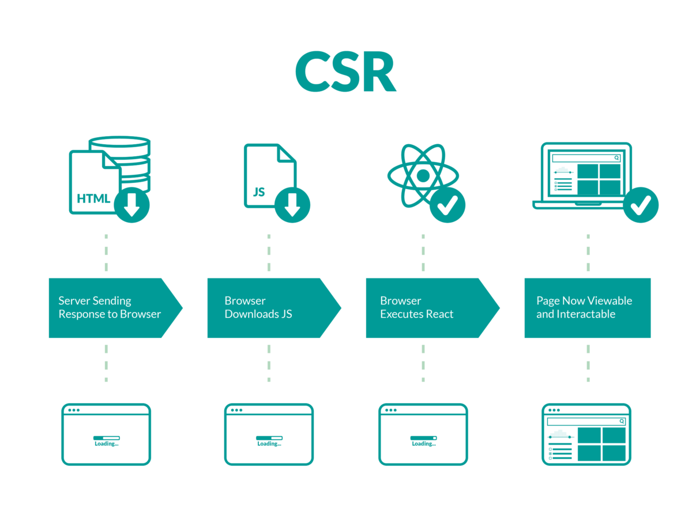

## CSR (Client Side Rendering)

### 1-1. CSR 의 정의

문자 그대로 클라이언트 측에서 렌더링을 담당한다는 의미를 가지고 있다.



### 1-2. CSR 의 작동 방식

작동 방식을 번호 순으로 설명을 나열해 본다.

1. 브라우저가 서버에 컨텐츠를 요청
   사용자가 [www.hello.com](http://www.hello.com) 으로 접속하여 서버에 컨텐츠를 요청하는 상황이다. <br /><br />

2. 서버는 index.html 을 응답해준다.
   리액트에서 루트 index.html 을 살펴보면 빈 뼈대 html 만 가지고 있는 모습을 확인할 수 있다.
   ```jsx
   <body>
     <div id="root"></div>
   </body>
   ```
   후술 예정이지만 해당 영역으로 인해 SEO (검색엔진 최적화) 에 영향을 주기도 한다. <br /><br />
3. 연결된 Javascript 링크를 통해 JS 파일 다운로드
   브라우저에서 링크된 어플리케이션 자바스크립트 (번들링 된 파일) 를 서버로부터 다운로드 받는다.

   ```jsx
   <body>
     <div id="root"></div>
     <script src="App.js"></script>
   </body>
   ```

   App.js ⇒ 자바스크립트 로직이 들어있는 파일이며 앱을 구동하는 프레임워크나 라이브러리의 소스 코드들이 포함되어 있다.
   그래서 다운로드 받는 데 처음에 느릴 수 있다. <br /><br />

4. 화면에 보여줄 데이터를 서버에 요청 (Data Fetching)
   데이터를 서버에 요청하고 응답을 받아오면서 동적인 DOM 을 생성하며 번들링된 자바스크립트 파일과 합쳐져 사용자에게 최종적인 어플리케이션을 보여주게 된다.

### 1-3. CSR 의 장점

- 초기 로딩 이후 페이지의 일부를 변경할 때는 구동속도가 빠르다.
- 서버는 빈 뼈대 index.html 만 넘겨주면 되기에 서버 측의 부하를 덜 수 있다.
- 클라이언트 측에서 연산, 라우팅 처리를 직접하기 때문에 반응 속도가 빠르고 UX 도 우수하다.

### 1-4. CSR 의 단점

- 사용자가 첫 화면을 보기까지 시간이 오래 걸릴 수 있다. (초기 로딩 속도가 느림)
- 썩 좋지 않은 SEO : CSR 에서 사용되는 html 바디는 텅텅 비어 있어서 검색엔진봇이 SEO 처리에 어려움을 줄 수 있다.

## SSR (Server Side Rendering)

### 2-1. SSR 의 정의

문자 그대로 서버 측에서 렌더링을 담당한다는 의미를 가지고 있다.


### 2-2. SSR 의 작동 방식

작동 방식을 번호 순으로 설명을 나열해 본다.

1. 브라우저가 서버에 컨텐츠를 요청
   사용자가 [www.hello.com](http://www.hello.com) 으로 접속하여 서버에 컨텐츠를 요청하는 상황이다. <br /><br />

2. 서버에서 필요한 데이터를 모두 준비함

   ▸ index.html

   ▸ data
   <br /><br />

3. index.html 과 Javascript 코드 파일 응답
   렌더링 준비를 마친 html 과 동적으로 조금 제어하게 될 Javascript code 파일을 브라우저로 응답한다.
   <br /><br />
4. 브라우저에서는 해당 문서를 받아 바로 사용자에게 최종적인 어플리케이션을 보여줌

### 2-3. SSR 의 장점

- CSR 보다 첫 번째 페이지 로딩이 빨라지는 장점이 있다. <br />▸ 즉, 초기 구동 속도가 CSR 보다 빠르다. <br /><br />
- 그리고 모든 컨텐츠가 html 에 담겨 있어서 효율적인 SEO 를 할 수 있다.

### 2-4. SSR 의 단점

- 블링킹(blinking, 깜빡임) 현상이 있어 UX 에 좋지 않음. <br />▸ 사용자가 다른 페이지 이동을 위해 클릭 시, 전체적인 웹사이트를 다시 서버에서 받아오는 것과 동일하기 때문에 블링킹, 깜박임 이슈가 있어 UX 에 좋진 않다. <br /><br />
- 서버에 과부하가 걸릴 수 있다. <br />▸ 사용자의 클릭이 많은 서비스일수록 클릭을 할 때마다 서버에 요청을 하고, 서버는 필요한 데이터를 가져와서 HTML 을 만들어야 하므로 서버에 과부하가 걸리기 쉽다. <br /><br />
- 사용자 인터랙션 전에 기다려야 되는 부분이 있다. (TTV !== TTI) <br />▸ 빠르게 화면을 확인할 수 있지만, 동적으로 데이터를 처리하는 자바스크립트를 아직 다운로드 받지 못한 상태에서 여기 저기 클릭 시 반응이 없을 수도 있다. <br />(Time to View 와 Time to Interact 의 시간 공백이 생긴다.)

## 결론 : CSR vs SSR 의 차이 (표)

|      | CSR                                           | SSR                                                                                               |
| ---- | --------------------------------------------- | ------------------------------------------------------------------------------------------------- |
| 장점 | - 화면 깜빡임이 없음                          | - 초기 로딩 이후 구동 속도가 빠름 <br />- TTV 와 TTI 사이의 간극이 없다. <br />- 서버 부하를 분산 | - 초기 구동 속도가 빠름 - SEO 에 유리함 |
| 단점 | - 초기 로딩 속도가 느림 <br />- SEO 에 불리함 | - 화면 깜빡임이 있음 <br />- TTV 와 TTI 사이 간극이 있음 <br />- 서버 부하가 있음                 |
