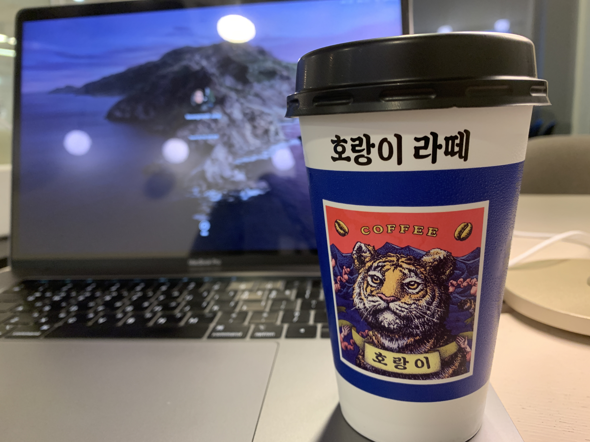

## 🚗 추석 을 마치고

이틀 아 오늘까지 삼일로 치자. 맛있는 고기도 구워먹고, 소고기.. 삼겹살.. 와인.. 온지 얼마 되지 않았는데 벌써 아른거린다.

원래 다음주까지 있다가 갈 생각이였는데, 적어도 나에게는 부모님과 함께 있는 집은 서로 무슨 일이 있었고 재미있게 이야기를 나누는 공간이지
나혼자 독불 장군마냥 문 걸어 잠그고 공부하는 공간은 아닌 거 같다.

그래서 이야기를 잘 드리고 아까 오후 한시쯤 다시 올라왔다.

밀린 빨래를 한 뒤 피곤해서 잠을 자려다가 다섯시 쯤 가방을 싸서 나만의 학습 장소로 갔다.

## 🥰 오늘의 성과

성과라고 하긴 좀 그렇지만, 고차함수 문제를 드디어 모두 풀어버렸다.
마지막 두 문제가 좀 그렇긴 했는데 한시간동안 고민했던게 해소가 되니까 기분이 좋았다.

그리고 코플잇의 다른 주제의 빈 곳들을 공략해서 문제를 해결했다.

물론 알고리즘 문제가 남아있다. 전 페어님하고 풀기는 했는데 언제 풀었는지 기억도 안나기도 하고 중간중간 빈 문제들도 있어서
삭 초기화 하고 하루 두 세 문제씩 내일부터 풀어갈 예정이다.

내일 뭐라도 따라 만들고 싶은데 발견해낸 영상이 영어로 설명을 해서 이걸 그대로 따라 해볼지, 고민이 좀 된다.
어쨋든 내일 뭐가 되었든 아무튼간에 뭔가 하나는 만들어 볼 거다.
