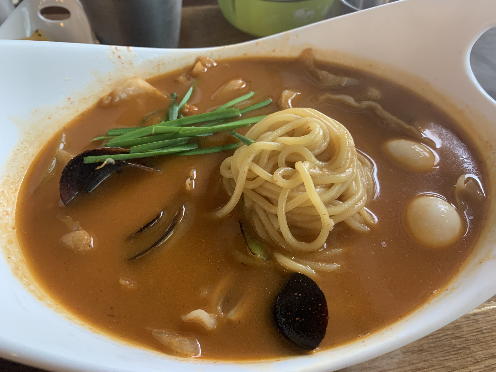
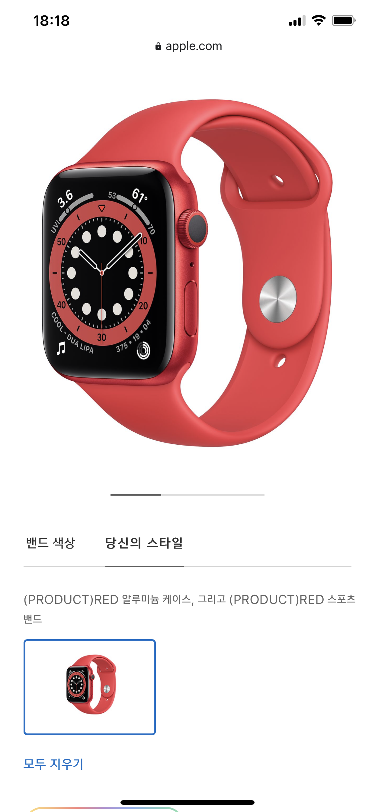

## 🍜짬뽕 먹으러

나는 매운 것을 좋아한다.

몇번 간 적이 있어서 오늘 점심 좀 지나서 또 갔다.
마치 내가 전세낸 듯 했다. 나밖에 없었기 때문이다...

여기 짬뽕은 오로지 '차뽕' 만을 시키는데, 맵기를 선택할 수가 있다.
1단계 부터 3단계 인데,
1단계는 먹어본적 없고 3단계는 지옥 전 단계 강건너는거 기다리는 정도의 맵기라서
2단계 가 딱 알맞다.

## 🏢나의 장소로

배도 부르고, 애플워치 6 레드 칼라가 무척 예뻐 보여서 보느라 정신이 팔렸다.

키야.. 옷에 받쳐서 빨간색이 좀 튈 수도 있겠지마는 이럴 땐 또 다른 사람들의 대세를 따르는 것을
난 좋아하지 않는다.

아 집중이 흐트러져서 그냥 코플잇 알고리즘이나 풀자 해서 8번까지는 풀어 보았다.
9번이.. 하.. 이게 다 된건데 이게 안되네..

## 🕊비둘기

이동네는 다 좋은데 단점이 딱 하나가 있다.
비둘기가 많다.
나는 비둘기를 극혐하는데, 옆에서 사람들이 나를 보면 저렇게 까지 해야 되나 싶을 정도로 극혐한다.

비둘기 무리가 있으면 빙 둘러 가려고 하는데 그러면 꼭 이 비둘기 xx.. 들이 내가 걷는 스텝 방향으로 따라온다.
와 미친다.
