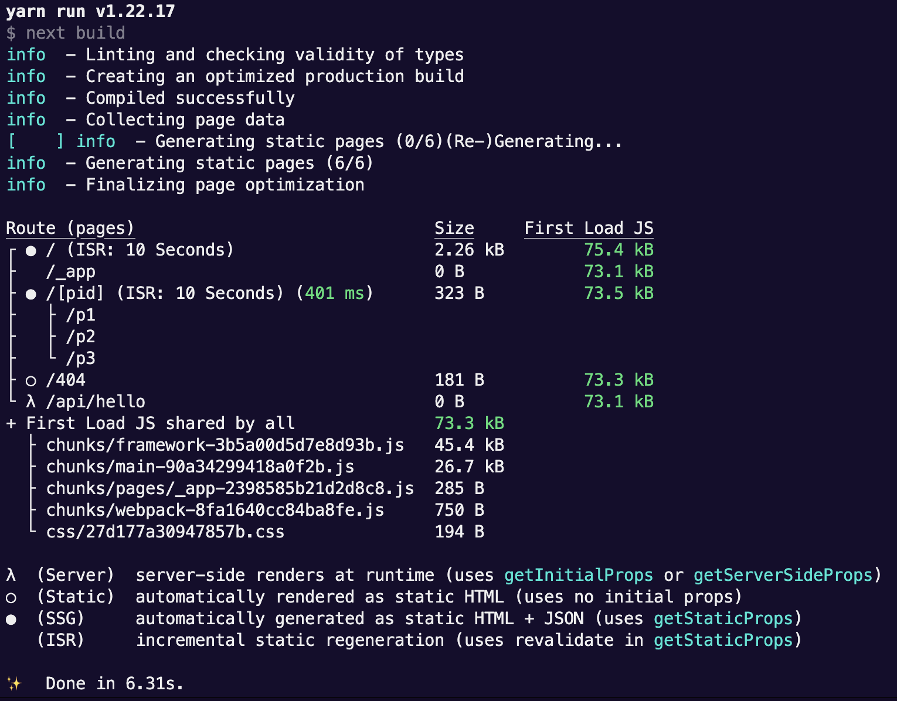

## 1. getStaticProps 정의

[NextJS-getStaticProps](https://nextjs.org/docs/api-reference/data-fetching/get-static-props)

정의 : 빌드하는 동안 페이지를 사전 생성하는 것

(pre-generate a page with data prepared on the server-side during build time.)

사전 생성이란 모든 페이지의 html 구조와 모든 데이터를 사전에 준비시켜 놓는다는 뜻이며 보통 서버 사이드에서만 실행되는 코드를 빌드 프로세스동안 실행되도록 허용하는 것을 의미한다.

NextJS 에 어떤 페이지를 사전에 생성해야 하는지, 사전 생선한 페이지에 어떤 데이터가 포함되어야 하는지 지정하기 위해 `getStaticProps` 라는 이름의 비동기 함수를 사용한다.

pages/ 경로 내에 있는 컴포넌트 내부에서만 사용 가능하며, jsx 를 리턴하는 컴포넌트 내부에서가 아닌 별도 함수를 선언 및 export 한다.

getStaticProps 를 선언하면 nextjs 로 하여금 이 페이지는 사전 생성이 되어야 한다는 것을 알려준다.

## 2. getStaticProps의 기본 사용 예시

- props : 기본적으로 해당 컴포넌트에서 받을 props 를 리턴해야 하며 위에서는 더미 데이터를 fs 로 불러와 넣어주고 있다.
  <br/>
  <br/>

* revalidate : 어떤 페이지의 데이터가 자주 바뀌는 경우 매번 빌드를 해주기에는 리소스가 낭비된다. 첫 배포 이후 재배포 없이 페이지를 재생성하도록 하는데, revalidate: 10 은 해당 페이지가 10초 마다 재생성 되어야 한다는 것을 알려준다.

  ```jsx
  export async function getStaticProps() {
    // 여기 안에서 fs 모듈을 쓸 수 있다.

    console.log('(Re-)Generating...')
    const filePath = path.join(process.cwd(), 'data', 'dummy-backend.json')
    const jsonData = await fs.readFile(filePath)

    const data = JSON.parse(jsonData)

    if (!data) {
      return {
        redirect: {
          destination: '/no-data',
        },
      }
    }

    if (data.products.length === 0) {
      return {
        notFound: true,
      }
    }

    return {
      props: {
        products: data.products,
      },
      revalidate: 10,
    }
  }
  ```

  <br/>

* npm run build 이후, npm start (빌드 프로덕션 ready 웹 사이트를 실행하는 것을 의미) 로 새로고침을 해보면 유효성 재검사가 이루어지고 이는 10초 마다 재구축 되는 것을 확인할 수 있다. (ISR : Incremental Static Generation, 증분 정적 생성)

  
  <br/>

* notFound : 데이터 페칭의 성공 유무, 잘못된 경로 접근 등에 따라 설정해 줄 수 있는 옵션, true 이면 일반 페이지 대신에 404 오류 페이지를 렌더링한다.
  <br/>
  <br/>

* redirect : 페이지 콘텐츠나 컴포넌트 콘텐츠를 렌더링하지 않고 다른 페이지, 즉 다른 라우트로 리디렉션 하는 것

## 3. 동적 컴포넌트, 페이지 이동 후 데이터 페칭

Root 인덱스 페이지애서 getStaticProps 를 통해 다음과 같은 더미 데이터를 props 로 불러올 수 있었다.

```json
{
  "products": [
    { "id": "p1", "title": "Product 1", "description": "This is product 1" },
    { "id": "p2", "title": "Product 2", "description": "This is product 2" },
    { "id": "p3", "title": "Product 3", "description": "This is product 3" }
  ]
}
```

products 리스트 들을 ul 과 li 를 통해 렌더링 해주고 `<Link />` 태그를 통해 /productId 경로로 들어가서 세부 상품 정보를 확인하도록 하였다.

그러면 해당 페이지의 컴포넌트 에서도 페이지 사전 생성함수 getStaticProps 를 필요로 할 것이다.

getStaticProps 의 context 인자를 통해 동적 라우팅의 경로 이름을 불러 올 수 있다.

```jsx
export async function getStaticProps(context) {
  const { params } = context

  const productId = params.pid

  const data = await getData()

  const filteredData = data.products.find(product => product.id === productId)

  if (!filteredData) {
    return {
      notFound: true,
    }
  }
  return {
    props: {
      productDetail: filteredData,
    },
    revalidate: 10,
  }
}
```

근데 아래와 같은 에러가 뜬다.


## 4. 동적 컴포넌트, 페이지를 위한 getStaticPaths 의 개요.

pages 내부 컴포넌트 중, `[pid].js`, `[pid].tsx` 등의 동적 페이지를 위한 컴포넌트는 NextJS 에서 기본 동작으로 페이지를 사전 생성하지 않는다.<br/> NextJS 에서는 사전에 이 동적 페이지를 위해 얼마나 많은 페이지를 미리 생성해야 하는지 알지 못하기 때문이다.

getStaticPaths 비동기 함수는 동적 페이지에서 어떤 인스턴스가 사전 생성되어야 할 지 NextJS 에 알려줄 수 있다.

```jsx
export async function getStaticPaths() {
  return {
    paths: [
      { params: { pid: 'p1' } },
      { params: { pid: 'p2' } },
      { params: { pid: 'p3' } },
    ],
    fallback: false,
  }
}
```

path 배열 내 생성할 페이지의 인스턴스를 위와 같은 형태로 넣어준다.

하지만, 상품이 많이 있다면 모든 상품을 다 사전 생성하기엔 시간과 자원 낭비이며 일부의 상품 상세 페이지는 방문객이 거의 없다고 하면 이 또한 리소스 낭비이다.

## 5. getStaticPaths 에서의 fallback 의 역할

fallback 을 true 로 설정 시, paths 에 포함되지 않은 인스턴스라도 페이지 방문 시 로딩되는 값이 유효할 수 있도록 해준다.

다만 이는 사전 생성되는 것이 아닌 요청이 서버에 도달하는 순간+시점 에 생성된다.

```jsx
export async function getStaticPaths() {
  return {
    paths: [
      { params: { pid: 'p1' } },
      //   { params: { pid: 'p2' } },
      //   { params: { pid: 'p3' } },
    ],
    fallback: false,
  }
}
```

그렇기 때문에 fallback: true 로 설정 시, url 입력으로 접근하면 에러가 난다.

> localhost:3000/p3, props 의 detail 정보가 없다는 Error 발생함

이 경우는 그래서 두가지 방법이 있는데, 하나는 클라이언트 단에서 props 로 받는 데이터의 유무에 따라 loading 처리 등으로 분기시켜서 화면을 렌더링해주는 방법, 두번째는 fallback: "blocking" 으로 설정하는 방법 이 있다.

- 화면 컴포넌트에서 분기하기

  ```jsx
  function ProductDetailPage(props) {
    const { productDetail } = props

    if (!productDetail) {
      return <p>Loading...</p>
    }

    return (
      <>
        <h1>{productDetail.title}</h1>
        <p>{productDetail.description}</p>
      </>
    )
  }

  export default ProductDetailPage
  ```

- fallback: "blocking" 으로 설정

  fallback: "blocking" 으로 설정 시 위와 같이 클라이언트 컴포넌트에서 분기할 필요가 없다. NextJS 에서 받아오는 데이터를 기다려준다. 단점은 페이지 방문자가 응답받는 시간이 길어질 수 있다는 점이다.

## 6. 전체 [pid].js 코드

```jsx
import React from 'react'
import fs from 'fs/promises'
import path from 'path'

function ProductDetailPage(props) {
  const { productDetail } = props

  if (!productDetail) {
    return <p>Loading...</p>
  }

  return (
    <>
      <h1>{productDetail.title}</h1>
      <p>{productDetail.description}</p>
    </>
  )
}

export default ProductDetailPage

async function getData() {
  const filePath = path.join(process.cwd(), 'data', 'dummy-backend.json')
  const jsonData = await fs.readFile(filePath)

  const data = JSON.parse(jsonData)

  return data
}

export async function getStaticProps(context) {
  const { params } = context

  const productId = params.pid

  const data = await getData()

  const filteredData = data.products.find(product => product.id === productId)

  if (!filteredData) {
    return {
      notFound: true,
    }
  }
  return {
    props: {
      productDetail: filteredData,
    },
    revalidate: 10,
  }
}

export async function getStaticPaths() {
  const data = await getData()

  const ids = data.products.map(product => product.id)

  const pathsWithParams = ids.map(id => ({
    params: {
      pid: id,
    },
  }))
  return {
    // paths: [
    //   { params: { pid: "p1" } },
    //   //   { params: { pid: "p2" } },
    //   //   { params: { pid: "p3" } },
    // ],
    paths: pathsWithParams,
    // fallback: false,
    fallback: true,
    // fallback: "blocking",
  }
}
```

## 7. conclusion

사전 렌더링은 최초 로딩시에만 영향을 미친다. 이후 부터는 SPA 방식으로 React 가 프론트엔드에서 모든 처리를 수행한다.
